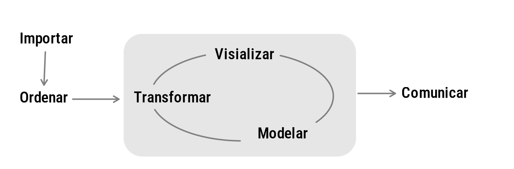

```{r setup, include=FALSE}
knitr::opts_chunk$set(echo = TRUE)

source("init.R")
```

```{r, echo=FALSE, out.width="100%", fig.align = "center"}
if (file.exists("img/recurso1.png")) knitr::include_graphics("img/recurso1.png")
```


<br/><br/>

```{r datos-estudiantes, include=FALSE}
knitr::opts_chunk$set(comment = NA)

library(RColorBrewer)
library(summarytools)
library(knitr)
library(readxl)
library(tidyverse)

# Importar la base de estudiantes de Estadística, grupo D

grupo016058 <- read.csv(
  "data/estudiantes_estadistica_grupo_D.csv",
  fileEncoding = "UTF-8",
  stringsAsFactors = FALSE
) |>
  dplyr::filter(
    !is.na(id),
    !is.na(promedio),
    !is.na(carrera),
    nzchar(trimws(carrera))
  )

# Ajustar tipos de variables para el análisis

grupo016058$carrera <- factor(grupo016058$carrera)

```

Para abordar las primeras etapas se plantea la **actividad 101**, donde se plantea la necesidad de definir un problema, definir unos objetivos y determinar las variables que serán empleadas para poder cumplir con los objetivos planteados.
Continuaremos con una parte importante de esta metodología que está relacionada con la obtención de la información y la construcción de la base de datos.

<br/>

```{r grafico-composicion-estudiantes, echo=FALSE, warning=FALSE, message=FALSE, fig.width=9, fig.height=5.5, fig.align="center"}
conteo_carreras <- grupo016058 |>
  dplyr::count(carrera) |>
  dplyr::mutate(
    porcentaje = n / sum(n),
    etiqueta = paste0(n, "\n", scales::percent(porcentaje, accuracy = 0.1))
  )

ggplot(conteo_carreras, aes(x = "", y = n, fill = carrera)) +
  geom_col(width = 1, color = "white", linewidth = 1) +
  geom_text(
    aes(label = etiqueta),
    position = position_stack(vjust = 0.5),
    color = "white", fontface = "bold", size = 4.2
  ) +
  coord_polar(theta = "y") +
  scale_fill_manual(values = c(c21, c31, c11, c41)) +
  labs(
    title = "Composición del grupo por programa académico",
    subtitle = "Estadística para la toma de decisiones · Grupo D · Curso 016058",
    fill = "Programa académico", x = NULL, y = NULL
  ) +
  theme_void(base_size = 13) +
  theme(
    plot.title = element_text(face = "bold", hjust = 0.5),
    plot.subtitle = element_text(hjust = 0.5),
    legend.position = "bottom"
  )
```

<br/><br/>

```{r grafico-promedios-estudiantes, echo=FALSE, warning=FALSE, message=FALSE, fig.width=9, fig.height=5.8, fig.align="center"}
ggplot(grupo016058, aes(x = carrera, y = promedio, fill = carrera)) +
  geom_boxplot(width = 0.55, alpha = 0.75, outlier.shape = NA, show.legend = FALSE) +
  geom_jitter(width = 0.10, size = 2.6, alpha = 0.80, show.legend = FALSE) +
  geom_hline(
    yintercept = mean(grupo016058$promedio),
    linetype = "dashed", color = c41, linewidth = 0.8
  ) +
  scale_fill_manual(values = c(c21, c31, c11, c41)) +
  coord_flip() +
  labs(
    title = "Promedio acumulado por programa académico",
    subtitle = paste0("La línea punteada representa el promedio general: ",
                      format(round(mean(grupo016058$promedio), 2), nsmall = 2, decimal.mark = ",")),
    x = NULL, y = "Promedio acumulado"
  ) +
  theme_minimal(base_size = 13) +
  theme(
    plot.title = element_text(face = "bold"),
    axis.text.y = element_text(hjust = 1),
    panel.grid.minor = element_blank()
  )
```

*Una base de datos es un conjunto de datos pertenecientes a un mismo contexto y almacenados sistemáticamente para su posterior uso.* 
Wikipedia
Una base de datos en estadística es un conjunto de información relacionada con una población organizada en filas y columnas. Las columnas corresponden a las variables y las filas están relacionadas con los individuos u objetos de estudio.  
Es importante indicar que variables como: número de la encuesta, número de identificación, teléfono, dirección, entre otros, no constituyen variables estadística, aun que pueden ser utilizadas para la identificación de la persona u objeto  de donde proviene la información. 
Existen repositorio de bases de datos para uso general como: 

* [dataset en RStudio](https://stat.ethz.ch/R-manual/R-devel/library/datasets/html/00Index.html)

* [Portal Bases de datos abiertos Colombia](https://www.datos.gov.co/)

* [Datos Banco mundial](https://datos.bancomundial.org/)

* [Portal de Datos Abiertos de Esri España](https://opendata.esri.es/)

<br/><br/>

## Base de estudiantes de Estadística

Como ejemplo de una base de datos real del curso utilizaremos el reporte de **Estadística para la toma de decisiones**, grupo **D**, con ID de curso **016058**. La base contiene `r nrow(grupo016058)` registros y `r ncol(grupo016058)` campos. Cada fila representa a un estudiante y cada columna representa una característica registrada.

Para proteger la información personal, los nombres y números de identificación se conservan únicamente en el archivo de trabajo y no se muestran en esta página.

```{r resumen-base-estudiantes, echo=FALSE}
resumen_estudiantes <- grupo016058 |>
  dplyr::group_by(carrera) |>
  dplyr::summarise(
    estudiantes = dplyr::n(),
    promedio = round(mean(promedio), 2),
    .groups = "drop"
  ) |>
  dplyr::mutate(
    porcentaje = scales::percent(estudiantes / sum(estudiantes), accuracy = 0.1)
  ) |>
  dplyr::select(carrera, estudiantes, porcentaje, promedio)

knitr::kable(
  resumen_estudiantes,
  col.names = c("Programa académico", "Estudiantes", "Participación", "Promedio acumulado"),
  caption = "Resumen agregado de los estudiantes por programa académico"
)
```

<br/><br/>

La base incluye `r dplyr::n_distinct(grupo016058$carrera)` programas académicos. El promedio acumulado general es **`r format(round(mean(grupo016058$promedio), 2), nsmall = 2, decimal.mark = ",")`** y el rango observado va de **`r format(min(grupo016058$promedio), decimal.mark = ",")`** a **`r format(max(grupo016058$promedio), decimal.mark = ",")`**.

<br/><br/>

### Variables de la base de estudiantes

| Campo | Descripción | Tipo de dato | Uso |
|:--|:--|:--|:--|
| `id` | Número consecutivo del registro | Identificador | Control |
| `nombre` | Nombre del estudiante | Identificador personal | Control |
| `emplid` | Identificador institucional del estudiante | Identificador personal | Control |
| `carrera` | Programa académico | Cualitativo nominal | Análisis |
| `matriculada` | Número de veces que ha matriculado | Cuantitativo discreto | Análisis |
| `cancelada` | Número de cancelaciones | Cuantitativo discreto | Análisis |
| `perdida` | Número de veces que ha perdido | Cuantitativo discreto | Análisis |
| `promedio` | Promedio acumulado | Cuantitativo continuo | Análisis |

<br/><br/>

### Vista anonimizada

```{r tabla-estudiantes-anonima, echo=FALSE}
grupo016058 |>
  dplyr::transmute(
    estudiante = paste("Estudiante", sprintf("%02d", dplyr::row_number())),
    carrera, matriculada, cancelada, perdida, promedio
  ) |>
  DT::datatable(
    rownames = FALSE,
    options = list(pageLength = 6),
    colnames = c("Estudiante", "Programa académico", "Matriculada", "Cancelada", "Perdida", "Promedio")
  )
```

<br/><br/>

## Base datos iris (dataset R)

```{r ,warning=FALSE, message=FALSE}
data(iris)
head(iris)
```

Datos de iris (de Fisher o Anderson) 
+ longitud y ancho del sépalo 
+ largo y ancho de pétalos
+ especies: setosa,  versicolor y virginica.
Base de datos estadísticos se estructura mediante arreglo de filas y columnas (matriz) donde por lo general las columnas representan las variables y las filas los registros de los objetos de estudio

*Una base de datos es un conjunto de datos pertenecientes a un mismo contexto y almacenados sistemáticamente para su posterior uso.*

Wikipedia

Una base de datos en estadística es un conjunto de información relacionada con una población organizada en filas y columnas. Las columnas corresponden a las variables y las filas están relacionadas con los individuos u objetos de estudio.

<br/>

Existen repositorio de bases de datos para uso general

<br/><br/>


## Repositorios


* [dataset en RStudio](https://stat.ethz.ch/R-manual/R-devel/library/datasets/html/00Index.html)   (bases de datos dentro de los paquetes de R)

* [Portal Bases de datos abiertos Colombia](https://www.datos.gov.co/)

* [Observatorio de violencia - Instituto de Medicina Legal](https://www.medicinalegal.gov.co/observatorio)

* [Datos Banco mundial](https://datos.bancomundial.org/)

* [Portal de Datos Abiertos de Esri España](https://opendata.esri.es/)

* [kaggle](https://www.kaggle.com)

* [FiveThirtyEight](https://data.fivethirtyeight.com/)

* [Datos abiertos Cali](https://datos.cali.gov.co/)

* [The home of the U.S. Government’s open data](https://www.data.gov/)

* [World Bank Open Data](https://data.worldbank.org/)

* [Open data initiative of the Government of Spain](https://datos.gob.es/en)

* [Open Data Barometer](https://opendatabarometer.org/4thedition/report/?lang=es)

* [NCBI (National Center for Biotechnology Information)](https://www.ncbi.nlm.nih.gov/)

* [EBI (European Bioinformatics Institute)](https://www.ebi.ac.uk/)    

* [Data.gov](https://data.gov/)

* [NASA Open Data Portal](https://data.nasa.gov/)

* [NIST Data Repository](https://data.nist.gov/sdp/#/)

* [Biodiversidad del Global Biodiversity Information Facility (GBIF)](https://www.gbif.org/dataset/search)

<br/><br/>

```{r }
data(iris)
library(DT)
DT::datatable(head(iris, 150),fillContainer = FALSE, options = list(pageLength = 8))
```

<br/><br/>

# Etapas del proceso de datos

Las siguientes etapas comprenden el ciclo de los datos desde la importación hasta la comunicación. Estas etapas suceden al interior de la Metodología Estadística antes mencionada y constituyen una parte muy importante del proceso, pues de la calidad de los datos, depende la calidad de los resultados.

```{r, echo=FALSE, out.width="70%", fig.align = "center"}
 
```

Imagen tomada de : https://bitsandbricks.github.io/ciencia_de_datos_gente_sociable/
Utilizaremos para este proceso el lenguaje estadístico **R** , bajo **RStudio**

<br/><br/>

# Importar datos

<br/><br/>

##  Origen de los datos

Los datos pueden proceder de diferentes fuentes (tanto primarias como secundarias), dentro de las cuales pueden ser:
* Encuesta personal (datos primarios)

* Online ( utilizando sistemas como REDCap, Office 365 - forms)

* Entrevista cara a cara

* Entrevista telefónica

* Investigación propia ( observaciones en laboratorios)      

* Sistema automático de recolección de datos ( webscraping)

* Fuente externa (datos secundarios : bases de datos abiertos)

* DANE (o entidades gubernamentales)

* Cámara de Comercio

* Agremiaciones (observatorios de gremios)

* Bancos de datos abiertos

<br/><br/>

##  Herramientas computacionales

Algunas de las herramientas utiliziadas en el manejo de información  son :
+ Excel
+ SQL
+ Oracle
+ SAS
+ Julia 

+ R,  RStudio, Positron
+ Python

En nuestro caso haremos uso del lenguaje estadístico **R*

<br/><br/>

## Limpieza de datos

Es importante después de haber importado la base de datos, hacer una revisión de cada una de las variables con el fin de poder detectar:

+ Datos faltantes (NA)

+ Datos anómalos o raros

+ Etiquetas mal colocadas ( minúsculas, MAYÚSCULAS, Titulo...)

Existen metodologías para corregir estos problemas sin afectar la información contenida en la data, para lo cual debemos realizar una verificación inicial mediante la construcción de tablas y resumen de datos.

<br/><br/>

# Ficha técnica

Las bases de datos debe estar acompañadas de una ficha técnica donde si indican sus principales características :

+ [Ficha tecnica](https://drive.google.com/file/d/1O1eaS8y6olf5o_42ehgDgVZ4q1dganbd/view) 

+ [Casos positivos de COVID-19 en Colombia](https://www.datos.gov.co/Salud-y-Protecci-n-Social/Casos-positivos-de-COVID-19-en-Colombia/gt2j-8ykr)

<br/><br/>

# Importar bases de datos

Los datos se pueden importar de diferentes formas :
+ Desde el menú de RStudio

+ Desde la consola de R o RStudio

+ De manera automática 
[**Ayudas:**](https://bookdown.org/gboccardo/manual-ED-UCH/gestion-de-bases-de-datos.html)

<br/><br/>

### Importar datos desde la dataset de R

```{r, echo=TRUE, warning=FALSE, message=FALSE}
data("mtcars")
head(mtcars, n=3)
```

<br/><br/>

## Importar los datos en formato xlsx

+ RStudio usando ventanas : **File/ Import Dataset / From Excel...**

+ RStudio usando comandos : 

<br/><br/>

## Importar datos en formato csv

El formato **csv** es uno de los mas utilizados para el almacenamiento de datos estructurados (agrupados en filas y columnas)  . El termino csv significa *"valores separados por comas"* 

+ RStudio usando ventanas : **File/ Import Dataset / From Text (base)...**

+ RStudio usando comandos : 

<br/><br/>

### Código R

<pre>
library(readr)
casas <- read_delim("data/casas.csv", delim = ";", escape_double = FALSE, trim_ws = TRUE)
</pre>

<br/><br/>

```{r, message=FALSE, warning=FALSE}
library(readr)
fifa2026 <- read_csv("data/squads_and_players.csv", show_col_types = FALSE)
head(fifa2026)
```

En este ejemplo se utiliza la base **FIFA World Cup 2026 Dataset**, que contiene información de los jugadores de las 48 selecciones participantes.

+ La base se puede consultar y descargar desde [Hugging Face](https://huggingface.co/datasets/Mominullptr/fifa-world-cup-2026-dataset/blob/main/squads_and_players.csv).

+ [Descargar `squads_and_players.csv` directamente desde GitHub](https://raw.githubusercontent.com/mominullptr/FIFA-World-Cup-2026-Dataset/main/squads_and_players.csv). Al abrir el enlace, se puede guardar el archivo con **Ctrl+S** o **Guardar como**.

+ El archivo se descarga con el nombre `squads_and_players.csv` y se guarda en la carpeta `data/`.

+ Finalmente se importa en RStudio con la función `read_csv()`. 

<br/><br/>

### Código R

<pre>
library(DT)
fifa2026 <- read.csv("data/squads_and_players.csv")
datatable(head(fifa2026, 100), fillContainer = FALSE, options = list(pageLength = 5))
</pre>

<br/><br/>

```{r, echo=TRUE, warning=FALSE, message=FALSE, results='hide'}
library(DT)
library(readr)
fifa2026 <- read_csv("data/squads_and_players.csv", show_col_types = FALSE)
datatable(head(fifa2026, 100), fillContainer = FALSE, options = list(pageLength = 5))
```

<br/><br/>

## Importar datos de manera automática

La API de datos abiertos de Socrata le permite acceder mediante programación a una gran cantidad de recursos de datos abiertos de gobiernos, organizaciones sin fines de lucro y ONG de todo el mundo. Haga clic en el enlace de abajo y pruebe un ejemplo en vivo ahora mismo.

https://dev.socrata.com/

Cargar la base de datos de COVID-19 Colombia

<br/><br/>

### Código R

<pre>
# install.packages("RSocrata")

 library(RSocrata)
 token ="ew2rEMuESuzWPqMkyPfOSGJgE"
 Colombia= read.socrata("https://www.datos.gov.co/resource/gt2j-8ykr.json", app_token = token)
 saveRDS(Colombia,"data/Colombia.RDS")
</pre>

<br/><br/>

```{r, eval=FALSE}
# install.packages("RSocrata")

 library(RSocrata)
 token ="ew2rEMuESuzWPqMkyPfOSGJgE"
 Colombia= read.socrata("https://www.datos.gov.co/resource/gt2j-8ykr.json", app_token = token)
 saveRDS(Colombia,"data/Colombia.RDS")
 # 25-07-2025 - 10:13
```

<br/><br/>

### Nota

Se requiere solicitar token en la pagina de los datos

<br/><br/>

