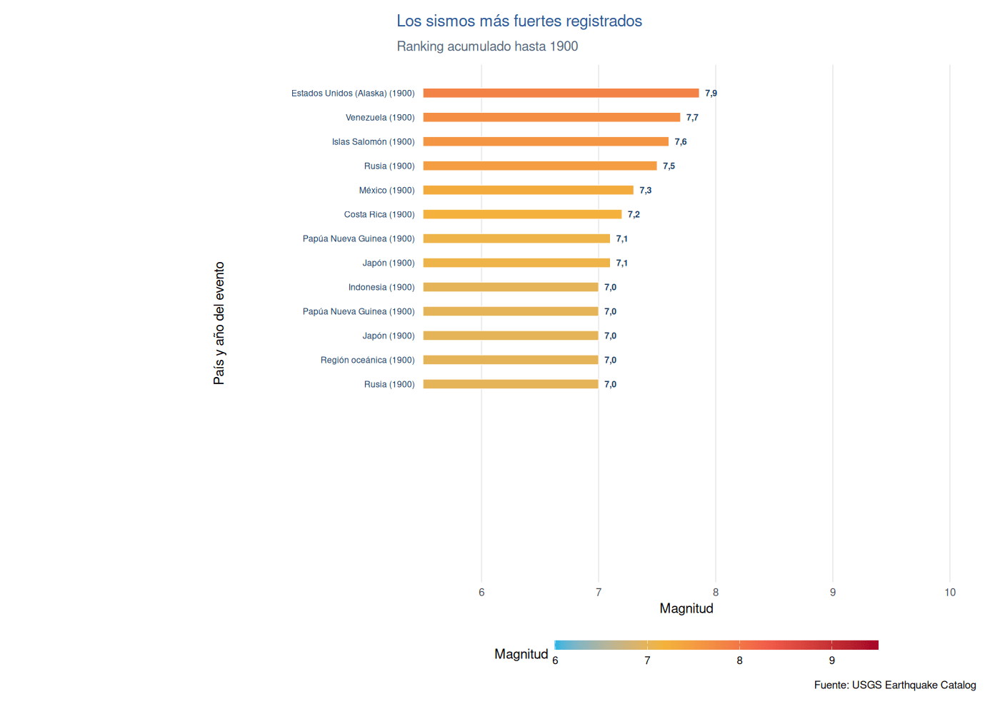
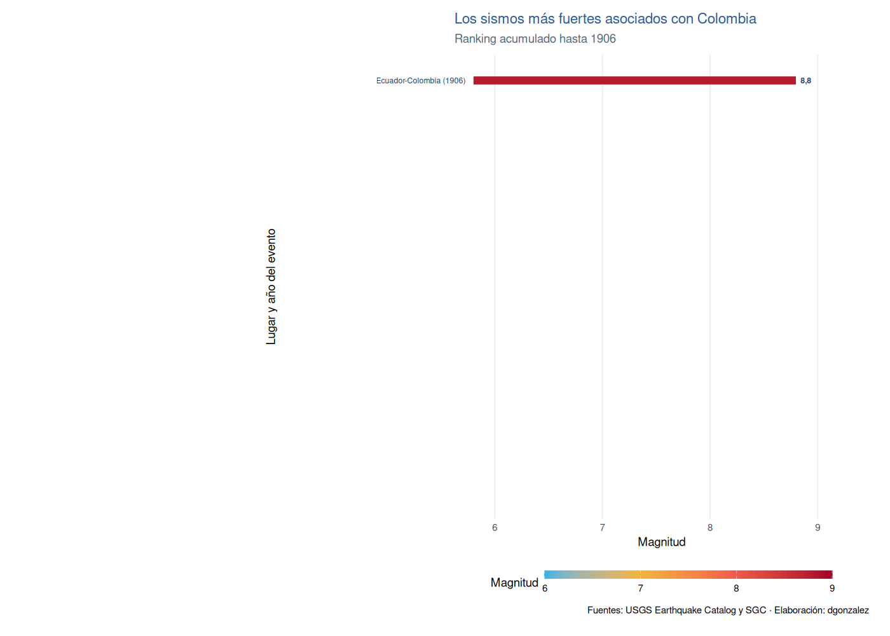

```{r setup, include=FALSE}

knitr::opts_chunk$set(echo = TRUE,comment = NA)
library(ggplot2)
library(dplyr)
library(tidyr)
library(readr)
library(readxl)

# Helper silencioso para cargar paquetes opcionales sin ensuciar la salida
load_pkg <- function(pkg) {
  if (!requireNamespace(pkg, quietly = TRUE)) {
    return(invisible(FALSE))
  }
  suppressPackageStartupMessages(
    library(pkg, character.only = TRUE)
  )
  invisible(TRUE)
}

Visitantes <- read_csv("data/Visitantes.csv")
clientes <- read_csv("data/clientes.csv")
ventas <- read_excel("data/ventas.xlsx")
cervezas <- read_csv("data/cervezas.csv")
beer <- read_csv("data/beer.csv")

# colores
source("colores.R")
paleta5 <- unname(paleta[c("rojo", "amarillo", "cian", "violeta", "verde")])
paleta4 <- unname(paleta[c("rojo", "amarillo", "cian", "violeta")])

```

<br/><br/>


```{r, echo=FALSE, out.width="100%", fig.align = "center"}
knitr::include_graphics("img/codigo1.png")
```


<br/><br/>


# Introducción

La visualización de datos es una de las partes más importantes del análisis de datos, que permite de manera gráfica representar la información con el fin de poder resumirlos e interpretarlos 


Algunas consideraciones

<br/><br/>

|Tipo de variable | Tipos de escala  |  Tipo de gráfico            |  Sintaxis R          | 
|:----------------|:-----------------|:----------------------------|:---------------------|
| Cualitativa     | Nominal          |  diagrama de torta          |  pie(table(x))       |
|                 |                  |                             |                      |
|                 | Ordinal          |  diagrama de barras         |  barplot(table(x))   |
|                 |                  |  diag.barras dobles         |  barplot(table(x,y)) |
|                 |                  |  diag. mosaico              |  plot(x,y)           |
|                 |                  |                             |                      |
|Cuantitativa     | De intervalo     |  diagrama de tallos y hojas | stem(x)              |
|                 |                  |  histograma                 | hist(x)              | 
|                 | De razón         |  diagrama de puntos         | plot(x,y)            |
|                 |                  |  diagrama de densidad       | density(x)           |
|                 |                  |  diagrama de cajas          | boxplot(x)           |
|                 |                  |  diagrama de linea          | plot(x, type="l")    |
|                 |                  |                             |                      |
 
 **Nota**: Además de estas formas de representación gráfica existen otras formas que combinan variables como:
 
 + Mapas
 + Diagrama de Mosaico
 + Diagramas de radar
 

<br/><br/>


# Cualitativa-nominal

## Diagrama circular - gráfico de tortas

```{r}
t1 <- table(clientes$categoria_preferida)
pie(t1)
```


```{r}
t1 <- table(clientes$categoria_preferida)
cols <- c("#2C5697", "#21B5E4", "#F05A4A", "#F4B43C", "#FBE8C5" )
pie(t1, col = cols)
```


```{r}
t1 <- table(clientes$categoria_preferida)
labs <- names(t1)
pct <- round(t1 / sum(t1) * 100)
labs <- paste(labs, pct, "%")
cols_t1 <- if (length(t1) <= 4) paleta4 else paleta5
pie(t1, 
    labels = labs, 
    main = "Distribución por categoría preferida",
    col = cols_t1[1:length(t1)])
```

<br/><br/><br/>

# Cualitativa-ordinal

## Diagrama de barras

```{r, warning=FALSE, message=FALSE}
library(dplyr)

clientes$edadR[clientes$edad_cliente <=30] = "1.Joven"
clientes$edadR[clientes$edad_cliente>=31 & clientes$edad_cliente <=60] = "2.Adulto"
clientes$edadR[clientes$edad_cliente>=61] = "3.Mayor"
 

barplot(table(clientes$edadR), ylim = c(0, 600))

```


```{r}
ev <- table(clientes$edadR)
cols <- c("#2C5697",  "#F4B43C", "#FBE8C5")
barplot(ev,  
        col = cols, 
        main = "Edad de clientes (categorías)",
        las = 1,
        ylim =c(0,600))
```
<br/><br/><br/>

## Diagrama de barras bivariados


```{r}
conteo <- table(ventas$Metodo_Pago, ventas$Tipo_Cliente)
barplot(conteo)

```


```{r}
counts <- table(ventas$Metodo_Pago, ventas$Tipo_Cliente)
cols <- c("#2C5697", "#21B5E4", "#F05A4A", "#F4B43C", "#FBE8C5" )
barplot(counts, main = "Método de pago por tipo de cliente",  
        xlab = "Tipo de cliente",
        col = cols,
        legend = rownames(counts),
        las = 1)
```


```{r}
counts <- table(ventas$Tipo_Cliente,ventas$Metodo_Pago)
barplot(counts, main = "Método de pago por tipo de cliente",  
        xlab = "Tipo de cliente",
        col = c( "#21B5E4", "#F05A4A"),
        legend = rownames(counts),
        las = 1)
```


## Diagrama de mosaico


```{r, message=FALSE, warning=FALSE}
op <- par(no.readonly = TRUE)

# Márgenes un poco más amplios (sobre todo abajo/izquierda)
par(mar = c(6, 6, 4, 2) + 0.1)

mosaicplot(
  ~ gear + vs,
  data = mtcars,
  col  = c("#7A6DB2", "#F4B43C"),
  las  = 1,
  main = "Número de cambios por  tipo de motor (vs)",
  xlab = "Número de cambios",
  ylab = "Tipo de motor(en V, en Línea)",
  cex.axis  = 0.9,
  cex.main  = 1.1,
  cex.lab   = 1.0,
  border    = "white",
  off       = 0.02
)

par(op)

```

<br/><br/><br/>

# Variables cuantitativas

## Diagrama de tallos y hojas

```{r}
# Diagrama de tallos y hojas
stem(beer$calorias)
```

<br/><br/><br/>

## Histograma

```{r}
hist(beer$calorias)
```


```{r}
h1=hist(beer$calorias, 
        main = "Calorías", 
        xlab = " ", ylab="frecuencias absolutas", 
        labels=TRUE, 
        col="#2C5697",
        ylim = c(0,50),
        las = 1)
abline(v=mean(beer$calorias), col=c31, lwd=2)
grid()
```
<br/><br/><br/>

##  Diagrama de densidad

```{r}
vn <- ventas$Ventas_Netas
plot(density(vn))
```


```{r}
plot(density(beer$calorias),
     main="Distribución de ventas netas", 
     col=c11, 
     lwd=2,
     las=1, 
     xlab = "Ventas netas",
     ylab = "Densidad")
```

<br/><br/><br/>

## 8. Diagrama de cajas 

```{r}
boxplot(vn)
```


```{r, fig.height=4}
boxplot(beer$calorias, main="Calorías por unidad",
        col=c41,
        las=1,
        horizontal = TRUE)

```

<br/><br/><br/>

## Comparación diagrama de cajas

```{r}
boxplot(Ventas_Netas ~ Tipo_Cliente, data = ventas)
```


```{r}
par(oma = c(2, 5, 3, 4) )  # margenes de la imagen
boxplot(Ventas_Netas ~ Tipo_Cliente, data = ventas,
        main = "Ventas netas por tipo de cliente", 
        col = paleta5,
        xlab = "ventas netas", ylab = " ", 
        horizontal = TRUE,
        las = 1)
abline(v = mean(ventas$Ventas_Netas), col = c31, lwd = 2)
```

<br/><br/><br/>

## Gráfico de líneas - series de tiempo

```{r}
ventas$fecha <- as.Date("2023-01-01") + 7 * (1:nrow(ventas))
ventas$mes <- as.Date(cut(ventas$fecha, "month"))
serie <- aggregate(Ventas_Netas ~ mes, data = ventas, sum)

plot(serie$mes, serie$Ventas_Netas, type = "l",
     main = "Ventas netas mensuales", 
     col = "#2C5697",
     lwd = 2, xlab = "mes", ylab = "ventas netas")
```


<br/><br/><br/>

#  Resumen

```{r, eval=FALSE }
x=rnorm(100,100,20)
y=rnorm(100,100,25)
z=rbinom(100,4,0.30)
t=1:100
pie(table(z))
barplot(table(z))
stem(x)
hist(x)
boxplot(x)
plot(x,y)
plot(t,y, type="l")
plot(density(x))
```

<br/><br/>

# Paquetes adicionales

Hasta el momento se ha utilizado R base para la elaboración de gráficos, a continuación se presentan algunos paquetes que mejoran la construcción de gráficos y su visualización :

<br/><br/>

## ggplot2 


```{r, echo=FALSE, out.width="10%", fig.align='left'}
knitr::include_graphics("img/ggplot2.png")
```


Este paquete de R permite la construcción de gráficos utilizando para ello una "grámatica" de los grafocos, la cual incorpora componentes como : los datos (data), un conjunto de coordenadas ( ), una serie de geometrias (geoms)  

Componentes de un gráfico en ggplot2:

+ **Data**: capa de los datos

+ **Aesthetics**: capa estetica (aes), definimos las variables a utilizar en el gráfico

+ **Geometries**: capa de geometrias, se define el tipo de gráfica a realizar

+ **Facets**: capa de facetas, permite detallar la gráfica por categorias

+ **Statistics**: capa de estadística, permite agregar modelos

+ **Coordinates**: capa de coordenadas, permite ajustar las escalas de los ejes

+ **Theme**: capas de características del gráfico que no dependen de los datos

<br/><br/>

Para empezar, inicialmente se instalar el paquete

```{r, eval=FALSE}
install.packages("ggplot2")
```
Y luego habilitarlo para su uso

```{r}
library(ggplot2)
```

Se empieza con el primero de los lienzo, donde se declara la data que vamos a utilizar

### data


```{r}
fig=ggplot(data=clientes)
fig
```

<br/><br/>

Como segundo paso se definen las variables que se van a utilizar en la construcción del gráfico

### data + aesthetics


```{r}
fig=ggplot(data=clientes,  aes(x=edad_cliente , y=puntos))
fig
```

Luego de tener definida la base y las variables a utilizar se indica la geometria a utilizar, en este caso se trata de puntos


### data + aesthetics + geometries


```{r}
fig=ggplot(data=clientes,  aes(x=edad_cliente , y=puntos))
fig + geom_point(color = "#2C5697")
```

<br/><br/>


Otros elementos a utilizar son :

<br/>

**facet**  que nos ayuda a visualizar el gráfico por factor, construyendo la gráfica para cada mes en este caso

### data + aesthetics + geometries + facets


```{r}
fig=ggplot(data=ventas,  aes(x=Edad , y=Ventas_Netas))+
  geom_point(color = "#2C5697") + facet_wrap(~ Metodo_Pago)
fig
```

<br/><br/>


**stat** permite realizar modelos lineales y mostrar asi la relación existente entre las variables 

### data + aesthetics + geometries + facets + statistics


```{r, message=FALSE, warning=FALSE}
fig=ggplot(data=ventas,  aes(x=Edad , y=Ventas_Netas))+
  geom_point(color = "#2C5697" ) +
  facet_wrap(~ Metodo_Pago) +
  stat_smooth(method = "loess" , formula =y ~ x, color = "#F05A4A")
fig
```

<br/><br/>


**coordinates**  la cual permite ajustar los ejes , por ejemplo podemos determian el rango de que queremos presentar en la gráfica

### data + aesthetics + geometries + facets + statistics + coordinates


```{r, warning=FALSE, message=FALSE}
fig=ggplot(data=ventas,  aes(x=Edad , y=Ventas_Netas)) + geom_point(color = "#2C5697") +
        facet_wrap(~ Metodo_Pago) + 
        stat_smooth(method = "loess" , formula =y ~ x, color = "#F05A4A") +
        coord_cartesian(xlim = c(18,70))
fig
```

<br/><br/>

**themes**  finalmente la capa del tema o fondo de la gráfica


### data + aesthetics + geometries + facets + statistics + coordinates + themes


```{r, warning=FALSE, message=FALSE}
fig=ggplot(data=ventas,  aes(x=Edad , y=Ventas_Netas)) + geom_point(color = "#2C5697") +
        facet_wrap(~ Metodo_Pago) + 
        stat_smooth(method = "loess" , formula =y ~ x, color = "#F05A4A" ) +
        coord_cartesian(xlim = c(18,70)) +
        theme_classic()
fig
```

<br/><br/><br/>

### Otros ejemplos de ggplot2

```{r}
ventas$Tipo_Cliente = as.factor(ventas$Tipo_Cliente)
fig2 = ggplot(data=ventas, aes(x=Ventas_Netas, y=Tipo_Cliente)) +
  geom_boxplot(fill = "#2C5697", color = "#F4B43C")+
  geom_point(color = c11, alpha = 0.5, position = position_jitter(width = 0.2))+
  ggtitle("Ventas netas por tipo de cliente")+
  labs(x="ventas netas" , y="tipo de cliente")
  
fig2        
```


```{r}
fig3=ggplot(clientes, aes(edad_cliente)) +
       geom_histogram(bins = 7,fill="#21B5E4", color="#F7F7F7", alpha=0.9)+
       theme_minimal() +
       labs(x = "edad", y = "frecuencia absoluta") +
       ggtitle("Edad de clientes")
fig3 
```


```{r grafico-polar-clientes, fig.width=9, fig.height=6}
fig <- ggplot(
  data = ventas,
  aes(x = Tipo_Cliente, fill = Metodo_Pago)
) +
  geom_bar(colour = "#2C5697", linewidth = 0.3) +
  coord_polar(clip = "off") +
  scale_fill_manual(
    values = c("#2C5697", "#21B5E4", "#F05A4A", "#F4B43C", "#FBE8C5")
  ) +
  labs(
    x = "Tipo de cliente",
    y = NULL,
    fill = "Método de pago"
  ) +
  theme_minimal() +
  theme(
    axis.text.x = element_text(margin = margin(t = 8)),
    legend.position = "bottom",
    plot.margin = margin(t = 20, r = 65, b = 20, l = 65)
  )

fig
```
```{r}
# Plot
ggplot(ventas, aes(x = Tipo_Cliente, y = Ventas_Netas, fill = Tipo_Cliente)) +
  geom_boxplot(alpha = 0.6) +
  geom_jitter(color = c11, size = 0.4, alpha = 0.6) +
  scale_fill_manual(values = c("#2C5697", "#21B5E4")) +
  theme_minimal() +
  theme(legend.position = "none",
        plot.title = element_text(size = 11)) +
  ggtitle("Ventas netas por tipo de cliente (geom_jitter)") +
  xlab("")
```


## highcharter  


```{r, echo=FALSE, out.width="10%", fig.align='left'}
knitr::include_graphics("img/highcharter.png")
```


Este es un paquete especializado en la creación de gráficos dinámicos que emplea inrnamente  javascript.

Este paquete permite crear varios tipos de gráficos como: diagramas de dispersión, de burbuja, de línea, serie de tiempo, mapas de calor, treemap, gráficos de barras, redes, entre otros.

Gran parte de los gráficos se realizan con la función : ** hchart() ** que es aplicada a objetos 

Inicialmente se instala el paquete por una única vez

```{r, eval=FALSE}
# install.packages("highcharter")
```

Luego se carga para utilizar sus funciones

```{r, message=FALSE,warning=FALSE}
```


```{r, message=FALSE,warning=FALSE, echo=FALSE}
if (load_pkg("highcharter")) {
  hchart(ventas, "scatter", hcaes(x = Edad, y = Ventas_Netas, group = Metodo_Pago)) %>%
    hc_title(text = "Ventas netas vs edad por método de pago")
}
```

<br/><br/>

```{r}
# paquetes requeridos
# install.packages("ggplot2")
library(ggplot2)
# install.packages("ggbeeswarm")
# gráfico 
if (load_pkg("ggbeeswarm")) {
  ggplot(ventas, aes(x = Tipo_Cliente, y = Ventas_Netas, color = Tipo_Cliente)) +
    geom_beeswarm(cex = 2) +
    scale_color_manual(values = c("#2C5697", "#F05A4A"))
}
```

<br/><br/>

```{r}
# construccion de la data
df <- cervezas[, c("tipo", "precio")]

# instalacion de paquetes
# install.packages("ggridges")
# install.packages("ggplot2")
library(ggplot2)

# construcción de gráfico
if (load_pkg("ggridges")) {
  ggplot(df, aes(x = precio, y = tipo, fill = tipo, color = tipo)) +
    geom_density_ridges(alpha = 0.6) +
    scale_fill_manual(values =c("#2C5697", "#21B5E4", "#F05A4A", "#F4B43C", "#FBE8C5" )) +
    scale_color_manual(values = c("#FBE8C5", "#F4B43C", "#F05A4A", "#21B5E4","#2C5697"))
}
```

<br/><br/>

```{r}
# Datos
v_m <- ventas$Ventas_Netas[ventas$Genero == "Mujer"]
v_h <- ventas$Ventas_Netas[ventas$Genero == "Hombre"]

# Estimaciones de densidad
denx <- density(v_m)
deny <- density(v_h)

# Gráfico
plot(denx,
     ylim = c(0, max(c(denx$y, deny$y))),
     xlim = c(min(c(denx$x, deny$x)),
              max(c(denx$x, deny$x))),
     las=1, main="Ventas netas por género", xlab="ventas netas")
lines(deny)

# Colorear las áreas
polygon(denx, col = adjustcolor("#2C5697", alpha.f = 0.6))
polygon(deny, col = adjustcolor("#F05A4A", alpha.f = 0.6))
```

<br/><br/>

## plotly


```{r, echo=FALSE, out.width="10%", fig.align='left'}
knitr::include_graphics("img/plotly.png")
``` 

<br/>

```{r, eval=FALSE, message=FALSE, warning=FALSE}
library(dplyr)
library(plotly)

set.seed(123)

# Datos de ejemplo (ambas cuantitativas)
datos <- data.frame(
  Gasto_Publicidad = runif(80, 200, 2000),                # X cuantitativa
  Ventas           = 5000 + 8*runif(80, 200, 2000) + rnorm(80, 0, 800)  # Y cuantitativa
)

p <- plot_ly(
  data = datos,
  x = ~Gasto_Publicidad,
  y = ~Ventas,
  type = "scatter", mode = "markers",
  text = ~paste0("Publicidad: $", round(Gasto_Publicidad, 0),
                 "<br>Ventas: $", round(Ventas, 0)),
  hoverinfo = "text",
  marker = list(size = 10, opacity = 0.8)
) %>%
  layout(
    title = "Relación entre publicidad y ventas",
    xaxis = list(title = "Gasto en publicidad ($)"),
    yaxis = list(title = "Ventas ($)")
  )

p

```

## gganimate (GIF) 

Ejemplo de gráfico dinámico que cambia en el tiempo y se exporta como GIF.

```{r, eval=FALSE, message=FALSE, warning=FALSE}
# install.packages(c("gganimate","gifski","transformr")) # instala paquetes
library(dplyr)
library(ggplot2)
library(gganimate)
library(gifski)

# IMPORTANTE:
# NO cargues el paquete {animation} en este documento, o se pisa animate().
# Si lo necesitas en otro chunk, usa gganimate::animate() explícito.

# 1) Crear fechas y mes
ventas <- ventas %>%
  mutate(
    fecha = as.Date("2023-01-01") + 7 * (row_number() - 1),
    mes   = as.Date(cut(fecha, "month"))
  )

# 2) Resumir por mes y tipo de cliente
resumen <- ventas %>%
  group_by(mes, Tipo_Cliente) %>%
  summarise(Ventas_Netas = sum(Ventas_Netas, na.rm = TRUE), .groups = "drop")

# 3) Gráfico base
p <- ggplot(resumen, aes(x = mes, y = Ventas_Netas, color = Tipo_Cliente, group = Tipo_Cliente)) +
  geom_line(linewidth = 1) +
  geom_point(size = 2) +
  scale_color_manual(values = c("#2C5697", "#F05A4A"))  +   # paleta institucional (5 colores)
  labs(
    title = "Ventas netas por tipo de cliente: {frame_along}",
    x = "Mes", y = "Ventas netas"
  ) +
  theme_minimal(base_size = 13) +
  theme(panel.grid.minor = element_blank()) +
  transition_reveal(along = mes)

# 4) Render GIF (usa gganimate::animate para evitar conflictos)
anim <- gganimate::animate(
  p, nframes = 80, fps = 10, width = 700, height = 400,
  renderer = gifski_renderer()
)

dir.create("img", showWarnings = FALSE)
anim_save("img/ventas_tiempo.gif", anim)

```


```{r, echo=FALSE, out.width="100%", fig.align = "center"}
knitr::include_graphics("img/ventas_tiempo.gif")
```


```{r, eval=FALSE, message=FALSE, warning=FALSE}
# install.packages(c("gganimate","gifski","transformr")) # instala paquetes
library(dplyr)
library(ggplot2)
library(gganimate)
library(gifski)

p <- datos %>%
  filter(country == "Colombia") %>%
  mutate(
    pop_mm = pop / 1e6,
    # Etiquetas solo en algunos años para no saturar
    etiqueta = if_else(year %in% c(min(year), 1970, 1990, 2010, max(year)),
                       paste0(number(pop_mm, accuracy = 0.1), " MM"),
                       NA_character_)
  ) %>%
  ggplot(aes(year, pop_mm)) +
  geom_line(linewidth = 1) +
  geom_point(size = 2) +
  geom_text_repel(
    aes(label = etiqueta),
    na.rm = TRUE,
    size = 3.6,
    min.segment.length = 0,
    box.padding = 0.25,
    point.padding = 0.2,
    max.overlaps = Inf
  ) +
  scale_color_manual(values = "#21B5E4") +
  scale_x_continuous(breaks = seq(1952, 2007, by = 5)) +
  scale_y_continuous(
    labels = function(x) paste0(number(x, accuracy = 1), " MM"),
    expand = expansion(mult = c(0.02, 0.10))
  ) +
  labs(
    title = "Población de Colombia",
    subtitle = "Año: {frame_along}",
    x = "Año",
    y = "Población (MM)"
  ) +
  theme_minimal(base_size = 13) +
  theme(
    panel.grid.minor = element_blank(),
    panel.grid.major.x = element_blank(),
    plot.title = element_text(face = "bold"),
    axis.title = element_text(face = "bold"),
    axis.text = element_text(color = "gray20")
  ) +
  transition_reveal(along = year)
p
```

<br/><br/>


```{r, echo=FALSE, eval=FALSE, out.width="100%", fig.align = "center"}
ok_anim <- load_pkg("gapminder") &&
  load_pkg("gganimate") &&
  load_pkg("gifski") &&
  load_pkg("ggrepel")

if (ok_anim) {
  datos <- gapminder::gapminder

  p <- datos %>%
    filter(country == "Colombia") %>%
    mutate(
      pop_mm = pop / 1e6,
      # Etiquetas solo en algunos años para no saturar
      etiqueta = if_else(year %in% c(min(year), 1970, 1990, 2010, max(year)),
                         paste0(scales::number(pop_mm, accuracy = 0.1), " MM"),
                         NA_character_)
    ) %>%
    ggplot(aes(year, pop_mm)) +
    geom_line(linewidth = 1) +
    geom_point(size = 2) +
    ggrepel::geom_text_repel(
      aes(label = etiqueta),
      na.rm = TRUE,
      size = 3.6,
      min.segment.length = 0,
      box.padding = 0.25,
      point.padding = 0.2,
      max.overlaps = Inf
    ) +
    scale_color_manual(values = paleta4[1]) +
    scale_x_continuous(breaks = seq(1952, 2007, by = 5)) +
    scale_y_continuous(
      labels = function(x) paste0(scales::number(x, accuracy = 1), " MM"),
      expand = expansion(mult = c(0.02, 0.10))
    ) +
    labs(
      title = "Población de Colombia",
      subtitle = "Año: {frame_along}",
      x = "Año",
      y = "Población (MM)"
    ) +
    theme_minimal(base_size = 13) +
    theme(
      panel.grid.minor = element_blank(),
      panel.grid.major.x = element_blank(),
      plot.title = element_text(face = "bold"),
      axis.title = element_text(face = "bold"),
      axis.text = element_text(color = "#2C5697")
    ) +
    transition_reveal(along = year)

  gif <- gganimate::animate(
    p, fps = 20, width = 900, height = 500,
    renderer = gganimate::gifski_renderer()
  )
  gganimate::anim_save("img/poblacion_colombia.gif", gif)
}

```

```{r, echo=FALSE, out.width="100%", fig.align = "center"}
if (file.exists("img/poblacion_colombia.gif")) {
  knitr::include_graphics("img/poblacion_colombia.gif")
} else {
  plot.new()
  text(0.5, 0.5, "GIF no disponible: revise paquetes opcionales", cex = 0.9)
}
```

```{r ranking-animado, echo=FALSE, message=FALSE, warning=FALSE, results='hide'}
ok_rank <- load_pkg("gapminder") && load_pkg("gganimate")

if (ok_rank) {
  gapminder::gapminder %>%
    dplyr::select(country, pop, year, continent) %>%
    # for each year we assign a rank
    group_by(year) %>%
    arrange(year, -pop) %>%
    # assign ranking
    mutate(rank = 1:n()) %>%
    filter(rank <= 20) ->
    ranked_by_year

  my_theme <- theme_minimal(base_family = "Times") +
    theme(axis.text.y = element_blank()) +
    theme(axis.ticks.y = element_blank()) +
    theme(panel.grid.major.y = element_blank()) +
    theme(panel.grid.minor = element_blank())

  ranked_by_year %>%
    ggplot() +
    aes(xmin = 0,
        xmax = pop / 1000000) +
    aes(ymin = rank - .45,
        ymax = rank + .45,
        y = rank) +
    facet_wrap(~ year) +
    geom_rect(alpha = .7) +
    aes(fill = continent) +
    scale_fill_manual(values = c("#2C5697", "#F05A4A", "#F4B43C", "#A7ABB9")) +
    geom_text(col = "gray13",
              hjust = "right",
              aes(label = country),
              x = -50) +
    scale_y_reverse() +
    labs(fill = NULL) +
    labs(x = 'Population (millions)') +
    labs(y = "") +
    my_theme ->
    my_plot

  my_plot +
    facet_null() +
    scale_x_continuous(
      limits = c(-355, 1400),
      breaks = c(0, 400, 800, 1200)) +
    geom_text(x = 1000, y = -10,
              family = "Times",
              aes(label = as.character(year)),
              size = 10, col = "grey18") +
    aes(group = country) +
    gganimate::transition_time(year)
}


```

```{r mostrar-ranking-animado, echo=FALSE, out.width="100%", fig.align="center"}
knitr::include_graphics(knitr::fig_chunk("ranking-animado", "gif"))
```


### Sismos más grandes por año

El GIF muestra, para cada año, los 20 sismos de mayor magnitud registrados desde 1900 hasta ese momento. Los eventos permanecen en el ranking hasta que un sismo más fuerte los desplaza.


```{r,  eval=FALSE}
# Este bloque queda desactivado durante Knit.
# Actívelo solamente para regenerar el archivo GIF.
terremotos <- readr::read_csv(
  "data/terremotos.csv",
  show_col_types = FALSE
) %>%
  mutate(
    anio_evento = as.integer(substr(time, 1, 4)),
    pais_grafico = case_when(
      pais != "Sin país identificado" ~ sub(" Earthquake$", "", pais),
      grepl("Chile", place, ignore.case = TRUE) ~ "Chile",
      grepl("Ecuador-Colombia", place, ignore.case = TRUE) ~ "Ecuador/Colombia",
      grepl("Aleutian|Alaska", place, ignore.case = TRUE) ~ "Estados Unidos (Alaska)",
      grepl("Sumatra|Banda Sea|Sulawesi|Ceram Sea|Wharton", place, ignore.case = TRUE) ~ "Indonesia",
      grepl("Assam-Tibet", place, ignore.case = TRUE) ~ "India/China",
      grepl("Papua New Guinea|Biak|Bougainville|New Britain|New Ireland|Bismarck", place, ignore.case = TRUE) ~ "Papúa Nueva Guinea",
      grepl("Taiwan", place, ignore.case = TRUE) ~ "Taiwán",
      grepl("Kuril|Okhotsk", place, ignore.case = TRUE) ~ "Rusia",
      grepl("Tonga", place, ignore.case = TRUE) ~ "Tonga",
      grepl("Vanuatu", place, ignore.case = TRUE) ~ "Vanuatu",
      grepl("South Sandwich", place, ignore.case = TRUE) ~ "Islas Sandwich del Sur",
      grepl("Bihar-Nepal", place, ignore.case = TRUE) ~ "India/Nepal",
      grepl("Hyuganada|Toankai|Tokachi|Hokkaido", place, ignore.case = TRUE) ~ "Japón",
      grepl("Makran", place, ignore.case = TRUE) ~ "Pakistán/Irán",
      grepl("Haida Gwaii", place, ignore.case = TRUE) ~ "Canadá",
      grepl("Samoa", place, ignore.case = TRUE) ~ "Samoa",
      grepl("Solomon|Santa Cruz", place, ignore.case = TRUE) ~ "Islas Salomón",
      grepl("Fiji", place, ignore.case = TRUE) ~ "Fiyi",
      grepl("Venezuela", place, ignore.case = TRUE) ~ "Venezuela",
      grepl("Costa Rica", place, ignore.case = TRUE) ~ "Costa Rica",
      grepl("Loyalty Islands", place, ignore.case = TRUE) ~ "Nueva Caledonia",
      grepl("Mariana Islands", place, ignore.case = TRUE) ~ "Islas Marianas del Norte",
      grepl("Greece", place, ignore.case = TRUE) ~ "Grecia",
      TRUE ~ "Región oceánica"
    )
  ) %>%
  mutate(
    pais_grafico = recode(
      pais_grafico,
      "Alaska" = "Estados Unidos (Alaska)",
      "Japan" = "Japón",
      "Russia" = "Rusia",
      "Mexico" = "México"
    )
  )

anios_animacion <- seq(
  min(terremotos$anio_evento),
  max(terremotos$anio_evento)
)

# Para cada año se seleccionan los 20 eventos más fuertes ocurridos
# desde 1900 hasta ese momento.
ranking_sismos <- bind_rows(lapply(anios_animacion, function(anio_actual) {
  terremotos %>%
    filter(anio_evento <= anio_actual) %>%
    arrange(desc(mag), time) %>%
    slice_head(n = 20) %>%
    mutate(
      anio_animacion = anio_actual,
      rango = row_number(),
      etiqueta_pais = paste0(pais_grafico, " (", anio_evento, ")")
    )
}))

grafico_sismos <- ggplot(
  ranking_sismos,
  aes(group = id, fill = mag)
) +
  geom_rect(
    aes(
      xmin = 5.5,
      xmax = mag,
      ymin = rango - 0.20,
      ymax = rango + 0.20
    ),
    colour = "white",
    linewidth = 0.35
  ) +
  geom_text(
    aes(x = 5.43, y = rango, label = etiqueta_pais),
    hjust = 1,
    colour = "#163A5F",
    size = 3.2
  ) +
  geom_text(
    aes(
      x = mag + 0.05,
      y = rango,
      label = scales::number(mag, accuracy = 0.1, decimal.mark = ",")
    ),
    hjust = 0,
    colour = "#163A5F",
    fontface = "bold",
    size = 3.2
  ) +
  scale_y_reverse(breaks = 1:20, labels = NULL) +
  scale_x_continuous(
    breaks = 6:10,
    labels = scales::label_number(decimal.mark = ",")
  ) +
  scale_fill_gradientn(
    colours = c("#21B5E4", "#F4B43C", "#F05A4A", "#A50026"),
    limits = c(6, 9.5),
    oob = scales::squish,
    name = "Magnitud"
  ) +
  coord_cartesian(xlim = c(5.5, 10), clip = "off") +
  labs(
    title = "Los sismos más fuertes registrados",
    subtitle = "Ranking acumulado hasta {closest_state}",
    x = "Magnitud",
    y = "País y año del evento",
    caption = "Fuente: USGS Earthquake Catalog"
  ) +
  theme_minimal(base_size = 14) +
  theme(
    axis.text.y = element_blank(),
    axis.ticks.y = element_blank(),
    panel.grid.major.y = element_blank(),
    panel.grid.minor = element_blank(),
    plot.title = element_text(face = "bold", colour = "#2C5697"),
    plot.subtitle = element_text(colour = "#526579"),
    axis.title.y = element_text(margin = margin(r = 175)),
    plot.margin = margin(15, 25, 20, 225),
    legend.position = "bottom"
  ) +
  guides(
    fill = guide_colorbar(
      direction = "horizontal",
      barwidth = grid::unit(12, "cm"),
      barheight = grid::unit(0.35, "cm")
    )
  ) +
  gganimate::transition_states(
    anio_animacion,
    transition_length = 1,
    state_length = 3
  ) +
  gganimate::ease_aes("cubic-in-out")

gif_sismos <- gganimate::animate(
  grafico_sismos,
  nframes = 508,
  fps = 6,
  width = 1400,
  height = 1000,
  res = 96,
  end_pause = 18,
  renderer = gganimate::gifski_renderer(loop = TRUE)
)

gganimate::anim_save(
  "img/sismos_mas_grandes_por_anio.gif",
  animation = gif_sismos
)
```

```{r mostrar-gif-sismos, echo=FALSE, out.width="100%", fig.align="center"}

```


### Sismos más fuertes de Colombia

Este segundo GIF presenta el ranking acumulado de los 20 sismos de mayor magnitud asociados con Colombia, incluidos eventos fronterizos o costeros documentados por USGS y SGC. En el eje izquierdo se indica el lugar y el año de cada evento.

```{r generar-gif-sismos-colombia, echo=FALSE, eval=FALSE, message=FALSE, warning=FALSE}
# Este bloque queda desactivado durante Knit.
# Actívelo solamente para regenerar el archivo GIF.
sismos_colombia <- readr::read_csv(
  "data/terremotos.csv",
  show_col_types = FALSE
) %>%
  mutate(
    anio_evento = as.integer(substr(time, 1, 4))
  ) %>%
  filter(
    pais == "Colombia" |
      grepl("Colombia", place, ignore.case = TRUE) |
      id %in% c("iscgem900274", "iscgem883713", "usp00014ey")
  ) %>%
  mutate(
    mag_usgs = mag,
    mag = case_when(
      id == "iscgem900274" ~ 7.9,
      id == "iscgem883713" ~ 7.8,
      id == "usp00014ey" ~ 8.1,
      TRUE ~ mag
    ),
    fuente_magnitud = if_else(
      id %in% c("iscgem900274", "iscgem883713", "usp00014ey"),
      "SGC",
      "USGS"
    ),
    lugar_corto = case_when(
      id == "iscgem900274" ~ "Costa de Ecuador-Colombia",
      id == "iscgem883713" ~ "Costa de Ecuador-Colombia",
      id == "usp00014ey" ~ "Costa de Ecuador-Colombia",
      TRUE ~ place
    ),
    lugar_corto = sub(", Colombia$", "", lugar_corto),
    lugar_corto = sub("^[0-9]{4} ", "", lugar_corto),
    lugar_corto = sub(" Earthquake$", "", lugar_corto),
    lugar_corto = if_else(
      nchar(lugar_corto) > 46,
      paste0(substr(lugar_corto, 1, 45), "…"),
      lugar_corto
    )
  )

anios_colombia <- seq(
  min(sismos_colombia$anio_evento),
  max(sismos_colombia$anio_evento)
)

ranking_colombia <- bind_rows(lapply(anios_colombia, function(anio_actual) {
  sismos_colombia %>%
    filter(anio_evento <= anio_actual) %>%
    arrange(desc(mag), time) %>%
    slice_head(n = 20) %>%
    mutate(
      anio_animacion = anio_actual,
      rango = row_number(),
      etiqueta_evento = paste0(lugar_corto, " (", anio_evento, ")")
    )
}))

grafico_sismos_colombia <- ggplot(
  ranking_colombia,
  aes(group = id, fill = mag)
) +
  geom_rect(
    aes(
      xmin = 5.8,
      xmax = mag,
      ymin = rango - 0.20,
      ymax = rango + 0.20
    ),
    colour = "white",
    linewidth = 0.35
  ) +
  geom_text(
    aes(x = 5.73, y = rango, label = etiqueta_evento),
    hjust = 1,
    colour = "#163A5F",
    size = 3.2
  ) +
  geom_text(
    aes(
      x = mag + 0.04,
      y = rango,
      label = scales::number(mag, accuracy = 0.1, decimal.mark = ",")
    ),
    hjust = 0,
    colour = "#163A5F",
    fontface = "bold",
    size = 3.2
  ) +
  scale_y_reverse(breaks = 1:20, labels = NULL) +
  scale_x_continuous(
    breaks = 6:9,
    labels = scales::label_number(decimal.mark = ",")
  ) +
  scale_fill_gradientn(
    colours = c("#21B5E4", "#F4B43C", "#F05A4A", "#A50026"),
    limits = c(6, 9),
    oob = scales::squish,
    name = "Magnitud"
  ) +
  coord_cartesian(xlim = c(5.8, 9.3), clip = "off") +
  labs(
    title = "Los sismos más fuertes asociados con Colombia",
    subtitle = "Ranking acumulado hasta {closest_state}",
    x = "Magnitud",
    y = "Lugar y año del evento",
    caption = "Fuentes: USGS Earthquake Catalog y SGC · Elaboración: dgonzalez"
  ) +
  theme_minimal(base_size = 14) +
  theme(
    axis.text.y = element_blank(),
    axis.ticks.y = element_blank(),
    panel.grid.major.y = element_blank(),
    panel.grid.minor = element_blank(),
    plot.title = element_text(face = "bold", colour = "#2C5697"),
    plot.subtitle = element_text(colour = "#526579"),
    axis.title.y = element_text(margin = margin(r = 205)),
    plot.margin = margin(15, 25, 20, 315),
    legend.position = "bottom"
  ) +
  guides(
    fill = guide_colorbar(
      direction = "horizontal",
      barwidth = grid::unit(12, "cm"),
      barheight = grid::unit(0.35, "cm")
    )
  ) +
  gganimate::transition_states(
    anio_animacion,
    transition_length = 1,
    state_length = 5
  ) +
  gganimate::ease_aes("cubic-in-out")

gif_sismos_colombia <- gganimate::animate(
  grafico_sismos_colombia,
  nframes = length(anios_colombia) * 6,
  fps = 6,
  width = 1400,
  height = 1000,
  res = 96,
  end_pause = 60,
  renderer = gganimate::gifski_renderer(loop = TRUE)
)

gganimate::anim_save(
  "img/sismos_colombia_por_anio.gif",
  animation = gif_sismos_colombia
)
```

```{r, echo=FALSE, out.width="100%", fig.align="center"}

```


## fmsb 

<br/><br/>

### gráficos de radar 

Paquete para el trabajo en Estadística Medica que se utiliza para la construcción de un diagrama de radar

```{r}

if (load_pkg("fmsb")) {
  set.seed(1) # fija semilla
  df <- data.frame(rbind(rep(10, 8), # máximos
                         rep(0, 8), # mínimos
                         matrix(sample(0:10, 8), nrow = 1))) # datos
  colnames(df) <- paste("Var", 1:8) # nombres

  radarchart(df, # radar
             cglty = 1, cglcol = "gray", # grid
             pcol = c11, plwd = 2, # línea
             pfcol = adjustcolor(c21, alpha.f = 0.25)) # relleno
}

```
<br/><br/>

```{r}
# matriz de datos
if (load_pkg("fmsb")) {
  df2 <- data.frame(rbind(rep(10, 8), rep(0, 8), # máximos y mínimos
                          matrix(sample(0:10, 24,
                                        replace = TRUE), # datos
                                 nrow = 3)))
  colnames(df2) <- paste("Var", 1:8) # nombres
  # colores de areas
  areas <- c(adjustcolor(c11, alpha.f = 0.25), # grupo 1
             adjustcolor(c31, alpha.f = 0.25), # grupo 2
             adjustcolor(c41, alpha.f = 0.25)) # grupo 3

  radarchart(df2, # radar
             cglty = 1,       # tipo de línea del grid
             cglcol = "gray", # color líneas grid
             pcol = c(c11, c31, c41),      # color de líneas
             plwd = 2,        # ancho de línea
             plty = 1,        # tipo de línea
             pfcol = areas)   # color de las áreas 

  legend("topright", # leyenda
         legend = paste("Grupo", 1:3), # etiquetas
         bty = "n", pch = 20, col = areas, # estilo
         text.col = "grey25", pt.cex = 2) # estilo texto
}

```

<br/><br/>

### gráfico de barras polar


```{r barras-polares, message=FALSE, warning=FALSE}
ventas_polar <- ventas |>
  count(Metodo_Pago, name = "frecuencia") |>
  arrange(desc(frecuencia)) |>
  mutate(
    Metodo_Pago = factor(Metodo_Pago, levels = Metodo_Pago)
  )

ggplot(
  ventas_polar,
  aes(x = Metodo_Pago, y = frecuencia, fill = Metodo_Pago)
) +
  geom_col(width = 0.82, colour = "white", linewidth = 0.4) +
  geom_text(
    aes(label = frecuencia),
    position = position_stack(vjust = 0.5),
    colour = "white",
    fontface = "bold",
    size = 3.8
  ) +
  coord_polar(start = 0) +
  scale_fill_manual(
    values = rep(paleta1, length.out = nrow(ventas_polar))
  ) +
  labs(
    title = "Frecuencia por método de pago",
    x = NULL,
    y = NULL,
    fill = "Método de pago"
  ) +
  theme_minimal() +
  theme(
    axis.text.y = element_blank(),
    axis.ticks = element_blank(),
    panel.grid.minor = element_blank(),
    plot.title = element_text(
      colour = "#2C5697",
      face = "bold",
      hjust = 0.5
    ),
    legend.position = "right"
  )
```

 <br/><br/><br/>
 
# Mapas 

Los mapas de esta sección se construyen con `sf`, el estándar actual para trabajar con datos vectoriales en R. Los archivos geográficos necesarios están incluidos en las carpetas `map/cali` y `map/colombia`, por lo que los ejemplos funcionan sin descargar recursos durante el render.

Un shapefile está compuesto por varios archivos asociados (`.shp`, `.shx`, `.dbf` y `.prj`). Todos deben conservar el mismo nombre base y permanecer en la misma carpeta.

### Mapa de Cali 

El primer ejemplo muestra las 22 comunas de Cali. `st_make_valid()` corrige automáticamente las geometrías que puedan presentar inconsistencias topológicas.

```{r mapa-cali-base, message=FALSE, warning=FALSE, fig.height=6}
library(sf)

cali <- st_read("map/cali/cali.shp", quiet = TRUE) |>
  st_make_valid() |>
  mutate(
    comuna = as.integer(CODIGO),
    nombre_comuna = paste("Comuna", comuna)
  )

ggplot(cali) +
  geom_sf(fill = c12, color = c41, linewidth = 0.35) +
  labs(
    title = "División por comunas de Cali",
    subtitle = paste(nrow(cali), "comunas representadas"),
    caption = "Fuente cartográfica: Infraestructura de Datos Espaciales de Santiago de Cali"
  ) +
  theme_void() +
  theme(
    plot.title = element_text(face = "bold", color = c41),
    plot.subtitle = element_text(color = c41),
    plot.caption = element_text(color = c41, hjust = 0)
  )
```

### Microzonificación sísmica de Cali

El [Estudio de Microzonificación Sísmica de Santiago de Cali](https://repositorio.gestiondelriesgo.gov.co/handle/20.500.11762/19833), elaborado por INGEOMINAS y DAGMA en 2005, divide la ciudad en seis zonas principales de respuesta sísmica. Como la zona 4 se subdivide en 4A, 4B, 4C, 4D y 4E, el mapa contiene diez unidades cartográficas. La microzonificación fue adoptada mediante el Decreto municipal 0158 del 18 de marzo de 2014.

La capa vectorial proviene del servicio WFS de la Infraestructura de Datos Espaciales de Santiago de Cali (IDESC). El mapa muestra la clasificación relativa presentada en la referencia informativa. La leyenda muestra únicamente el nivel de intensidad asociado con cada color. Esta visualización es educativa y no reemplaza una consulta oficial para diseño estructural.

```{r mapa-microzonificacion-sismica-cali, message=FALSE, warning=FALSE, fig.height=8, fig.width=9}
microzonas_cali <- st_read(
  "map/cali/microzonificacion_sismica.geojson",
  quiet = TRUE
) |>
  st_make_valid() |>
  filter(!is.na(label)) |>
  distinct(label, .keep_all = TRUE) |>
  transmute(
    zona = label,
    aceleracion_maxima = am_etc,
    intensidad = case_when(
      zona %in% c("Zona 1", "Zona 4D", "Zona 4E") ~ "Baja",
      zona %in% c("Zona 4B", "Zona 5", "Zona 6") ~ "Moderada",
      zona %in% c("Zona 2", "Zona 4A") ~ "Moderada alta",
      zona %in% c("Zona 3", "Zona 4C") ~ "Alta"
    ),
    intensidad = factor(
      intensidad,
      levels = c("Baja", "Moderada", "Moderada alta", "Alta")
    )
  )

etiquetas_comunas <- cali |>
  st_transform(6249) |>
  st_point_on_surface() |>
  st_transform(st_crs(microzonas_cali)) |>
  mutate(etiqueta_comuna = as.character(comuna))

colores_intensidad <- c(
  "Baja" = "#79B66A",
  "Moderada" = "#E7D64A",
  "Moderada alta" = "#F1A23A",
  "Alta" = "#C83E37"
)

ggplot() +
  geom_sf(
    data = microzonas_cali,
    aes(fill = intensidad),
    color = "white",
    linewidth = 0.35
  ) +
  geom_sf(
    data = cali,
    fill = NA,
    color = "#455A64",
    linewidth = 0.18,
    alpha = 0.65
  ) +
  geom_sf(
    data = etiquetas_comunas,
    shape = 21,
    size = 4.2,
    stroke = 0.45,
    fill = scales::alpha("white", 0.9),
    color = c41
  ) +
  geom_sf_text(
    data = etiquetas_comunas,
    aes(label = etiqueta_comuna),
    size = 2.35,
    fontface = "bold",
    color = c41
  ) +
  scale_fill_manual(
    values = colores_intensidad,
    breaks = c("Baja", "Moderada", "Moderada alta", "Alta"),
    labels = c("Baja", "Moderada", "Moderada alta", "Alta"),
    drop = FALSE,
    name = "Nivel de intensidad"
  ) +
  guides(
    fill = guide_legend(
      ncol = 2,
      byrow = TRUE,
      title.position = "top"
    )
  ) +
  coord_sf(clip = "off") +
  labs(
    title = "Microzonificación sísmica de Santiago de Cali",
    subtitle = "Círculos numerados: comunas",
    caption = paste(
      "Fuente: IDESC; INGEOMINAS–DAGMA (2005), mapa MZSC-RS2.",
      "Adoptado mediante Decreto municipal 0158 de 2014."
    )
  ) +
  theme_void() +
  theme(
    plot.title = element_text(face = "bold", color = c41, size = 16),
    plot.subtitle = element_text(color = c41, size = 11),
    plot.caption = element_text(color = c41, hjust = 0, size = 8),
    plot.margin = margin(12, 18, 12, 18),
    legend.position = "right",
    legend.box = "vertical",
    legend.title = element_text(face = "bold"),
    legend.text = element_text(size = 8)
  )
```

### Mapa de Colombia

El siguiente mapa representa **riesgo sísmico relativo**, no solamente amenaza. La medida utilizada es la **Pérdida Anual Esperada (PAE) por sismo como proporción del valor expuesto**, expresada en partes por mil (‰). Este indicador combina amenaza, exposición y vulnerabilidad, pero permite comparar departamentos sin que el tamaño de su economía determine por sí solo el resultado.

Los intervalos corresponden al Mapa 20 del *Atlas de Riesgo de Colombia* de la UNGRD. La tabla `map/colombia/riesgo_sismico_relativo_departamentos.csv` contiene una fila para cada uno de los 32 departamentos y Bogotá, D. C. Se une a la cartografía GADM mediante `GID_1`, evitando depender de diferencias ortográficas en los nombres.

```{r mapa-colombia, message=FALSE, warning=FALSE, fig.height=8, fig.width=10}
mapco <- st_read("map/colombia/gadm41_COL_1.shp", quiet = TRUE) |>
  st_make_valid()

# Riesgo sísmico relativo importado del Atlas de Riesgo de Colombia
riesgo_sismico <- read.csv(
  "map/colombia/riesgo_sismico_relativo_departamentos.csv",
  stringsAsFactors = FALSE,
  check.names = FALSE
)

rangos_pae <- c(
  "0,0 - 0,5", "0,5 - 1,0", "1,0 - 1,5", "1,5 - 2,0",
  "2,0 - 2,5", "2,5 - 3,0", "3,0 - 4,0", "4,0 - 5,0",
  "5,0 - 6,0", "> 6,0"
)

riesgo_sismico <- riesgo_sismico |>
  mutate(
    pae_sismo_relativa_rango = factor(
      pae_sismo_relativa_rango,
      levels = rangos_pae
    )
  )

mapco_riesgo <- mapco |>
  left_join(riesgo_sismico, by = "GID_1")

# Comprobaciones para que ningún territorio quede sin dato o se duplique
stopifnot(
  nrow(riesgo_sismico) == 33,
  !anyDuplicated(riesgo_sismico$GID_1),
  !any(is.na(mapco_riesgo$pae_sismo_relativa_rango))
)

ggplot(mapco_riesgo) +
  geom_sf(
    aes(fill = pae_sismo_relativa_rango),
    color = "white",
    linewidth = 0.25,
    show.legend = TRUE
  ) +
  scale_fill_manual(
    values = c(
      "0,0 - 0,5" = "#71C09E",
      "0,5 - 1,0" = "#ABD190",
      "1,0 - 1,5" = "#E1E26A",
      "1,5 - 2,0" = "#FBEE6C",
      "2,0 - 2,5" = "#FFD110",
      "2,5 - 3,0" = "#F8AA21",
      "3,0 - 4,0" = "#F08224",
      "4,0 - 5,0" = "#E6342A",
      "5,0 - 6,0" = "#C22032",
      "> 6,0" = "#711A0C"
    ),
    drop = FALSE,
    name = "Riesgo sísmico relativo\n(PAE en ‰)"
  ) +
  labs(
    title = "Riesgo sísmico de Colombia",
    subtitle = "Pérdida Anual Esperada por sismo respecto al valor expuesto (‰)",
    caption = paste0(
      "Fuente: UNGRD (2018), Atlas de Riesgo de Colombia, Mapa 20; ",
      "cálculos de Ingeniar: Risk Intelligence. Cartografía: GADM 4.1."
    )
  ) +
  coord_sf(datum = NA, expand = FALSE) +
  theme_void() +
  theme(
    plot.title = element_text(face = "bold", color = c41),
    plot.subtitle = element_text(color = c41),
    plot.caption = element_text(color = c41, hjust = 0),
    legend.position = "right",
    legend.title = element_text(face = "bold"),
    legend.key.height = unit(0.48, "cm")
  )
```

La escala indica cuántas unidades monetarias se espera perder anualmente por cada mil unidades de valor expuesto. Por ejemplo, una PAE de 5‰ equivale a una pérdida media anual de 5 pesos por cada 1.000 pesos expuestos. Los tonos oscuros representan mayor riesgo sísmico relativo. No indican que necesariamente ocurran más sismos ni constituyen una escala de intensidad.

<br/><br/>


<br/><br/><br/> 

#  Parámetros en los gráficos

## Margenes de los gráficos

```{r}
# Grafico normal
x=rnorm(100,100,20)
plot(density(x))
```

<br/> <br/> 

### margenes de la grafica  c(bottom, left, top, right)

```{r}

par(mar = c(5, 4, 4, 2) + 0.1)
x=rnorm(100,100,20)
plot(density(x))
```

<br/> <br/> 


###  margenes de la gráfica

```{r}

par(mai = c(1.5, 1.5, 1.5, 1.5))
x=rnorm(100,100,20)
plot(density(x))

```

<br/> <br/> 

### Matriz de gráficos mfrow = c(2, 2)

```{r}
x=rnorm(100,100,20)
y=rnorm(100,100,25)
z=rbinom(100,4,0.30)
t=1:100
par(mfrow = c(2, 2) ) # definición de la matriz

plot(density(x))
barplot(table(z))
hist(x)
plot(x,y)
```

<br/> <br/> 

### margenes exteriores c(bottom, left, top, right)

```{r}

par(mfrow = c(2, 2),   # matriz de graficos 2x2
    oma = c(3, 5, 2, 4) )  # margenes de la imagen
plot(density(x))
barplot(table(z))
hist(x)
plot(x,y)

```

<br/> <br/> 

# Tamaño texto


```{r}
x=rnorm(100,100,20)
plot(density(x),cex.lab=.8,  # tamaño de etiqueta ejes
                cex.axis=2, # tamaño escalas de los ejes 
                cex.main=1.5, # tamaño del titulo
                cex.sub=1)    # tamaño del subtitulo
```


https://r-charts.com/es/r-base/margenes/


<br/> <br/> <br/> 

# Tableros

## Flexdashboard

Este paquete permite la construcción de tableros que pueden ser publicados en formato html. A continuación se describen las principales características y la forma que podemos construir un tablero

Iniciaremos cargando el paquete (por una única vez)
```{r, eval=FALSE, message=FALSE, warning=FALSE}
# install.packages("flexdashboard")
```

<br/> 

Tambien debemos activarlo, aunque este procedimiento viene en el formato que nos proporciona RStudio 

```{r, eval=FALSE, message=FALSE, warning=FALSE}
library(flexdashboard)
```

<br/> 

Inicialmente utilizamos la plantilla que para este propósito tiene RStudio, entrando por el menú : **File/ New file /  RMarkdown..**

{width=50%}

{width=50%}

Este procedimiento genera un formato para un tablero que puede ser modificado o ajustado a nuestras necesidades

{width=60%}

<br/> 

En este formato podemos distinguir varias partes :

+ Encabezado :  donde se define la estructura del tablero y los temas 
+ Bloque setup . Donde colocamos las instrucciones generales de R , como puede ser cargar las bases de datos que seran utilizadas durante todo el documento, ademas de cargar las librerias necesarias  
+ Definicion de columnas o filas del tablero y hojas del tablero
+ Bloques de R con el contenido


<br/> <br/> 

# Uso de color

https://r-charts.com/colors/

http://brandcolors.net/

<br/> <br/> 

## Algunos paquetes

[Selección de paquetes de Sharpm Machis](https://www.computerworld.com/article/2921176/great-r-packages-for-data-import-wrangling-visualization.html)

<br/> <br/> <br/> 

## Ejemplo de tablero

<br/> <br/> 


```{r, echo=FALSE, out.width="100%", fig.align = "center"}
knitr::include_graphics("img/tablero-01.png")
```

<br/> <br/> 

<html>
<button id="dl-rmd" class="download-button" type="button">
  📥 Descargar código tablero02.Rmd
</button>
<script>
const downloadFile = async (urlRaw, fileName) => {
  const resp = await fetch(urlRaw);
  const blob = await resp.blob();
  const url  = URL.createObjectURL(blob);
  const a = document.createElement('a');
  a.href = url;
  a.download = fileName;
  document.body.appendChild(a);
  a.click();
  a.remove();
  URL.revokeObjectURL(url);
}

document.getElementById('dl-rmd').addEventListener('click', async () => {
  const urlRaw = 'https://raw.githubusercontent.com/dgonxalex80/300MAE018B/main/tablero1/tablero-02.Rmd';
  await downloadFile(urlRaw, 'tablero-02.Rmd');
});
</script>
</html>

<br/> <br/> 

## Descarga de practica

<html>
<button id="dl-practica" class="download-button" type="button">
  📥 Descargar práctica (R)
</button>
<script>
document.getElementById('dl-practica').addEventListener('click', async () => {
  const urlRaw = 'https://raw.githubusercontent.com/dgonxalex80/300MAE018B/main/practica_beer.R';
  await downloadFile(urlRaw, 'practica_beer.R');
});
</script>
</html>


<br/> <br/> 

## Descarga de base de datos

<html>
<button id="dl-beer" class="download-button" type="button">
  📥 Descargar data beer.csv
</button>
<script>
document.getElementById('dl-beer').addEventListener('click', async () => {
  const urlRaw = 'https://raw.githubusercontent.com/dgonxalex80/300MAE018B/main/data/beer.csv';
  await downloadFile(urlRaw, 'beer.csv');
});
</script>
</html>

<br/> <br/> 

# Código R

El siguiente bloque reúne el código esencial para elaborar los principales gráficos estudiados en este documento.

```{r codigo-r-graficos, eval=FALSE}
library(readr)
library(readxl)
library(dplyr)
library(ggplot2)

# Importación de datos y colores del curso
clientes <- read_csv("data/clientes.csv")
ventas <- read_excel("data/ventas.xlsx")
beer <- read_csv("data/beer.csv")
source("colores.R")

# Variable cualitativa nominal: gráfico circular
frecuencia_categoria <- table(clientes$categoria_preferida)
porcentaje <- round(prop.table(frecuencia_categoria) * 100, 1)
etiquetas <- paste(names(frecuencia_categoria), porcentaje, "%")

pie(
  frecuencia_categoria,
  labels = etiquetas,
  col = paleta[seq_along(frecuencia_categoria)],
  main = "Categoría preferida"
)

# Variable cualitativa ordinal: diagrama de barras
clientes <- clientes |>
  mutate(
    grupo_edad = cut(
      edad_cliente,
      breaks = c(-Inf, 30, 60, Inf),
      labels = c("Joven", "Adulto", "Mayor")
    )
  )

barplot(
  table(clientes$grupo_edad),
  col = c(c03, c01, c05),
  main = "Edad de los clientes",
  ylab = "Frecuencia",
  las = 1
)

# Dos variables cualitativas
metodo_cliente <- table(ventas$Metodo_Pago, ventas$Tipo_Cliente)
barplot(
  metodo_cliente,
  beside = TRUE,
  col = paleta[seq_len(nrow(metodo_cliente))],
  legend.text = rownames(metodo_cliente),
  main = "Método de pago por tipo de cliente",
  las = 1
)

# Variable cuantitativa: histograma, densidad y caja
hist(
  beer$calorias,
  col = c03,
  main = "Distribución de calorías",
  xlab = "Calorías",
  labels = TRUE
)
abline(v = mean(beer$calorias, na.rm = TRUE), col = c01, lwd = 2)

plot(
  density(beer$calorias, na.rm = TRUE),
  col = c04,
  lwd = 2,
  main = "Densidad de calorías",
  xlab = "Calorías"
)

boxplot(
  Ventas_Netas ~ Tipo_Cliente,
  data = ventas,
  horizontal = TRUE,
  col = c05,
  main = "Ventas netas por tipo de cliente",
  xlab = "Ventas netas"
)

# Serie de tiempo de ventas mensuales
ventas_mensuales <- ventas |>
  mutate(
    fecha = as.Date("2023-01-01") + 7 * row_number(),
    mes = as.Date(cut(fecha, "month"))
  ) |>
  group_by(mes) |>
  summarise(
    Ventas_Netas = sum(Ventas_Netas, na.rm = TRUE),
    .groups = "drop"
  )

plot(
  ventas_mensuales$mes,
  ventas_mensuales$Ventas_Netas,
  type = "l",
  col = c04,
  lwd = 2,
  xlab = "Mes",
  ylab = "Ventas netas",
  main = "Ventas netas mensuales"
)

# Ejemplo equivalente con ggplot2
ggplot(clientes, aes(x = grupo_edad, fill = grupo_edad)) +
  geom_bar(show.legend = FALSE) +
  scale_fill_manual(values = c(c03, c01, c05)) +
  labs(
    title = "Edad de los clientes",
    x = "Grupo de edad",
    y = "Frecuencia"
  ) +
  theme_minimal()
```
