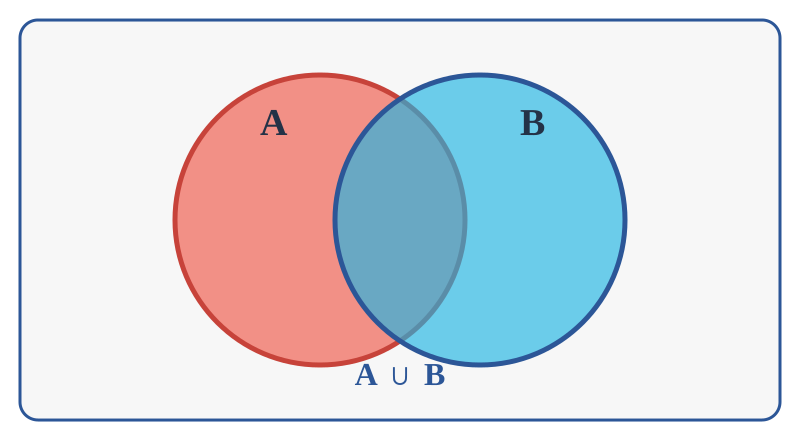
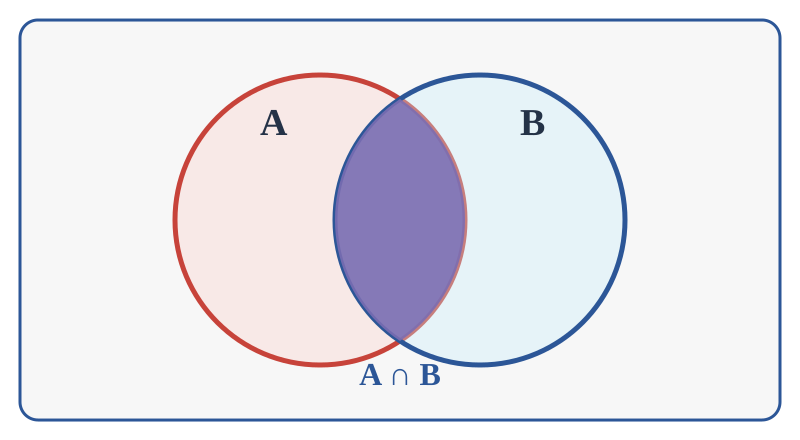
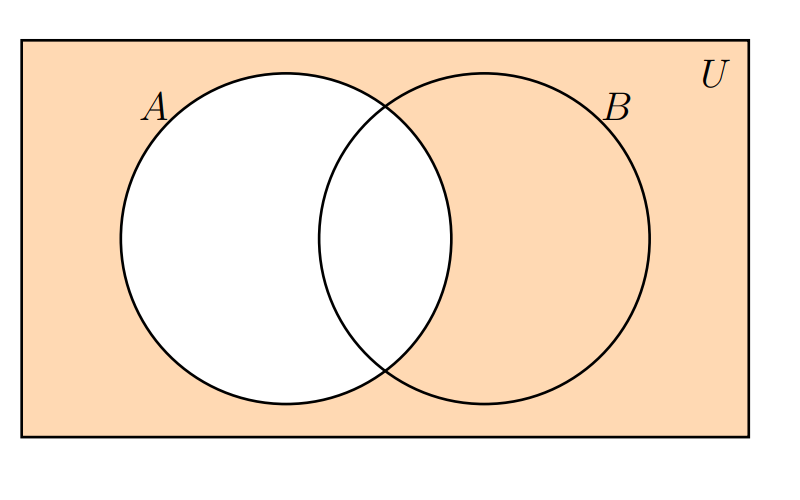
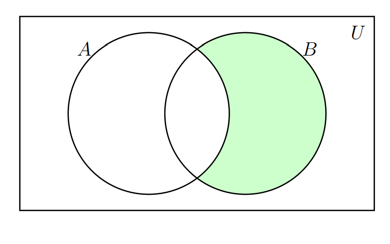

```{r setup, include=FALSE}
knitr::opts_chunk$set(echo = TRUE,comment = NA)


# colores
source("colores.R")


```


```{r, echo=FALSE, out.width="100%", fig.align = "center"}
 knitr::include_graphics("img/recurso0.png")
```


<br/><br/><br/>

# Teoría de conjuntos

<br/><br/>

# Introducción

A continuación se relacionan las principales características de los conjuntos y sus principales relaciones. Estos conceptos serán importantes al abordar los conceptos básicos de probabilidad que se expondrán en el Módulo 2.

Empezaremos con su definición.

<br/><br/>

<div class="box1 with-label">
### Definición de conjunto


Un conjunto es una colección de objetos que se denota con una letra mayúscula (comúnmente las primeras letras del alfabeto A,B,C..) .

</div>

<br/><br/><br/>

Se pueden escribir por:

+ **por extensión** :  $A=\{0,1,2,3,4,5,6,7,8,9\}$, escribiendo todos los elementos que lo conforman.

+ **por su nombre** : los dígitos

+ **por compresión** : $A=\{ x\in\mathbb{Z},  0\le x  \le 9    \}$, utilizando  nomenclatura matemática.

Al  comparar o combinar conjuntos debemos hacer uso de sus propiedades y operaciones, dentro de  las  cuales se encuentran $A \cup B$, $A \cap B$,

<br/><br/><br/>

# Unión del conjunto

La unión del conjunto $A$ con el conjunto $B$ se denota por $A \cup B$. La zona sombreada en la siguiente figura representa esta operación.


```{r, echo=FALSE, out.width="50%", fig.align = "center"}

```


<div class="box1 with-label">
### Ejemplo

Supongamos los siguientes conjuntos

* $A = \{a,e,i,o,u \}$ y
* $B = \{1,2,3,4,5,6,7,8,9,0\}$

$$A \cup B = \{a,e,i,o,u, 1,2,3,4,5,6,7,8,9,0 \}$$


</div>

<br/><br/><br/>

# Intersección

La intersección entre el conjunto $A$ y el $B$ se denota por : $A \cap B$ y se representa por la siguiente zona sombreada


```{r, echo=FALSE, out.width="50%", fig.align = "center"}

```


<br/><br/>

<div class="box1 with-label">

### Ejemplo

Supongamos los siguientes conjuntos:

* $A = \{1,2,3,4,5,6 \}$ y
* $B = \{2,4,6,8,10,12,14,16,18,20 \}$

 $$A \cap B = \{ 2,4,6 \}$$


</div>

<br/><br/><br/>

# Complemento

El complemento del conjunto $A$ se escribe como: $\overline{A}$ y se representa por la siguiente zona sombreada


```{r, echo=FALSE, out.width="50%", fig.align = "center"}

```


<br/><br/>

<div class="box1 with-label">
### Ejemplo

Supongamos los siguientes conjuntos:

* $U = \{0,1,2,3,4,5,6,7,8,9\}$ y
* $A = \{1,2,3,4,5,6\}$.

 $$\overline{A}  = \{0, 7, 8, 9 \}$$

</div>

<br/><br/><br/>

# Resta

La resta del conjunto $B$ menos el conjunto $A$ : $B-A$ , está representada por la zona sombreada en la siguiente figura


```{r, echo=FALSE, out.width="50%", fig.align = "center"}

```


<br/><br/>

<div class="box1 with-label">
### Ejemplo

Supongamos los siguientes conjuntos

* $A = \{1,2,3,4,5,6 \}$ y
* $B = \{2,4,6,8,10,12,14,16,18,20 \}$


$$B-A =\{ 8,10,12,14,16,18,20 \}$$
</div>

<br/><br/>

# Ejercicios propuestos


1. Escriba por extensión los siguientes conjuntos:

(a). $A=\{x\in\mathbb{N}:1\leq x\leq 8\}$.

(b). $B=\{x\in\mathbb{Z}:-3\leq x<4\}$.

(c). $C=\{x\in\mathbb{N}:x\text{ es par y }x<15\}$.

<br/>

2. Sean $A=\{1,2,3,4,5,6\}$ y $B=\{4,5,6,7,8\}$. Calcule $A\cup B$, $A\cap B$, $A-B$ y $B-A$.

<br/>

3. Considere el conjunto universal $U=\{1,2,3,4,5,6,7,8,9,10\}$ y $A=\{2,4,6,8,10\}$. Determine $A^c$ y compruebe que $A\cup A^c=U$.

<br/>

4. Para $D=\{a,b,c\}$, escriba todos sus subconjuntos y determine la cardinalidad del conjunto potencia $\mathcal{P}(D)$.

<br/>

5. En un curso, 28 estudiantes practican fútbol, 18 practican baloncesto y 10 practican ambos deportes. ¿Cuántos practican al menos uno de los dos deportes?

<br/>

6. Sean $U=\{1,2,3,4,5,6,7,8,9\}$, $A=\{1,2,3,4,5\}$ y $B=\{4,5,6,7\}$. Verifique las leyes de De Morgan calculando:

(a). $(A\cup B)^c$ y $A^c\cap B^c$.

(b). $(A\cap B)^c$ y $A^c\cup B^c$.


<br/>

7. Si $A=\{1,2,3\}$ y $B=\{x,y\}$, construya los productos cartesianos $A\times B$ y $B\times A$. ¿Tienen los mismos elementos?

<br/>

8. En una encuesta de 60 personas, 35 consumen café, 30 consumen té y 15 consumen ambas bebidas. Determine cuántas personas consumen solamente café, solamente té y ninguna de las dos bebidas.

<br/>

9. Determine si cada afirmación es verdadera o falsa y justifique su respuesta:

(a). $A\cap B\subseteq A$.

(b). $A\subseteq A\cup B$.

(c). $A-B=B-A$ para cualesquiera conjuntos $A$ y $B$.

(d). $A\cap\varnothing=A$.

<br/>

10. Sean $A=\{2,4,6,8,10,12\}$, $B=\{3,6,9,12\}$ y $C=\{1,2,3,4,5,6\}$. Calcule y represente mediante un diagrama de Venn:

(a). $(A\cup B)\cap C$.

(b). $A\cap(B\cup C)$.

(c). $(A-B)\cup(B-C)$.


<br/><br/>

<div class="box1 with-label">
### Código R

```{r codigo-conjuntos, eval=FALSE}
# Ejercicio 1: construye los conjuntos definidos por comprensión.
A <- 1:8                    # Números naturales entre 1 y 8.
B <- -3:3                   # Números enteros desde -3 hasta 3.
C <- seq(2, 14, by = 2)     # Números pares positivos menores que 15.

# Ejercicio 2: define A y B para efectuar las operaciones básicas.
A <- c(1, 2, 3, 4, 5, 6)
B <- c(4, 5, 6, 7, 8)

union(A, B)                 # Elementos que pertenecen a A o a B.
intersect(A, B)             # Elementos comunes a ambos conjuntos.
setdiff(A, B)               # Elementos de A que no pertenecen a B.
setdiff(B, A)               # Elementos de B que no pertenecen a A.

# Ejercicio 3: calcula el complemento de A respecto del universo U.
U <- 1:10
A <- c(2, 4, 6, 8, 10)
Ac <- setdiff(U, A)

Ac
setequal(union(A, Ac), U)   # Verifica que A unido con su complemento sea U.

# Ejercicio 4: genera el conjunto potencia de un vector x.
conjunto_potencia <- function(x) {
  # Para cada tamaño k, combn() obtiene todos los subconjuntos posibles.
  unlist(
    lapply(
      0:length(x),
      function(k) combn(x, k, simplify = FALSE)
    ),
    recursive = FALSE       # Conserva cada subconjunto como un vector separado.
  )
}

D <- c("a", "b", "c")
P_D <- conjunto_potencia(D)
P_D                         # Muestra todos los subconjuntos de D.
length(P_D)                 # Comprueba que hay 2^3 = 8 subconjuntos.

# Ejercicio 5: aplica el principio de inclusión-exclusión.
futbol <- 28
baloncesto <- 18
ambos <- 10
al_menos_uno <- futbol + baloncesto - ambos

# Ejercicio 6: define el universo y los conjuntos para verificar De Morgan.
U <- 1:9
A <- 1:5
B <- 4:7

# Comprueba que el complemento de la unión sea la intersección de complementos.
setequal(
  setdiff(U, union(A, B)),
  intersect(setdiff(U, A), setdiff(U, B))
)

# Comprueba que el complemento de la intersección sea la unión de complementos.
setequal(
  setdiff(U, intersect(A, B)),
  union(setdiff(U, A), setdiff(U, B))
)

# Ejercicio 7: construye los productos cartesianos en ambos órdenes.
A <- c(1, 2, 3)
B <- c("x", "y")
AxB <- expand.grid(A = A, B = B)
BxA <- expand.grid(B = B, A = A)

# Ejercicio 8: separa los resultados de la encuesta por regiones del diagrama.
total <- 60
cafe <- 35
te <- 30
ambas <- 15

solo_cafe <- cafe - ambas
solo_te <- te - ambas
ninguna <- total - (cafe + te - ambas)

# Ejercicio 9: una función auxiliar comprueba si A es subconjunto de B.
es_subconjunto <- function(A, B) all(A %in% B)

es_subconjunto(intersect(A, B), A)       # A intersección B está contenido en A.
es_subconjunto(A, union(A, B))           # A está contenido en A unión B.
setequal(setdiff(A, B), setdiff(B, A))    # Evalúa si A-B y B-A son iguales.
setequal(intersect(A, numeric(0)), A)     # Evalúa si A intersección vacío es A.

# Ejercicio 10: redefine A, B y C y resuelve las operaciones combinadas.
A <- c(2, 4, 6, 8, 10, 12)
B <- c(3, 6, 9, 12)
C <- 1:6

intersect(union(A, B), C)                 # (A unión B) intersección C.
intersect(A, union(B, C))                 # A intersección (B unión C).
union(setdiff(A, B), setdiff(B, C))       # (A-B) unión (B-C).
```

</div>
