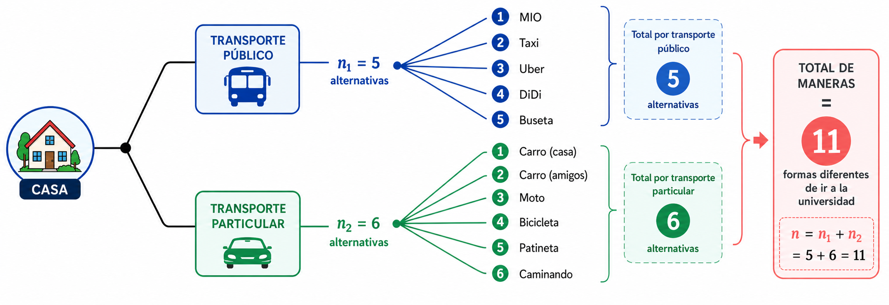

```{r setup, include=FALSE}
knitr::opts_chunk$set(echo = TRUE,comment = NA)


# colores
source("colores.R")


```


```{r, echo=FALSE, out.width="100%", fig.align = "center"}
 knitr::include_graphics("img/recurso0.png")
```


</br>

# Técnicas de conteo

<br/><br/>

>Las técnicas de conteo constituyen una serie de estrategias que permiten, mediante reglas, establecer el número de elementos de un conjunto finito.

Inicialmente empezaremos por definir dos reglas:

<br/><br/>

<div class="box0 with-label">
### Principio de la adicción

Supongamos que un procedimiento, designado con $P_1$, se puede hacer de $n_1$ maneras diferentes. Supongamos que un segundo procedimiento, $P_2$, se puede realizar de $n_2$ maneras diferentes. Además, los dos procedimientos no se pueden realizar juntos. Entonces, el número de formas diferentes de realizar $P_1$ o $P_2$ es $n_1+n_2$.

</div>

<br/><br/>


<div class="box0 with-label">

### Ejemplo

Un estudiante tiene dos posibilidades de ir de su casa a la universidad: En transporte público o en transporte particular. Para el caso del transporte público existen 5 alternativas. Para el caso de transporte particular tienen 6 alternativas. En este caso $n_{1}=5$ y $n_{2}=6$. El número de maneras como se puede transportar de la casa a la universidad será $n=n_{1}+n_{2}=11$ formas diferentes de ir a la U.


<br/>


```{r, echo=FALSE, out.width="100%", fig.align = "center"}

```

</div>

<br/><br/><br/>

<div class="box0 with-label">
### Principio de la multiplicación

Supongamos que un procedimiento $P_1$ se puede realizar de $n_1$ maneras diferentes y que otro procedimiento $P_2$ se puede realizar de $n_2$ maneras diferentes. Si los procedimientos se realizan uno después del otro, el número de formas diferentes de realizar $P_1$ y $P_2$ consecutivamente es $n_1\times n_2$.

</div>

<br/><br/>


<div class="box0 with-label">

### Ejemplo

En el proceso de fabricación de una silla se diferencian las siguientes etapas: El diseño de la silla ($P_{1}$) y el proceso de pintado ($P_{2}$). El proceso $P_{1}$ se puede realizar de 3 formas diferentes. Para el proceso $P_{2}$ se puede optar por 4 formas diferentes. ¿De cuántas formas diferentes se puede construir una silla?


<br/><br/>

El número de posibles formas como puede fabricar una silla será:  $n_{1} \times n_{2} = 3 \times 4 = 12$


```{r, echo=FALSE, out.width="100%", fig.align = "center"}
knitr::include_graphics("img/pmultiplicacion1.png")
```

</div>


<br/><br/>

# Otras técnicas de conteo

Para explicar un poco los otros casos de conteo utilizaremos el siguiente experimento aleatorio:

Se tiene una urna  que contiene $n$ elementos todos numerables ( se pueden contar) y de ellos se quiere seleccionar $k$ elementos como se muestra en  la siguiente figura.

<br/><br/>


```{r, echo=FALSE, out.width="35%", fig.align = "center"}

```

<br/><br/>

Este procedimiento se puede realizar de varias  formas:

A. Cuando importa el orden

+ $\mathcal{P}'(n,k)$ Con repetición o también llamada con sustitución

+ $\mathcal{P}(n,k)$ Sin repetición o sin sustitución

B. Sin importar el  orden

+ $\mathcal{C}'(n,k)$ Con repetición o también llamada con sustitución

+ $\mathcal{C}(n,k)$ Sin repetición o sin sustitución

<br/><br/>

Es decir que se definen  los siguientes procedimientos:

**A1** : $\mathcal{P}'(n,k)$: Conjunto formado por todas las manera posible como se puede seleccionar una  muestra de tamaño k de una urna que contiene n elementos cuando importa el orden, con  sustitución. En este procedimiento se hace diferencia de la posición que tienen los elementos al ser seleccionados y también que después de  la extracción de un elemento, este se regresa  a la urna antes  de  la siguiente selección. Esto implica que hay siempre en la urna n  elementos antes de la cada selección.

<br/><br/>

**A2** : $\mathcal{P}(n,k)$: Conjunto de todas la formas posibles como se puede seleccionar una muestra de tamaño k de una urna que  contiene n elementos cuando importa el orden, sin  sustitución. En este caso los elementos que son  seleccionados van  quedando por fuera de  la urna  y no participan en la siguiente selección.

<br/><br/>
**B1** : $\mathcal{C}'(n,k)$: Conjunto de  todas las maneras  posible como se puede  seleccionar una  muestra de tamaño k de una urna que contiene n  elementos sin importar el orden pero con  sustitución. En  esta  caso  no  tiene importancia el orden en que se seleccionan los elementos de la urna, pero  los elementos seleccionados  regresan  a  la  urna y podrían se seleccionados nuevamente.

<br/><br/>

**B2** : $\mathcal{C}(n,k)$: Conjunto  de  todas  las formas posibles como se puede selecciona una  muestra de tamaño k de una  urna que contiene n elementos, sin importar el  orden, pero en este caso los elementos seleccionados previamente son excluidos de la siguiente selección.

<br/><br/>

Contemplados estos casos vamos a definir la  forma  en  que se pueden contar  los conjuntos anteriores

<br/><br/>


<div class="box0 with-label">
### Importa el orden con sustitución

$$\mathcal{P}^{\prime}(n,k) = \underbrace{n \times n \times \cdots \times n}_{k\text{ factores}} = n^k$$

El número de maneras diferentes de extraer una muestra de tamaño $k$ de una urna con $n$ elementos, cuando importa el orden y hay sustitución, es $n^k$.

</div>

<br/><br/>


<div class="box0 with-label">
### Importa el orden sin sustitución

$$\mathcal{P}(n,k) = n \times (n-1) \times (n-2) \times \cdots \times (n-k+1) = \dfrac{n!}{(n-k)!}$$

El número de maneras diferentes de extraer una muestra de tamaño $k$ de una urna con $n$ elementos, cuando importa el orden y no hay sustitución, es $\dfrac{n!}{(n-k)!}$, que se lee «$n$ permutado con $k$».

</div>

<br/><br/>


Un ingeniero debe realizar visitas a 6 áreas de trabajo diferentes durante el día. A fin de impedir que los funcionarios sepan cuándo realizará su visita, varía el orden de sus visitas. ¿De cuántas maneras puede hacerlo?


<br/><br/>

$$ _{6}\mathcal{P}_{6} = \dfrac{6!}{(6-6)!}=6! =720$$

<br/><br/>

<div class="box0 with-label">
### No importa el orden sin  sustitución

$$\mathcal{C}(n,k) = \dfrac{n!}{(n-k)! k!}= \binom{n}{k}$$

El número de maneras diferentes de extraer una muestra de tamaño $k$ de una urna que contiene $n$ elementos, sin importar el orden y sin sustitución, es $\binom{n}{k}$, que se lee «$n$ combinado con $k$».

</div>

<br/><br/>


El juego del Baloto está conformado por una urna que contiene 45 bolas numeradas del 1 al 45. ¿De cuántas formas diferentes puede salir el resultado de un sorteo?


 <br/><br/>

De las 45 bolas se eligen 6 sin importar el orden y sin que ninguna de las bolas se repita. Este experimento cumple con las condiciones de una combinación.

El número de formas diferentes como se puede salir el resultado del Baloto será:

$$_{45}\mathcal{C}_{6} = \binom{45}{6}=8'145,060$$

<br/><br/>

<div class="box0 with-label">
### No importa el orden con sustitución

$$\mathcal{C}^{\prime}(n,k) = \binom{n+k-1}{k}$$

El número de maneras diferentes de extraer una muestra de tamaño $k$ de una urna con $n$ elementos, sin importar el orden y con sustitución, es $\binom{n+k-1}{k}$.

</div>

<br/><br/>

# Problemas propuestos

1. ¿Cuántos números de 4 dígitos se pueden formar con los dígitos 0, 1, 2, 3, 4, 5, 6 y 7, permitiendo su repetición?
  a. ¿Cuántos de los anteriores números son impares?
  b. ¿Cuántos son mayores o iguales a 1420?

<br/><br/>

2. ¿Cuántas placas para automóvil pueden ser diseñadas si deben contener tres letras (mayúsculas)    seguidas de tres dígitos?

a.  Si es posible repetir letras y números.
b.  No es posible repetir letras y números.
c. ¿Cuántas de las placas diseñadas en el punto (b)  empiezan por la letra K y termina en   cero,
d. ¿Cuántas de las placas diseñadas en el inciso (a) empiezan por la letra K seguida de la L.

<br/><br/>

3.   ¿Cuántos números telefónicos móviles es posible diseñar, si una de las líneas debe constar de siete dígitos?,

a. Considere que todos los números empiezan con 300.
b. El número empieza por 312 y no es posible repetir dígitos.
c. ¿Cuántos de los números telefónicos del inciso (b) terminan  en  siete?.
d. ¿Cuántos de los números telefónicos del inciso (b) forman un número impar?.

<br/><br/>

4. ¿Cuántas maneras diferentes hay de asignar las posiciones de salida de 8 autos que participan en una carrera de fórmula uno? (Considere que las posiciones de salida de los autos.  participantes en la carrera son dadas totalmente al azar), ¿Cuántas maneras diferentes hay de asignar los primeros tres premios de esta carrera de   fórmula uno?

<br/><br/>

5. En la configuración de un sistema de cómputo, para que la empresa lo use en su departamento de control de calidad, un ingeniero tiene cuatro opciones de computadora: IVM, VAX, QELL, o PH. Hay seis marcas de monitores: M1, M2, M3, M4, M5 y M6; y tres tipos de impresoras gráficas: P1, P2 y P3.

a. Si todo el equipo es compatible, ¿en cuántas formas puede diseñarse el sistema?
b. Si el ingeniero necesita usar un paquete de software estadístico que está disponible solo para equipos IVM o QELL, ¿de cuántas maneras puede configurar el sistema?

<br/><br/>

6. Se realizarán pruebas con cinco recubrimientos usados en la protección de cables de fibra óptica contra el frío extremo. Las pruebas se efectuarán en orden aleatorio.

a. ¿En cuántos órdenes pueden llevarse a cabo las pruebas?
b. Si dos de los recubrimientos son de un fabricante, ¿de cuántas maneras se puede presentar que las pruebas de esos recubrimientos se realicen una después de la otra?

<br/><br/>

7. Una multinacional  tiene 10 ingenieros industriales, ocho economistas, cuatro administradores y tres contadores. Se elegirá un equipo para un nuevo proyecto de largo plazo. El equipo estará formado por tres ingenieros industriales, dos economistas, dos administradores y un contador.

a. ¿En cuántas formas puede seleccionarse el equipo?
b. Si el gerente insiste en que se incluya en el proyecto a un ingeniero industrial con el que ha trabajado anteriormente, ¿de cuántas maneras puede seleccionarse al equipo?

<br/><br/>

8. El Departamento de Ingeniería Industrial de una Universidad tiene 10 profesores Ph.D. De estos, cuatro son mujeres y seis hombres. Todos cuentan con las capacidades necesarias para ser elegidos como coordinadores de las 3 áreas con que cuenta el Departamento. En una selección aleatoria de 3 de estos profesores.

a. ¿Cuál es la probabilidad que en el grupo no haya mujeres?
b. ¿Es  lógico pensar que ninguna mujer sea elegida  bajo tales circunstancias?

<br/><br/>

9. En un plano hay 10 puntos denominados A, B, C, D, E, F, G, H, J, K. en una misma línea no hay más de dos puntos.
a. ¿Cuántos triángulos pueden ser trazados a partir de los puntos?
b. ¿Cuántos de los triángulos contienen el punto A?
c. ¿Cuántos de los triángulos tienen el lado AB?.

<br/><br/>

10. Supongamos que el CSI de la universidad le pide construya una contraseña que consista en cinco letras seguidas de un dígito.
a. ¿Cuántas contraseñas son posibles?
b. ¿Cuántas contraseñas incluyen tres A y dos B, además de terminar en dígito par?
c. Si olvida completamente la contraseña y recuerda que tiene las características descritas en el párrafo b, ¿cuál es la probabilidad de que adivine correctamente en el primer intento?

Problemas tomados y basados en  Meyer(1986)

<br/><br/>


<div class="box6 with-label">
### Código R


```{r codigo-conteo, eval=FALSE}
# Funciones auxiliares para aplicar directamente las fórmulas de conteo.
# nPk calcula permutaciones sin repetición: n factorial dividido entre (n-k) factorial.
nPk <- function(n, k) {
  # Verifica que n y k sean valores admisibles.
  stopifnot(n >= 0, k >= 0, k <= n)
  factorial(n) / factorial(n - k)
}

# nCk calcula combinaciones sin repetición.
nCk <- function(n, k) {
  stopifnot(n >= 0, k >= 0, k <= n)
  choose(n, k)
}

# nHk calcula combinaciones con repetición mediante C(n+k-1, k).
nHk <- function(n, k) {
  stopifnot(n >= 1, k >= 0)
  choose(n + k - 1, k)
}

# 1. Números de cuatro dígitos con 0, 1, ..., 7.
# El primer dígito tiene 7 opciones y cada posición restante tiene 8.
total_cuatro_digitos <- 7 * 8^3
impares <- 7 * 8^2 * 4  # El último dígito debe ser 1, 3, 5 o 7.

# Genera candidatos y verifica que todos sus dígitos estén entre 0 y 7.
numeros_validos <- 1000:7777
digitos_validos <- vapply(
  strsplit(as.character(numeros_validos), ""),
  function(d) all(as.integer(d) <= 7),
  logical(1)
)
mayores_iguales_1420 <- sum(digitos_validos & numeros_validos >= 1420)

# Cuenta los candidatos válidos que cumplen también el límite inferior.
# 2. Placas con tres letras y tres dígitos.
# Con repetición, cada letra tiene 26 opciones y cada dígito tiene 10.
placas_con_repeticion <- 26^3 * 10^3

# Sin repetición, se usan permutaciones para letras y dígitos.
placas_sin_repeticion <- nPk(26, 3) * nPk(10, 3)

# Fija K al inicio y 0 al final; cuenta las posiciones restantes.
placas_sin_repeticion_K_final_0 <- 25 * 24 * 9 * 8

# Fija K y L; deja libre la tercera letra y los tres dígitos.
placas_con_repeticion_KL <- 26 * 10^3

# 3. Números telefónicos: cuatro dígitos libres después del prefijo.
# Con el prefijo 300, cada dígito restante tiene 10 opciones.
telefonos_prefijo_300 <- 10^4

# El prefijo 312 deja siete dígitos disponibles para cuatro posiciones.
telefonos_prefijo_312_sin_repetir <- nPk(7, 4)

# Fija el 7 al final y ordena tres de los seis dígitos restantes.
telefonos_312_terminados_7 <- nPk(6, 3)

# Hay tres finales impares posibles y P(6,3) formas de llenar las otras posiciones.
telefonos_312_impares <- 3 * nPk(6, 3)

# 4. Ordena los ocho autos y asigna por separado los tres premios.
ordenes_salida <- factorial(8)
primeros_tres_premios <- nPk(8, 3)

# 5. Aplica el principio multiplicativo a computador, monitor e impresora.
configuraciones_totales <- 4 * 6 * 3

# El software restringe a dos las opciones de computador.
configuraciones_software <- 2 * 6 * 3

# 6. Ordena las cinco pruebas.
ordenes_pruebas <- factorial(5)

# Considera los dos recubrimientos como un bloque; el factor 2 cambia su orden.
recubrimientos_juntos <- 2 * factorial(4)

# 7. Multiplica las combinaciones correspondientes a cada profesión.
equipos <- nCk(10, 3) * nCk(8, 2) * nCk(4, 2) * nCk(3, 1)

# Fija un ingeniero y elige dos de los nueve restantes.
equipos_con_ingeniero_fijo <-
  nCk(9, 2) * nCk(8, 2) * nCk(4, 2) * nCk(3, 1)

# 8. Divide los casos favorables de tres hombres entre todos los grupos de tres.
probabilidad_sin_mujeres <- nCk(6, 3) / nCk(10, 3)

# 9. Cada triángulo se determina eligiendo tres puntos.
triangulos <- nCk(10, 3)

# Fija A y selecciona los otros dos vértices.
triangulos_con_A <- nCk(9, 2)

# Fija el lado AB y selecciona uno de los ocho puntos restantes.
triangulos_con_lado_AB <- 8

# 10. Cuenta cinco letras con repetición y un dígito final.
contrasenas_totales <- 26^5 * 10

# Elige las posiciones de las tres A y uno de los cinco dígitos pares.
contrasenas_tres_A_dos_B_par <- nCk(5, 3) * 5

# Solo una de las contraseñas posibles es la correcta.
probabilidad_primer_intento <- 1 / contrasenas_tres_A_dos_B_par

# Agrupa todos los resultados para mostrarlos en una sola salida.
list(
  total_cuatro_digitos = total_cuatro_digitos,
  impares = impares,
  mayores_iguales_1420 = mayores_iguales_1420,
  placas_con_repeticion = placas_con_repeticion,
  placas_sin_repeticion = placas_sin_repeticion,
  placas_sin_repeticion_K_final_0 = placas_sin_repeticion_K_final_0,
  placas_con_repeticion_KL = placas_con_repeticion_KL,
  telefonos_prefijo_300 = telefonos_prefijo_300,
  telefonos_prefijo_312_sin_repetir = telefonos_prefijo_312_sin_repetir,
  telefonos_312_terminados_7 = telefonos_312_terminados_7,
  telefonos_312_impares = telefonos_312_impares,
  ordenes_salida = ordenes_salida,
  primeros_tres_premios = primeros_tres_premios,
  configuraciones_totales = configuraciones_totales,
  configuraciones_software = configuraciones_software,
  ordenes_pruebas = ordenes_pruebas,
  recubrimientos_juntos = recubrimientos_juntos,
  equipos = equipos,
  equipos_con_ingeniero_fijo = equipos_con_ingeniero_fijo,
  probabilidad_sin_mujeres = probabilidad_sin_mujeres,
  triangulos = triangulos,
  triangulos_con_A = triangulos_con_A,
  triangulos_con_lado_AB = triangulos_con_lado_AB,
  contrasenas_totales = contrasenas_totales,
  contrasenas_tres_A_dos_B_par = contrasenas_tres_A_dos_B_par,
  probabilidad_primer_intento = probabilidad_primer_intento
)
```


</div>


