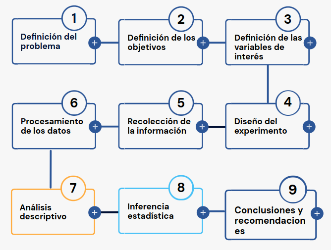

---
title: <span style="color:#f9ceca"> </span>  
author: <span style="color:#f9ceca">dgonzalez</span> 
subtitle: <span style="color:#f9ceca"> </span> 
output:
  html_document:
    toc: no 
    toc_depth: 2
    toc_float: yes
    code_folding: hide
    theme: flatly
    css:
      - style.css
      - cajas.css
---  

```{r setup, include=FALSE}
knitr::opts_chunk$set(echo = TRUE, message = FALSE, warning = FALSE, comment = NA)
library(psych)
library(summarytools)

# install.packages("devtools")
#devtools::install_github("dgonxalex80/paqueteDEG")
#library(paqueteDEG)

## colores
source("colores.R")

# install.packages('gtools')
# install.packages("TeachingSampling")

#load library
#library(gtools)
#library(TeachingSampling)
#library(readr)
#base_muestreo <- read_delim("data/base_muestreo.csv", 
#    delim = ";", escape_double = FALSE, col_types = cols(ID = col_integer()), 
#    trim_ws = TRUE)


```

```{r, echo=FALSE, out.width="100%", fig.align = "center"}

```
<br/><br/>


# Introducción

<br/>

En esta unidad se presenta la **Metodología Estadística** como estrategia que permite visualizar las diferentes etapas presentes en una investigación o análisis de datos:

<br/><br/>


```{r, echo=FALSE, out.width="70%", fig.align = "center"}

```

<br/><br/>


También se hará especial referencia a la construcción, depuración y documentación de las bases de datos, acciones necesarias para un buen análisis de datos.

Con este propósito se hará uso del portal **Bases de Datos Abiertos**,  del lenguaje **R** y su IDE **RStudio**.

<br/><br/>

# Objetivos de la unidad

<br/>

Al finalizar la unidad los estudiantes estarán en capacidad de RECONOCER los pasos de la Metodología Estadística y podrán ESTRUCTURAR, LIMPIAR y DOCUMENTAR una base de datos con el fin de garantizar los elementos necesarios para realizar un procesamiento de datos. Para ello seleccionarán una base de datos. Adicionalmente propondrán un problema que les permita el desarrollo de la metodología estadística. 

<br/><br/>

# Duración

<br/>

La presente unidad será desarrollada durante la primera semana del semestre. Además del material suministrado se podrá contar con el acompañamiento del profesor en dos sesiones y una tercera sesión con apoyo de un monitor. Los documentos requeridos para esta unidad deberán ser entregados a través de la plataforma **Brightspace** hasta el 4 de agosto.

Para alcanzar los objetivos planteados se propone realizar las siguientes actividades:

<br/><br/>

# Cronograma de trabajo

<br/>

|Actividad111   | Descripción                    |
|:--------------|:-----------------------------  |
|Individual     | **Metodología estadística:** Formular un problema que le permita desarrollar un ejercicio académico durante el semestre a través de la recolección de información (primaria o secundaria), además de establecer los objetivos y las variables de interés asociadas en dicho problema e identificar el tipo de variable y su escala de medición. El resultado de esta actividad deberá ser entregado en **archivo en formato pdf** con nombre: **actividad111.pdf** en enlace ubicado en la plataforma Bs |
| Fecha         | 4  de agosto de 2026 |
| Hora          | 23:59 hora local    |

<br/> 

|Actividad112   | Descripción                    | 
|:--------------|:-----------------------------  |
|Individual     | **Base de datos**: Cada estudiante deberá buscar una base de datos de su interés, depurarla y documentarla si es necesario. A partir de la información recolectada deberá construir la ficha técnica de la base. El resultado de esta actividad deberá ser entregado en **archivo en formato pdf** con nombre: **actividad112.pdf** |
| Recurso       | Video: [**Cómo descargar datos abiertos**](https://youtu.be/lRftK2mL3Sw)
|               | Formato ficha : **Ficha técnica** |
|               | Excel |
|               | RStudio |
|Fecha          | 4 de agosto 2026 |
|Hora           | 23:59 hora local |

<br/> 

|Actividad113   | Descripción                    | 
|:--------------|:-----------------------------  |
|Individual     | **Instalación de R y RStudio**: Para el desarrollo de las actividades del curso deberán instalar [R CRAN](https://www.r-project.org/) y [RStudio](https://rstudio.com/). Para su correcta instalación existen varios videos en YouTube que le permitirán realizarlo de una manera correcta |
|Recursos       | [Descargar e instalar R y RStudio 2021 -Video Rafa Gonzalez Gouveia](https://www.youtube.com/watch?v=Nmu4WPdJBRo) |
|               | [R download](https://cran.r-project.org/) |
|               | [RStudio download](https://rstudio.com/products/rstudio/download/) |
| Fecha         | 4 de agosto 2026 |
| Hora          | 23:59 hora local |

<br/><br/>

# Criterios de evaluación

<br/>

* Reconocer la relación existente entre la definición del problema, el planteamiento de los objetivos y la definición de las variables de interés dentro de la Metodología Estadística.

* Reconocer e identificar los diferentes tipos de variables  y sus respectivas escalas de medición.

* Identificar la estructura de una base de datos

 
<br/><br/>

# Entregables 

<br/>

| Entregable |  Descripción                    |
|:--------------|:-----------------------------|
|**actividad111.pdf** | Documento que contenga: formulación de problema propuesto, definición de los objetivos y definición de variables de interés. En este último caso detallar para cada variable su tipo (cualitativa o cuantitativa) y su escala de medición (nominal, ordinal, de intervalo o de razón).|
|**actividad112.pdf**| Ficha técnica de  la base seleccionada |
|||
|**Fecha** | 4 de agosto 2026 |
|**Hora límite**| 23:59 hora local|
|||


<br/><br/>

# Ficha técnica

<div class="ficha-tecnica">

<p class="ficha-intro">Complete la siguiente información para describir de manera clara la base de datos seleccionada.</p>

<div class="ficha-campo">
<h3>Título de la base de datos</h3>
<p class="ficha-ayuda">Escriba un título breve que permita identificarla.</p>
<div class="linea-respuesta"></div>
</div>

<div class="ficha-campo">
<h3>Concepto o contexto</h3>
<p class="ficha-ayuda">Explique el tema que aborda la base de datos y su propósito.</p>
<div class="area-respuesta"></div>
</div>

<div class="ficha-grid">
<div class="ficha-campo">
<h3>Población</h3>
<p class="ficha-ayuda">Grupo del cual se obtuvo la información.</p>
<div class="linea-respuesta"></div>
</div>

<div class="ficha-campo">
<h3>Tamaño de la muestra</h3>
<p class="ficha-ayuda">Número de observaciones registradas.</p>
<div class="linea-respuesta"></div>
</div>

<div class="ficha-campo">
<h3>Instrumento de recolección</h3>
<p class="ficha-ayuda">Por ejemplo: encuesta, formulario, planilla o registro administrativo.</p>
<div class="linea-respuesta"></div>
</div>

<div class="ficha-campo">
<h3>Ubicación espacio-temporal</h3>
<p class="ficha-ayuda">Lugar y periodo en los que se recogió la información.</p>
<div class="linea-respuesta"></div>
</div>
</div>

<div class="ficha-campo">
<h3>Unidad estadística</h3>
<p class="ficha-ayuda">Persona, objeto o entidad de la cual se obtiene cada observación.</p>
<div class="linea-respuesta"></div>
</div>

<div class="ficha-variables">
<h3>Descripción de las variables</h3>
<p>Registre el nombre de cada variable, su tipo y su escala de medición.</p>
<table>
<colgroup>
<col class="variable-nombre" />
<col class="variable-tipo" />
<col class="variable-escala" />
</colgroup>
<thead>
<tr>
<th>Nombre de la variable</th>
<th>Tipo de variable</th>
<th>Escala de medición</th>
</tr>
</thead>
<tbody>
<tr><td></td><td></td><td></td></tr>
<tr><td></td><td></td><td></td></tr>
<tr><td></td><td></td><td></td></tr>
<tr><td></td><td></td><td></td></tr>
<tr><td></td><td></td><td></td></tr>
<tr><td></td><td></td><td></td></tr>
<tr><td></td><td></td><td></td></tr>
<tr><td></td><td></td><td></td></tr>
</tbody>
</table>
</div>

<div class="ficha-firma">
<strong>Nombre del estudiante</strong>
<div class="linea-respuesta"></div>
</div>

</div>
