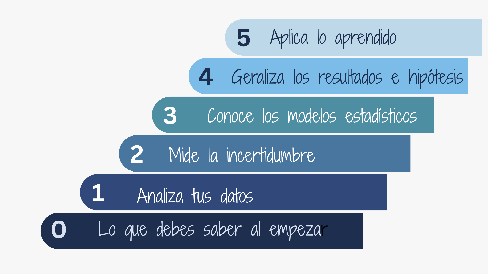
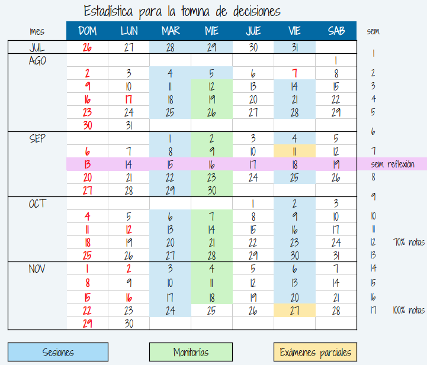
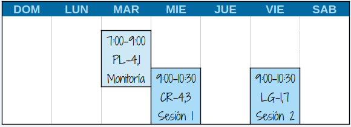
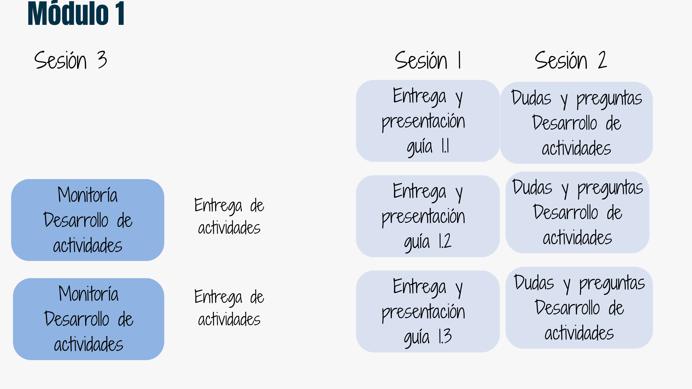
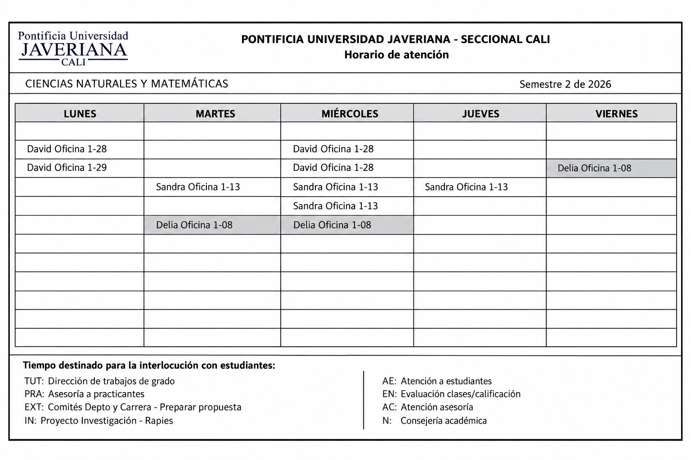

  

```{r setup, include=FALSE}
knitr::opts_chunk$set(echo = TRUE, comment = NA)
# colores
source("colores.R")
```


```{r, echo=FALSE, out.width="100%", fig.align = "center"}

```


<br/><br/>

## Módulos


```{r, echo=FALSE, out.width="70%", fig.align = "center"}

```

<br/><br/>

## Cronograma


```{r, echo=FALSE, out.width="70%", fig.align = "center"}

```


<br/><br/>

## Salones de clase


```{r, echo=FALSE, out.width="50%", fig.align = "center"}
 
```


<br/><br/>

## Metodología

```{r, echo=FALSE, out.width="70%", fig.align = "center"}

```


<br/><br/>

#### Profesor : Daniel Enrique González

correo : dgonzalez@javerianacali.edu.co

<br/><br/>

#### Monitor : Juan David Naranjo Zapata

<br/><br/>


<br/><br/>

## Atención estudiantes

```{r, echo=FALSE, out.width="100%", fig.align = "center"}
# 
```


<br/><br/>


<br/><br/>

## Supletorios


```{r, echo=FALSE, out.width="100%", fig.align = "center"}
# knitr::include_graphics("img/supletorios2.png")
```


 
 
