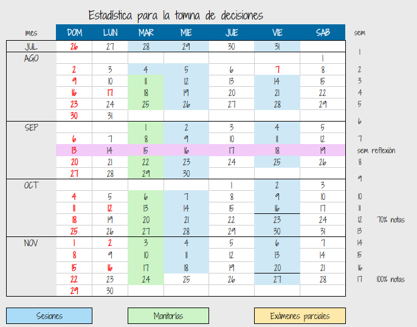
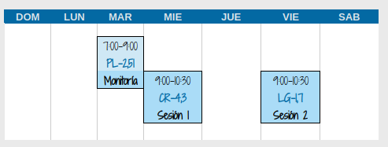

  

```{r setup, include=FALSE}
knitr::opts_chunk$set(echo = TRUE, comment = NA)
# colores
source("colores.R")
```


```{r, echo=FALSE, out.width="100%", fig.align = "center"}
knitr::include_graphics("img/estadistica.png")
```


<br/><br/>


<div class="box6 with-label">

## Empieza aquí

Este es un curso con metodología de **AULA INVERTIDA**. Antes de cada sesión se recomienda revisar la guía y los recursos de la unidad, realizar la práctica indicada y registrar tus dudas. En la sesión de clase aplicaremos lo estudiado a problemas y datos reales.

En el Módulo 0 podrá encontrar temas prerrequisitos para abordar los temas de los módilos del curso.
<br/>

Cada unidad estará acompañada de :

* **Guia** : recoge las orientaciones relacioandas con el objetivo, actividades a realizar y fechas de ejecución y entrega de las actividades.
* **Recurso** : contiene los temas de la unidad acopañado de ejemplos  
* **Código** : contiene códigos y ejemplos con sus respectivas sintaxis

</div>


<br/><br/>

El trabajo de cada unidad sigue esta secuencia:

1. **Antes de la sesión 1:** lee la guía, estudia el recurso, ejecuta los ejemplos y anota tus dudas.
2. **Monitoría:** sesión de acompañamiento por un monitor en el desarrollo de las actividades propuestas.
2. **Durante la sesión 2:** contrasta tus ideas, resuelve problemas, recibe retroalimentación y aplica los conceptos.
3. **Después de la sesión 2:** corrige tu trabajo, completa la actividad y entrega la evidencia por el canal indicado en la guía y en Brightspace.

Las fechas, los formatos y los criterios específicos se consultan siempre en la **guía de la unidad**. 


<br/><br/>

<div class="box6 with-label">
## Módulos


```{r, echo=FALSE, out.width="70%", fig.align = "center"}
knitr::include_graphics("img/modulos.png")
```

</div>

<br/><br/>

<div class="box6 with-label">
## Cronograma


```{r, echo=FALSE, out.width="70%", fig.align = "center"}

```
</div>

<br/><br/>


<div class="box6 with-label">
## Salones de clase


```{r, echo=FALSE, out.width="50%", fig.align = "center"}
 
```
</div>

<br/><br/>

<div class="box6 with-label">
## Metodología

```{r, echo=FALSE, out.width="70%", fig.align = "center"}
# knitr::include_graphics("img/metodologia.png")
```
</div>


<br/><br/>

#### Profesor : Daniel Enrique González

correo : dgonzalez@javerianacali.edu.co

<br/><br/>

#### Monitor : Jeison David de Vuijst

<br/><br/>


<br/><br/>

<div class="box6 with-label">
## Atención estudiantes

```{r, echo=FALSE, out.width="100%", fig.align = "center"}
# knitr::include_graphics("img/atencion.png")
```
</div>

<br/><br/>


<br/><br/>

<div class="box6 with-label">
## Supletorios

```{r, echo=FALSE, out.width="100%", fig.align = "center"}
# knitr::include_graphics("img/supletorios2.png")
```

</div>


 
 
