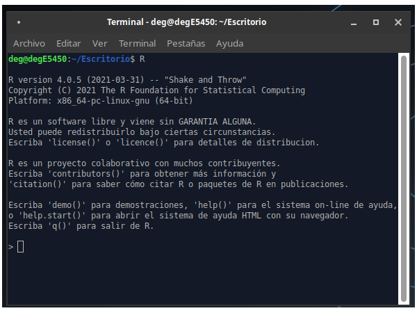
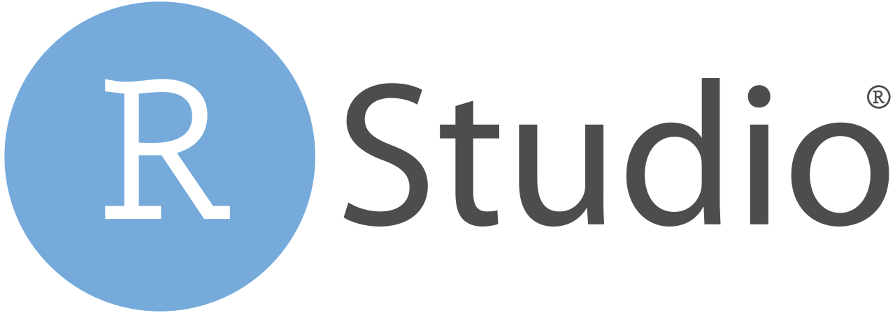
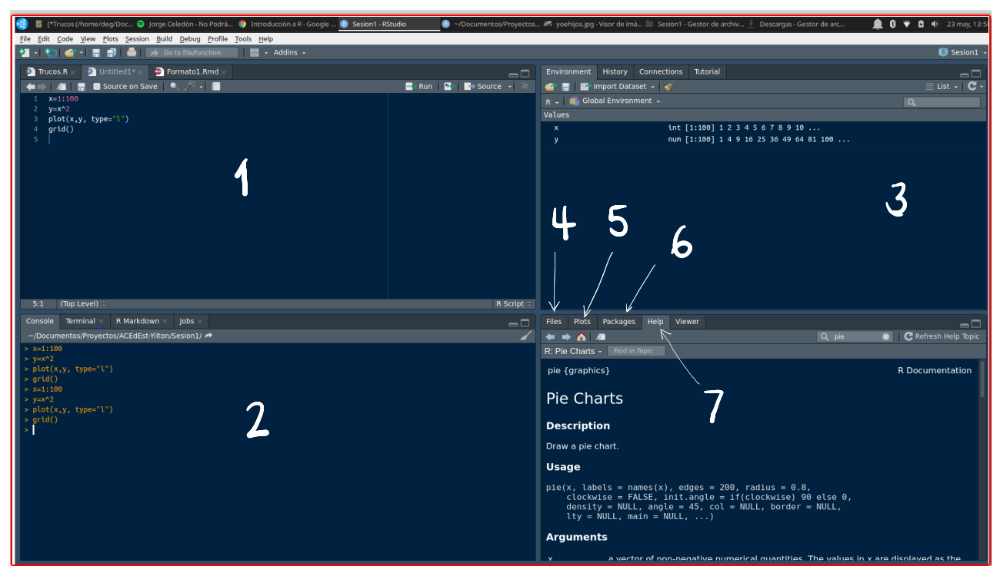

  

```{r setup, include=FALSE}
knitr::opts_chunk$set(echo = TRUE)

# colores
source("colores.R")
```


```{r, echo=FALSE, out.width="100%", fig.align = "center"}
 
```


<br/><br/>

# Introducción a  "R"

<br/><br/>

## Qué es R 

Es un lenguaje para la computación estadística, utilizado para el procesamiento de información y la generación de modelos. Entre las principales características están:

   + Licencia (GNU GPL) abierta y gratuita
   
   + Creciente popularidad en ciencia de datos
   
   + Multiplataforma (UNIX, Windows, macOS)
   
   + Ross Ihaka y Robert Gentleman (U. Auckland - Nueva Zelanda), 1993

   + Lenguaje multiparadigma
   
   + Código construido en C y Fortran
   
   + Gran comunidad muy activa 
   
   + Más de 7000 paquetes 
   


```{r, echo=FALSE, out.width="70%", fig.align = "center"}

```


En el siguiente enlace se pueden obtener los archivos para su instalación: https://www.r-project.org/


Podemos usar este lenguaje utilizando una terminal o mediante un entorno de desarrollo integrado (IDE) como **RStudio**, que integra herramientas para escribir, ejecutar y organizar proyectos en R.

Una forma sencilla de recordarlo: **R es el lenguaje**, y **RStudio es el programa** (IDE) donde escribimos y ejecutamos el código con mayor comodidad.


```{r, echo=FALSE, out.width="20%", fig.align='left'}

```


Esta interfaz está conformada por varias ventanas, como se muestra en la siguiente imagen:



1. Fuente (Source): ventana donde se trabajan los scripts con código que se guardan para posterior utilización.
2. Consola (Console): ventana donde se pueden escribir comandos de manera directa.
3. Ambiente (Environment): ventana donde se pueden observar las variables y objetos creados.
4. Archivos (Files): ventana que muestra el directorio y los archivos en el que estamos trabajando.
5. Gráficos (Plots): ventana que presenta los gráficos construidos.
6. Paquetes (Packages): ventana que permite instalar los paquetes requeridos.
7. Ayudas (Help): ventana en la que podemos pedir ayuda sobre la sintaxis de funciones.


En los siguientes enlaces se pueden descargar los programas, dependiendo el sistema operativo :

+ [R download](https://cran.r-project.org/)

+ [RStudio download](https://posit.co/downloads/)


<br/><br/>

# Bibliografía recomendada:

+ [**R para principiantes**](https://cran.r-project.org/doc/contrib/rdebuts_es.pdf)

+ [**Manual de R**](https://fhernanb.github.io/Manual-de-R/index.html)

+ [**Curso de R** - Videos -Rafa Gonzalez Gouveia](https://www.youtube.com/watch?v=k3tiNvTmug8&list=PLbDLkhJ5sFvCWFbP4tAFALHkNWNFo_FiL)


A continuación se relacionan algunas ayudas para la iniciación del lenguaje


<br/><br/>

# Primeros pasos recomendados en R y RStudio

Si es tu primera vez, estos pasos te ayudan a organizarte y evitar errores comunes:

1. **Crea un proyecto**: en RStudio ve a `File > New Project` y elige una carpeta. Esto facilita el manejo de rutas y archivos.
2. **Guarda tus scripts**: trabaja siempre en el panel *Source* y guarda tus archivos `.R` o `.Rmd`.
3. **Conoce tu directorio de trabajo**: es la carpeta desde donde R lee y guarda archivos.
4. **Pide ayuda**: usa `?función` o `help("función")` para leer la documentación.

Ejemplos básicos:

```{r eval=FALSE}
getwd()           # muestra el directorio de trabajo
setwd("ruta")     # cambia el directorio de trabajo
list.files()      # lista archivos en el directorio actual

?mean            # ayuda de la función mean
help("plot")     # ayuda de la función plot
```


<br/><br/>

# Tipos de datos en R


<br/><br/>

## Vector  

Arreglo unidimensional de valores, caracteres o cadenas

```{r tidy=FALSE, eval=TRUE}
x=c(1,2,3,4,5)         #<<
x
```


```{r tidy=FALSE, eval=TRUE}
y=c("Muy regular", "Regular", "Bueno", "Muy bueno", "Excelente")
y
```


<br/><br/>

## Matriz 

Arreglo bidimensional de valores

```{r tidy=FALSE}
x=1:9
m=matrix(x,nrow=3)   #<<
m
```


<br/><br/>

## Arrays  

Arreglos multimensionales de valores. 
En el siguiente ejemplo se representa un arreglo de 3 matrices 3x3 que conformarian en 3D un cubo de datos

```{r tidy=FALSE}
x=1:9
y=10:18
z=19:27
mn=array(c(x,y),dim=c(3,3,3)) #<<
mn
```


<br/><br/>

## Factores 

Vector de variables categóricas, por lo general se utilizan para dividir una base en subgrupos  

```{r tidy=FALSE, eval=TRUE}
x=c("rojo", "verde", "azul")
y=rep(x, times=4)
x
y

```


<br/><br/>

## Listas 

Colección de objetos cada uno de tipos diferentes. El objeto de esta clase guarda valores en diferentes formatos. 

En el siguiente ejemplo se construye un objeto **h** que contiene varios elementos dentro de sí, todos relacionados con un histograma

```{r tidy=FALSE, eval=FALSE}
h=hist(rnorm(100,25,10)) #<<
h$breaks
h$counts
h$density
h$mids
h$xname
h$equidist
```


<br/><br/>

## Fata.frames

Estructura de datos de dos dimensiones - filas y columnas - base de datos. En este caso se puede obtener una fila (data[1,]), una columna (data[,1]) o un elemento de la data directamente (data[20,2]).

```{r tidy=FALSE, eval=FALSE}
data(iris) #<<
head(iris)
iris[1,]
iris[1,5]

```


<br/><br/>

## Funciones

Para construir una función utilizamos la palabra *function*, entre paréntesis los valores de entrada y entre corchetes la fórmula que conforma la función. Por ejemplo:

$$f(x)=\dfrac{1}{(x-1)^{2}} $$

```{r }
fx=function(x){1/(x-1)^2} #<<
fx(100) # función evaluada en x=100
```

En este caso la función es evaluada dentro de un otra función en la construcción de un gráfico

```{r }
x=seq(from=2,to=10, by=0.01)  # genera secuencia de numeros entre 2 y 10 con paso 0.01
plot(x, fx(x), type="l", col=c11, las=1) # genera gráfica
```

El siguiente ejemplo construye una función para la realización de un gráfico. En este caso los valores de entrada están conformados por un vector de datos y un color

```{r}
y=sample(1:6,100, replace = T)  # generación de datos
# función definida para la construcción de gráficos
grafica=function(x,color){
        barplot(x,
                col=color, las=1)
        grid()
}

z=table(y) # generación de tabla de datos
grafica(z,c03)  # evalúa la función en los datos z y color rojo
```


```{r}
w=round(prop.table(z)*100,2)  # genera datos y construye tabla en porcentaje
grafica(w,c21)  # evalúa la función con w y color azul
```


<br/><br/>

## ts

Objeto para series de tiempo


<br/><br/>

#  Operadores en R

|      |Aritméticos         |      | Comparativos       |        | Lógicos     |
|:----:|:-------------------|:----:|:-------------------|:------:|:------------|
|  +   | adición            | <    | menor que          | !x     | NO lógico   |
|  -   | substracción       | >    | mayor que          | x & y  | Y lógico    |
|  *   | multiplicación     | <=   | menor o igual que  | x | y  | O lógico    |
|  /   | división           | >=   | mayor o igual que  | x or y | O exclusivo |
|  ^   | potencia           | ==   | igual              |        |             |
|  %%  | módulo             | !=   | diferente de       |        |             |
|  %/% | división enteros   |      |                    |        |             |


<br/><br/>

# Instalación de paquetes en R


El lenguaje **R** está conformado por miles de paquetes o **Packages** construidos por investigadores en diversos temas y áreas del conocimiento.

Al instalar inicialmente R contiene una serie de funciones listas para ser utilizadas, las que llamamos **base**, con las que R funciona de manera adecuada para dar respuesta a problemas básicos. Sin embargo, en algunos casos es necesario instalar paquetes adicionales, los cuales iremos anunciando en la medida que sean necesarios.

Para instalar un paquete lo podemos hacer de dos formas : 


1. Utilizando la ventana **Packages** ubicada en la parte inferior derecha de RStudio

<center>

<div class="video-youtube"><a href="https://www.youtube.com/watch?v=D5MfQu__FJU" target="_blank" rel="noopener noreferrer" class="video-youtube-enlace"><span>▶ Ver video en YouTube</span></a></div>


</center>


2. Digitando en la consola la función **install.packages ()** 

```{r, eval=FALSE}
install.packages("ggplot2")
```

<center>

<div class="video-youtube"><a href="https://www.youtube.com/watch?v=4KY2xFm05JA" target="_blank" rel="noopener noreferrer" class="video-youtube-enlace"><span>▶ Ver video en YouTube</span></a></div>


</center>


<br/><br/>

### Paquetes más utilizados 

<br/><br/>

#### Análisis descriptivo

+ agricolae
+ psych
+ summarytools
+ ggplot2


+ flexdashboard
+ rmarkdown

[Paquetes RStudio](https://gallery.shinyapps.io/087-crandash/)


<br/><br/>

# Introducción a Positron

**Positron** es un IDE gratuito y de nueva generación creado por **Posit** para ciencia de datos. Está pensado para trabajar con **R y Python** en el mismo entorno y combina edición moderna de código con herramientas interactivas para análisis.

Principales ideas para empezar:

1. **Editor moderno**: basado en Code OSS (la base de Visual Studio Code), con extensiones y personalización.
2. **Exploración de datos**: visor de variables y data frames con filtros y resúmenes.
3. **Consola interactiva**: ejecutar líneas o bloques de código sin salir del editor.
4. **Notebooks y Quarto**: soporte integrado para documentos y reportes reproducibles.
5. **Apps de datos**: ejecución y vista previa de Shiny, Streamlit o Dash desde el IDE.

Si ya usas RStudio, puedes probar Positron para flujos más modernos o proyectos que mezclen R y Python. RStudio sigue vigente y optimizado para R, mientras que Positron apunta a un entorno unificado de ciencia de datos.

Descarga e información oficial: https://positron.posit.co/
