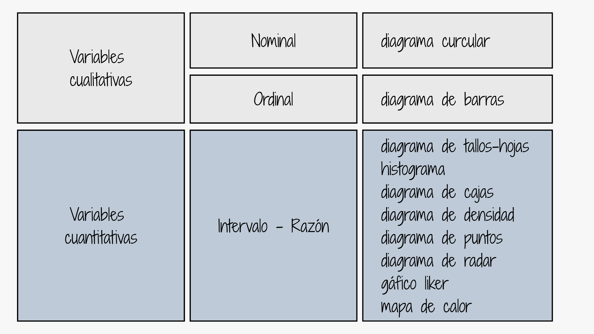
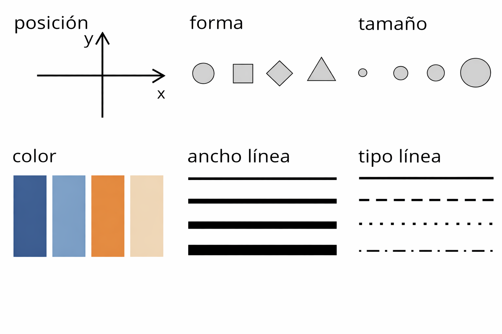
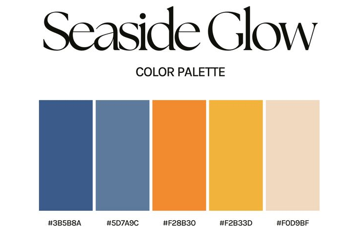

---
title: <span style="color:#f9ceca"> </span>  
author: <span style="color:#f9ceca">dgonzalez</span> 
subtitle: <span style="color:#f9ceca"> </span> 
output:
  html_document:
    toc: no 
    toc_depth: 2
    toc_float: yes
    code_folding: hide
    theme: flatly
    css:
      - style.css
      - cajas.css
---  

        


```{r setup, include=FALSE}


# colores
source("init.R")


knitr::opts_chunk$set(comment = NA)
library(RColorBrewer)
library(summarytools)
library(knitr)
library(readxl)
library(readr)
library(tidyverse)

# Colombia<- readRDS("data/Colombia.RDS")
# pye20222 <- read_excel("data/pye20222.xlsx", sheet = "Sheet4")

# colores
source("colores.R")

# Paleta categórica de cuatro colores principales
paleta4 <- c(c11, c21, c31, c41)

# Identidad visual del sitio para todas las visualizaciones
paleta_curso <- setNames(
  c(c11, c21, c31, c41, c51, c61, c71),
  c("Naranja", "Coral", "Azul", "Azul petróleo", "Verde menta",
    "Lavanda", "Turquesa")
)
paleta_curso_clara <- c(c12, c22, c32, c42, c52, c62, c72)

# Tema reutilizable: fondo limpio, tipografía legible y títulos alineados
tema_curso <- function(base_size = 12) {
  theme_minimal(base_size = base_size) +
    theme(
      plot.title.position = "plot",
      plot.title = element_text(face = "bold", color = c41, size = rel(1.25)),
      plot.subtitle = element_text(color = "#4B5563"),
      plot.caption = element_text(color = "#6B7280", hjust = 0),
      axis.title = element_text(face = "bold", color = c41),
      panel.grid.minor = element_blank(),
      panel.grid.major.x = element_blank(),
      legend.position = "bottom",
      legend.title = element_text(face = "bold")
    )
}


Visitantes <- read_csv("data/Visitantes.csv")
clientes <- read_csv("data/clientes.csv")
ventas <- read_excel("data/ventas.xlsx")


```

<br/><br/>


```{r, echo=FALSE, out.width="100%", fig.align = "center"}

```


<br/><br/>


# Introducción

>Una gráfica o una representación gráfica o un gráfico, es un tipo de representación de datos, generalmente cuantitativos, mediante recursos visuales (líneas, vectores, superficies o símbolos), para que se manifieste visualmente la relación matemática o correlación estadística que guardan entre sí.

Wikipedia

En esta unidad vamos a revisar cómo elegir y construir gráficos que apoyen el análisis en administración y mercadeo. La idea es que cada visualización responda a una pregunta concreta (por ejemplo: ¿qué producto vende más?, ¿cómo se comporta la demanda en el tiempo?, ¿qué segmentos son diferentes?) y no sea solo un adorno.

# Paquetes de R para gráficos

R posee numerosos paquetes para visualizar datos con excelente presentación: desde las funciones del núcleo base hasta bibliotecas que producen gráficos interactivos.

En el trabajo profesional, el objetivo es comunicar hallazgos a equipos y directivos. Por eso aquí verás opciones desde gráficos rápidos en R base hasta alternativas más flexibles e interactivas, útiles para reportes ejecutivos y tableros.


<div class="package-logo-row">


</div>


# Paquetes de R para gráficos y soluciones gráficas

| Categoría | Paquetes (ejemplos) | ¿Para qué sirven? |
|---|---|---|
| Gráficos base / extensiones de **ggplot2** | `ggthemes`, `ggrepel`, `patchwork`, `cowplot`, `ggpubr`, `ggridges`, `GGally` | Mejorar estética, etiquetas, combinar gráficos, figuras tipo “paper”, ridgelines, matrices de dispersión |
| Dashboards y reportes | `rmarkdown`, `quarto`, `shinydashboard`, `bslib`, `golem`, `htmlwidgets` | Reportes reproducibles, dashboards en Shiny, estilos Bootstrap, estructura profesional de apps, widgets embebibles |
| Interactivos (además de plotly) | `leaflet`, `mapview`, `DT`, `echarts4r`, `apexcharter`, `ggiraph` | Mapas interactivos, tablas interactivas, gráficos web modernos, interactividad (hover/click) sobre ggplot |
| Mapas y análisis espacial | `sf`, `terra`, `raster`, `tmap`, `ggspatial` | Manejo de datos espaciales (vectores/raster), cartografía estática/interactiva, elementos cartográficos en ggplot |
| Redes y diagramas | `igraph`, `ggraph`, `DiagrammeR`, `networkD3` | Redes (nodos/aristas), grafos con gramática tipo ggplot, diagramas de flujo, redes interactivas tipo D3 |
| Visualizaciones “especiales” | `corrplot`, `ggcorrplot`, `pheatmap`, `ComplexHeatmap`, `treemapify`, `waffle` | Correlaciones, heatmaps avanzados, treemaps, gráficos waffle |


Elegir el gráfico adecuado es tan importante como construirlo. La decisión depende del tipo de variable, la pregunta de análisis y el público al que se dirige.

Antes de graficar, identifica la variable principal (cualitativa o cuantitativa) y el objetivo del análisis (comparar, describir distribución, identificar tendencias, etc.). Esa decisión guía el tipo de gráfico.

En términos prácticos, los gráficos se pueden agrupar según la pregunta que quieres responder:

- **Comparación**: barras y columnas para contrastar categorías (marcas, productos, canales).
- **Composición**: tortas o barras apiladas para mostrar participación o cuota.
- **Distribución**: histogramas, densidades y cajas para entender cómo se dispersan los datos.
- **Relación**: dispersión para ver asociaciones entre dos variables (precio vs. demanda).
- **Evolución en el tiempo**: líneas o series de tiempo para observar tendencias y estacionalidad.
- **Jerarquía o composición con muchas categorías**: treemap o barras apiladas.
- **Patrones en dos dimensiones**: mapas de calor para cruces como día y hora.
- **Indicadores frente a una meta**: bullet chart o barras con una línea de referencia.

| Pregunta | Gráfico recomendado | Evita |
|---|---|---|
| ¿Qué categoría tiene mayor valor? | Barras ordenadas o lollipop | Tortas con muchas categorías |
| ¿Cómo cambia una métrica en el tiempo? | Línea | Barras para series largas |
| ¿Cómo se distribuyen los valores? | Histograma, densidad o violín | Mostrar solo el promedio |
| ¿Existe relación entre dos variables? | Dispersión | Ejes truncados sin advertencia |
| ¿Dónde se concentran dos variables categóricas? | Mapa de calor | Tablas extensas sin jerarquía visual |
| ¿El lector necesita explorar detalles? | Gráfico o tabla interactiva | Interacción sin instrucciones |

También es clave considerar el público. Si el gráfico va dirigido a directivos o clientes, prioriza claridad y mensajes clave. Si es para análisis técnico, puedes incluir más detalle (como distribución o valores atípicos).

Ejemplos aplicados:

- Comparación: ventas por línea de producto en un trimestre.
- Composición: participación de mercado por marca en un sector.
- Distribución: variabilidad del ticket promedio por cliente.
- Relación: inversión en pauta digital vs. conversiones.
- Evolución en el tiempo: visitas al sitio web mes a mes y picos en campañas.

```{r, fig.height=4}
# Comparación: ventas por línea de producto
ventas_prod <- data.frame(
  producto = c("A", "B", "C", "D"),
  ventas = c(120, 95, 140, 80)
)
barplot(
  ventas_prod$ventas,
  names.arg = ventas_prod$producto,
  col = c11,
  main = "Ventas por línea de producto",
  ylab = "Unidades"
)
```

```{r, fig.height=4}
# Composición: participación de mercado por marca
participacion <- data.frame(
  marca = c("Marca 1", "Marca 2", "Marca 3", "Otros"),
  share = c(35, 25, 20, 20)
)
pie(
  participacion$share,
  labels = paste0(participacion$marca, " (", participacion$share, "%)"),
  main = "Participación de mercado por marca",
  col = paleta4
)
```

```{r, fig.height=4}
# Distribución: ticket promedio por cliente
set.seed(123)
ticket <- rnorm(120, mean = 85, sd = 20)
hist(
  ticket,
  col = c21,
  main = "Distribución del ticket promedio",
  xlab = "Ticket (miles de $)",
  ylab = "Frecuencia"
)
```

```{r, fig.height=4}
# Relación: inversión en pauta digital vs conversiones
inv <- c(10, 15, 20, 25, 30, 35, 40)
conv <- c(120, 150, 190, 210, 260, 300, 330)
plot(
  inv, conv,
  pch = 19, col = c11,
  main = "Inversión vs conversiones",
  xlab = "Inversión (millones)",
  ylab = "Conversiones"
)
```

```{r, fig.height=4}
# Evolución en el tiempo: visitas al sitio web
mes <- c("Ene","Feb","Mar","Abr","May","Jun","Jul","Ago","Sep","Oct","Nov","Dic")
visitas <- c(12, 14, 15, 18, 22, 25, 30, 28, 24, 20, 18, 16)
plot(
  visitas,
  type = "o", col = c31, lwd = 2, pch = 19,
  xaxt = "n",
  main = "Visitas al sitio web por mes",
  xlab = "Mes",
  ylab = "Miles de visitas"
)
axis(1, at = 1:12, labels = mes)
```


```{r, echo=FALSE, out.width="100%", fig.align = "center"}

```

<!-- |Tipo de variable  | Escala          | Gráfico                                   | -->
<!-- |:-----------------|:----------------|:------------------------------------------| -->
<!-- |Cualitativas      |                 |                                           | -->
<!-- |                  |Nominal          | torta                                     | -->
<!-- |                  |Ordinal          | barras                                    | -->
<!-- |                  |                 |                                           | -->
<!-- |Cuantitativas     |Intervalo-razón  | diagrama de tallos y hojas                | -->
<!-- |                  |                 | histograma                                | -->
<!-- |                  |                 | diagrama de cajas                         | -->
<!-- |                  |                 | diagrama de densidad                      | -->
<!-- |                  |                 | diagrama de puntos                        | -->
<!-- |                  |                 | diagrama de lineas                        | -->
<!-- |                  |                 | diagrama de radar                         | -->
<!-- |                  |                 | gráfico likert                            | -->
<!-- |                  |                 | mapa de calor                             | -->

<br/><br/>

# Gráficos variables cualitativas 

## Gráfico de tortas o diagrama circular

Este gráfico es útil para mostrar participaciones o cuotas de mercado. Se recomienda cuando hay pocas categorías y se desea resaltar la proporción de cada una.

```{r, fig.height=6}
a=rep("Cultural", 360145)
b=rep("Pastoral", 61496)
c=rep("Bienestar",49912)
d=rep("Deportivo",11777)
data=c(a,b,c,d)
t=table(data)
lbs=c("Cultural", "Pastoral", "Bienestar", "Deportivo")
pct=round(t/sum(t)*100)
labs=paste(lbs, pct)
labs=paste(labs, "%", sep = " ") 
pie(t, labels=labs, main=" Participación eventos Medio Universitario",
    col = paleta4)
```

<br/><br/>

## Diagrama de barras

Las barras permiten comparar categorías con facilidad. En mercadeo se usan, por ejemplo, para comparar niveles de satisfacción o respuestas a encuestas por opciones.

```{r, fig.height=6}
ev=c(4,  8, 12, 43, 32)
names(ev)=c("Muy regular", "Regular", "Bueno", "Muy bueno","Excelente")
barplot(ev, col = paleta_curso[1:5], main = "Evaluación del proceso de inducción")
```

<br/><br/>

## Diagrama de barras dos variables

Cuando se cruzan dos variables categóricas, las barras agrupadas permiten comparar combinaciones (p. ej., tipo de producto vs. canal). Esto ayuda a detectar patrones por segmento.

```{r, fig.height=5.5}
set.seed(123)
canal <- sample(c("Digital", "Tienda fisica"), 150, replace = TRUE, prob = c(0.6, 0.4))
categoria <- sample(c("Aseo", "Bebidas", "Snacks"), 150, replace = TRUE)
counts <- table(canal, categoria)
barplot(
  counts,
  main = "Ventas por categoría y canal",
  xlab = "Categoría de producto",
  col = c(c11, c41),
  legend = rownames(counts)
)
```

<br/><br/>

# Gráficas variables cuantitativas 

En variables numéricas nos interesa describir la distribución, la tendencia y la dispersión. Los siguientes gráficos ayudan a responder preguntas como: ¿hay valores atípicos?, ¿la distribución es simétrica?, ¿existen agrupaciones?

<br/><br/>

## Diagrama de árbol

El diagrama de tallos y hojas permite ver valores individuales y su frecuencia sin perder detalle. Es una buena alternativa cuando el conjunto de datos no es muy grande.

```{r}
nf=c(4.1, 2.7, 3.1, 3.2, 3.0, 3.2, 2.0, 2.4, 1.6, 3.2, 3.1, 2.6, 2.0, 2.4, 2.8, 3.3, 4.0, 3.4, 3.0, 3.1, 2.7, 2.7, 3.0, 3.8, 3.2, 2.2, 3.5, 3.5, 3.8, 3.5, 3.9, 4.2, 4.3, 3.9, 3.2, 3.5, 3.5, 3.7, 4.1, 3.7, 3.5, 3.6, 3.2, 3.1, 3.4, 3.0, 3.0, 3.0, 2.7, 1.7, 3.6, 2.1, 2.4, 3.0, 3.1, 2.5, 2.5, 3.6, 2.2, 2.4, 3.1, 3.3, 2.7, 3.7, 3.0, 2.7, 3.0, 3.2, 3.1, 2.4, 3.0, 2.7, 2.5, 3.0, 3.0, 3.0, 3.2, 3.1, 3.8, 4.1, 3.7, 3.5, 3.0, 3.7, 3.7, 4.1, 3.7, 3.9, 3.7, 2.0)
stem(nf)
```

Este diagrama ordena los datos y permite identificar rápidamente el mínimo, el máximo y el rango donde se concentra la mayor parte del ticket promedio por cliente.

<br/><br/>

## Histograma

El histograma resume la distribución de una variable. En contextos de negocio puede servir para ver la dispersión de tiempos de entrega o el rango de ventas por cliente.

```{r, fig.height=5}
nf=c(4.1, 2.7, 3.1, 3.2, 3.0, 3.2, 2.0, 2.4, 1.6, 3.2, 3.1, 2.6, 2.0, 2.4, 2.8, 3.3, 4.0, 3.4, 3.0, 3.1, 2.7, 2.7, 3.0, 3.8, 3.2, 2.2, 3.5, 3.5, 3.8, 3.5, 3.9, 4.2, 4.3, 3.9, 3.2, 3.5, 3.5, 3.7, 4.1, 3.7, 3.5, 3.6, 3.2, 3.1, 3.4, 3.0, 3.0, 3.0, 2.7, 1.7, 3.6, 2.1, 2.4, 3.0, 3.1, 2.5, 2.5, 3.6, 2.2, 2.4, 3.1, 3.3, 2.7, 3.7, 3.0, 2.7, 3.0, 3.2, 3.1, 2.4, 3.0, 2.7, 2.5, 3.0, 3.0, 3.0, 3.2, 3.1, 3.8, 4.1, 3.7, 3.5, 3.0, 3.7, 3.7, 4.1, 3.7, 3.9, 3.7, 2.0)

h1 = hist(nf, main = "Distribución del ticket promedio por cliente", xlab = "ticket (decenas de miles COP)", ylab="frecuencias absolutas", labels=TRUE, col=c21, ylim = c(0,30))
abline(v=3,col=c31, lwd=2)
h1
```


<br/><br/>

## Diagrama de densidad

La densidad muestra la forma general de la distribución suavizada. Es útil para comparar rápidamente perfiles de consumo o niveles de gasto.

```{r, fig.height=5}
nf=c(4.1, 2.7, 3.1, 3.2, 3.0, 3.2, 2.0, 2.4, 1.6, 3.2, 3.1, 2.6, 2.0, 2.4, 2.8, 3.3, 4.0, 3.4, 3.0, 3.1, 2.7, 2.7, 3.0, 3.8, 3.2, 2.2, 3.5, 3.5, 3.8, 3.5, 3.9, 4.2, 4.3, 3.9, 3.2, 3.5, 3.5, 3.7, 4.1, 3.7, 3.5, 3.6, 3.2, 3.1, 3.4, 3.0, 3.0, 3.0, 2.7, 1.7, 3.6, 2.1, 2.4, 3.0, 3.1, 2.5, 2.5, 3.6, 2.2, 2.4, 3.1, 3.3, 2.7, 3.7, 3.0, 2.7, 3.0, 3.2, 3.1, 2.4, 3.0, 2.7, 2.5, 3.0, 3.0, 3.0, 3.2, 3.1, 3.8, 4.1, 3.7, 3.5, 3.0, 3.7, 3.7, 4.1, 3.7, 3.9, 3.7, 2.0)
plot(density(nf), main="Distribución del ticket promedio de clientes", col=c21, lwd=2)
```

<br/><br/>
  
## Diagrama de cajas

El boxplot resume mediana, cuartiles y valores atípicos. Es ideal para comparar desempeño entre productos, tiendas o periodos.

```{r}
nf=c(4.1, 2.7, 3.1, 3.2, 3.0, 3.2, 2.0, 2.4, 1.6, 3.2, 3.1, 2.6, 2.0, 2.4, 2.8, 3.3, 4.0, 3.4, 3.0, 3.1, 2.7, 2.7, 3.0, 3.8, 3.2, 2.2, 3.5, 3.5, 3.8, 3.5, 3.9, 4.2, 4.3, 3.9, 3.2, 3.5, 3.5, 3.7, 4.1, 3.7, 3.5, 3.6, 3.2, 3.1, 3.4, 3.0, 3.0, 3.0, 2.7, 1.7, 3.6, 2.1, 2.4, 3.0, 3.1, 2.5, 2.5, 3.6, 2.2, 2.4, 3.1, 3.3, 2.7, 3.7, 3.0, 2.7, 3.0, 3.2, 3.1, 2.4, 3.0, 2.7, 2.5, 3.0, 3.0, 3.0, 3.2, 3.1, 3.8, 4.1, 3.7, 3.5, 3.0, 3.7, 3.7, 4.1, 3.7, 3.9, 3.7, 2.0)
boxplot(nf, main="Ticket promedio por cliente",col=c21, las=1)
abline(h=3, col=c41)
```
  
<br/><br/>

## Diagrama de cajas por factor

Aquí se compara la distribución por grupos. Esta lógica es muy útil para comparar resultados por canal, sede, segmento o región.

```{r, fig.height=4.5}
nf=c(4.1, 2.7, 3.1, 3.2, 3.0, 3.2, 2.0, 2.4, 1.6, 3.2, 3.1, 2.6, 2.0, 2.4, 2.8, 3.3, 4.0, 3.4, 3.0, 3.1, 2.7, 2.7, 3.0, 3.8, 3.2, 2.2, 3.5, 3.5, 3.8, 3.5, 3.9, 4.2, 4.3, 3.9, 3.2, 3.5, 3.5, 3.7, 4.1, 3.7, 3.5, 3.6, 3.2, 3.1, 3.4, 3.0, 3.0, 3.0, 2.7, 1.7, 3.6, 2.1, 2.4, 3.0, 3.1, 2.5, 2.5, 3.6, 2.2, 2.4, 3.1, 3.3, 2.7, 3.7, 3.0, 2.7, 3.0, 3.2, 3.1, 2.4, 3.0, 2.7, 2.5, 3.0, 3.0, 3.0, 3.2, 3.1, 3.8, 4.1, 3.7, 3.5, 3.0, 3.7, 3.7, 4.1, 3.7, 3.9, 3.7, 2.0)
set.seed(123)
canal <- sample(c("Digital", "Tienda física", "Mayorista"), length(nf), replace = TRUE)
labs=c("Digital","Tienda física","Mayorista")
boxplot((nf~canal),main="Ticket promedio por canal de venta", 
        col=c(c21,c51,c41), names=labs, xlab = "canal", ylab = "ticket")
abline(h=3, col=c31,  lwd=2)
abline(h=4, col=c11, lwd=2)
```

<br/><br/>

## Diagrama de dispersión

Este gráfico permite analizar la relación entre dos variables numéricas. En administración es clave para explorar asociaciones como inversión publicitaria vs. ventas.

```{r, fig.height=5}
set.seed(123)
inversion_digital <- runif(90, 8, 40)
ventas_mensuales <- 60 + 9 * inversion_digital + rnorm(90, 0, 25)
plot(inversion_digital, ventas_mensuales, main="Inversión digital vs ventas", xlab = "Inversión (millones COP)", ylab = "Ventas (millones COP)",col=c11,pch=19)
grid()
```


<br/><br/>

## Gráfica de series de tiempo

Las series de tiempo muestran el comportamiento a lo largo de meses o años. Son fundamentales para analizar tendencias, estacionalidad y cambios en la demanda.

```{r, fig.height=5}
ventas_ts <- ts(c(120, 132, 128, 140, 155, 162, 170, 168, 160, 158, 166, 180), frequency = 12, start = c(2025, 1))
plot(ventas_ts, main="Ventas mensuales de la compañía", ylab = "Ventas (millones COP)", xlab = "Mes", col=c31, lwd = 2)
```

<br/><br/>

# Resumen

El siguiente bloque resume varios tipos de gráficos en una sola vista. Úsalo como referencia rápida de qué gráfico elegir según el tipo de variable y el objetivo del análisis.

```{r}
x=rnorm(100,100,20)
y=rnorm(100,100,25)
z=rbinom(100,4,0.30)
t=1:100
op <- par(no.readonly = TRUE)
par(
  mfrow = c(2, 2),
  mar = c(4.5, 4.5, 2.5, 1),
  cex.axis = 1.25,
  cex.lab = 1.2
)

# Panel circular: menor margen y mayor diámetro
par(mar = c(1, 1, 1, 1))
pie(table(z), radius = 1, cex = 1.15)

# Restaurar márgenes amplios para leer mejor las escalas
par(mar = c(4.5, 4.5, 2.5, 1))
barplot(table(z))
stem(x)
hist(x)
boxplot(x, frame.plot = FALSE)
plot(x,y)
plot(t,y, type="l")
plot(density(x))
par(op)
```
    

<br/><br/>


# Gráficos con ggplot2

`ggplot2` es el paquete más usado en R para visualización. Su lógica por capas facilita construir gráficos claros y consistentes, lo cual es muy útil para reportes académicos y corporativos.

<br/>

+ **Data**: capa de los datos. Aquí defines el dataset, por ejemplo una tabla de ventas, clientes o campañas.

+ **Aesthetics**: capa estética (**aes**), definimos las variables a utilizar en el gráfico. Ejemplo: `x = mes`, `y = ventas`, `color = canal`.

+ **Geometries**: capa de geometrías, se define el tipo de gráfica a realizar. Por ejemplo barras para comparar productos o líneas para ver tendencias.

+ **Facets**: capa de facetas, permite detallar la gráfica por categorías. Útil para comparar sedes, segmentos de clientes o regiones.

+ **Statistics**: capa de estadística, permite agregar modelos. Por ejemplo, una línea de tendencia para evaluar crecimiento de ingresos.

+ **Coordinates**: capa de coordenadas, permite ajustar las escalas de los ejes. Ayuda a enfocar rangos relevantes (p. ej. solo 2023-2025).

+ **Theme**: capas de características del gráfico que no dependen de los datos. Se usa para estilos y legibilidad en reportes ejecutivos.

<br/><br/>

###  gráfico = data + aesthetics + geometries + facets + statistics + coordinates + themes

<br/><br/>


## Primer paso:  
### Instalar y cargar la libreria

Primero instalamos y cargamos la librería. Esto se hace una sola vez por equipo (instalación) y luego se carga en cada sesión de trabajo.

```{r, eval=FALSE}
# Instalar ggplot2 si no lo tienes
install.packages("ggplot2")

# Cargar la librería ggplot2
library(ggplot2)
```

<pre>
# Instalar ggplot2 si no lo tienes
install.packages("ggplot2")

# Cargar la librería ggplot2
library(ggplot2)

</pre>

</br></br>

## Segundo paso: 
### Declarar la base de datos y las variables

Aquí definimos la base y las variables que vamos a comparar. En este ejemplo, relacionamos inversión en pauta y ventas, segmentando por canal.

```{r,fig.height=5}
campanas <- tibble(
  inversion = c(8, 10, 12, 15, 18, 20, 22, 25, 28, 30, 35, 40),
  ventas = c(102, 108, 120, 119, 108, 121, 145, 175, 147, 177, 163, 192),
  canal = factor(c("Digital", "Digital", "Retail", "Retail", "Mayorista", "Digital",
                   "Retail", "Mayorista", "Digital", "Retail", "Mayorista", "Digital"))
)
p <- ggplot(campanas, aes(x = inversion, y = ventas))
p


```


</br></br>

## Tercer paso : 
### Crear grafico base con las diferentes geometrías

Con la geometría definimos el tipo de gráfico. El `geom_point()` crea el diagrama de dispersión, muy usado para visualizar relaciones entre variables.


```{r,fig.height=5}
p <- p + geom_point()  
p

```

</br></br>

|                   |                    |                     |                      |
|:------------------|:-------------------|:--------------------|:---------------------|
|geo_point()        |geom_bar()          |geom_col()           |stat_count()          |
|geom_boxplot()     |stat_boxplot()      |geom_density()       |stat_density()        |
|geom_histogram()   |geom_violin()       |                     |                      |

</br></br>


## Cuarto paso: 
### Agregar características adicionales

Se pueden incluir colores, tamaños y transparencia para resaltar grupos o categorías. Esto ayuda a hacer comparaciones por segmentos.

```{r,fig.height=5}
p <- ggplot(campanas, aes(x = inversion, y = ventas, color = canal)) +
          geom_point(size = 2, alpha = 0.7)  # Tamaño y transparencia de los puntos
p

```


</br></br>


## Quinto paso: 
### Agregar título, etiquetas a los ejes y leyenda

Los títulos y etiquetas convierten un gráfico técnico en uno comunicativo. En contextos de negocio, esto facilita que el lector entienda el mensaje sin leer el código.

```{r, message=FALSE, warning=FALSE,fig.height=5}
p <- p + labs(title = "Relación entre inversión y ventas",
              subtitle = "Clasificación por canal comercial",
              x = "Inversión en pauta (millones COP)",
              y = "Ventas (millones COP)",
              color = "Canal"
              )
p
```


</br></br>

## Sexto paso: 
### Agregar una línea de tendencia

La línea de tendencia resume la relación general entre las variables. Es útil para explicar patrones de crecimiento o caída en términos gerenciales.

```{r, message=FALSE, warning=FALSE,fig.height=5}
p <- p + geom_smooth(method = "lm", se = FALSE, linetype = "dashed", color = c31)
p
```

</br></br>

## Séptimo paso: 
### Agregar un tema o fondo

El tema define el estilo visual. Un tema limpio mejora la legibilidad, especialmente en presentaciones o informes.

```{r}
p <- p + tema_curso(base_size = 14)
p
```


</br></br>

## Octavo paso: 
### Ajustar la escala de colores

La escala de color debe ser coherente y fácil de interpretar. En dashboards o reportes, colores consistentes ayudan a comparar gráficos entre sí.

```{r}
library(ggplot2)

# Crear el gráfico desde cero
p <- ggplot(campanas, aes(x = inversion, y = ventas, color = canal)) +
  geom_point(size = 4, alpha = 0.7) +  # Agregar puntos
  scale_color_manual(values = paleta_curso) +  # Paleta oficial del sitio
  labs(
    title = "Relación entre inversión y ventas",
    subtitle = "Clasificación por canal comercial",
    x = "Inversión en pauta (millones COP)",
    y = "Ventas (millones COP)",
    color = "Canal"
  ) +
  tema_curso(base_size = 12)

# Mostrar el gráfico
p
```

### gráfico completo !!


</br></br>


# Otros gráficos

A continuación se muestran ejemplos adicionales para ampliar el repertorio. La idea es que puedas reconocer qué gráfico usar según la pregunta del análisis.

```{r, fig.height=5}
library(ggplot2)
data=data.frame(linea_producto=c("Aseo","Bebidas","Snacks","Hogar","Tecnología","Mascotas"),frecuencia=c(48, 59, 65, 41, 36, 28))

ggplot(data, aes(x=linea_producto, y=frecuencia)) +
  geom_bar(stat="identity", fill=c11)+
  geom_text(aes(label=frecuencia), vjust=2.5, color="white", size=4)+
  labs(x = "Línea de producto", y = "Ventas (miles de unidades)") +
  tema_curso()
```


</br></br>

```{r, message=FALSE, warning=FALSE,fig.height=5}
set.seed(123)
df_ticket <- tibble(ticket = rlnorm(500, meanlog = log(90), sdlog = 0.35))
ggplot(df_ticket, aes(ticket)) +
       geom_histogram(bins = 7, fill = c11, color = c41, alpha = 0.9) +
       tema_curso() +
       labs(x = "Ticket promedio (miles COP)", y = "frecuencia absoluta") +
       ggtitle("Distribución del ticket de compra")


```

</br></br>

```{r, message=FALSE, warning=FALSE, fig.height=4}
set.seed(123)
df_canal <- tibble(
  canal = sample(c("Digital", "Tienda física", "Mayorista"), 400, replace = TRUE),
  ticket = rlnorm(400, meanlog = log(95), sdlog = 0.3)
)
ggplot(df_canal, aes(x=ticket, y=canal)) +
  geom_boxplot(fill=c(c12,c32,c42),  # color de relleno
               color = c41,    # color de lineas
               alpha=0.5)+
  geom_point(color=c11,alpha=0.2) +
  labs(x = "Ticket promedio (miles COP)", y = "Canal") +
  tema_curso()
```

</br></br>

# Visualizaciones modernas para decisiones

Los gráficos modernos no tienen que ser complejos. Deben reducir ruido, dirigir la atención al hallazgo y permitir explorar detalles cuando esa interacción aporte valor. Los siguientes ejemplos conservan la identidad cromática del sitio.


</br></br>

## Lollipop: comparación compacta

El gráfico lollipop es una alternativa ligera a las barras. Funciona bien para rankings ejecutivos cuando interesa destacar la posición y el valor de cada categoría.

```{r lollipop-moderno, fig.height=4.8}
ranking <- tibble(
  producto = c("Aseo", "Bebidas", "Snacks", "Hogar", "Tecnología", "Mascotas"),
  ventas = c(48, 59, 65, 41, 36, 28)
) |>
  arrange(ventas) |>
  mutate(producto = factor(producto, levels = producto))

ggplot(ranking, aes(ventas, producto)) +
  geom_segment(aes(x = 0, xend = ventas, yend = producto),
               linewidth = 1.4, color = c32) +
  geom_point(size = 4.5, color = c31) +
  geom_text(aes(label = ventas), hjust = -0.8, color = c41, fontface = "bold") +
  scale_x_continuous(expand = expansion(mult = c(0, .1))) +
  labs(
    title = "Ventas por línea de producto",
    subtitle = "Ranking de unidades vendidas",
    x = "Miles de unidades", y = NULL,
    caption = "Fuente: datos simulados"
  ) +
  tema_curso()
```

</br></br>

## Mapa de calor: concentración de actividad

Un mapa de calor revela patrones en dos dimensiones. Aquí permite detectar los momentos de mayor tráfico sin obligar al lector a revisar una tabla extensa.

```{r mapa-calor, fig.height=4.8}
set.seed(123)
trafico <- expand_grid(
  dia = factor(c("Lun", "Mar", "Mié", "Jue", "Vie"),
               levels = rev(c("Lun", "Mar", "Mié", "Jue", "Vie"))),
  hora = 8:18
) |>
  mutate(visitas = round(40 + 35 * exp(-((hora - 13)^2) / 10) +
                          if_else(dia == "Vie", 18, 0) + rnorm(n(), 0, 26)))

ggplot(trafico, aes(hora, dia, fill = visitas)) +
  geom_tile(color = "white", linewidth = .8) +
  scale_fill_gradientn(colors = c(c42, c31, c61), name = "Visitas") +
  scale_x_continuous(breaks = seq(8, 18, 2)) +
  labs(
    title = "Tráfico digital por día y hora",
    subtitle = "Los tonos intensos indican mayor actividad",
    x = "Hora", y = NULL, caption = "Fuente: datos simulados"
  ) +
  tema_curso()
```
<br/><br/>

## Tabla interactiva: detalle bajo demanda

Cuando el lector necesita buscar, ordenar o filtrar registros, una tabla interactiva complementa al gráfico. La búsqueda y la paginación evitan sobrecargar la página.

```{r tabla-interactiva, message=FALSE, warning=FALSE}
library(DT)

datatable(
  campanas,
  rownames = FALSE,
  filter = "top",
  options = list(pageLength = 6, dom = "ftip", autoWidth = TRUE),
  colnames = c("Inversión (millones COP)", "Ventas (millones COP)", "Canal")
) |>
  formatStyle(
    "canal",
    color = "white",
    backgroundColor = styleEqual(levels(campanas$canal), unname(paleta_curso[1:3]))
  )
```

<div class="note-box">
<div class="note-box-title">Cuándo usar interactividad</div>

Úsala cuando el lector necesite comparar puntos, consultar valores exactos, filtrar categorías o ampliar un periodo. Para informes impresos o para comunicar un único hallazgo, una figura estática bien anotada suele ser más efectiva.
</div>

</br></br>

## Gráficos con plotly

`plotly` permite convertir gráficos en interactivos. Esto es útil para presentaciones donde el usuario puede pasar el mouse y ver detalles sin saturar la pantalla.

```{r plotly-interactivo, message=FALSE, warning=FALSE}
# install.packages("plotly") # ejecutar una sola vez si fuera necesario

# Cargar librerías necesarias
library(ggplot2)
library(plotly)

# Crear base ejemplo para campañas
campanas <- tibble(
  inversion = c(8, 10, 12, 15, 18, 20, 22, 25, 28, 30, 35, 40),
  ventas = c(102, 108, 120, 119, 108, 121, 145, 175, 147, 177, 163, 192),
  canal = factor(c("Digital", "Digital", "Retail", "Retail", "Mayorista", "Digital",
                   "Retail", "Mayorista", "Digital", "Retail", "Mayorista", "Digital"))
)

# Crear gráfico base con ggplot2
p <- ggplot(campanas, aes(
  x = inversion, y = ventas, color = canal,
  text = paste(
    "Canal:", canal, "<br>",
    "Inversión:", inversion, " millones COP<br>",
    "Ventas:", ventas, " millones COP"
  )
)) +
  geom_point(size = 2, alpha = 0.7) +  # Agregar puntos
  scale_color_manual(values = paleta_curso) +  # Paleta oficial del sitio
  labs(
    title = "Relación entre inversión y ventas",
    subtitle = "Datos de campañas comerciales",
    x = "Inversión en pauta (millones COP)",
    y = "Ventas (millones COP)",
    color = "Canal"
  ) +
  tema_curso(base_size = 14)

# Convertir el gráfico de ggplot2 a un gráfico interactivo con Plotly
p_interactivo <- ggplotly(p, tooltip = "text") |>
  layout(legend = list(orientation = "h", x = 0, y = -0.2)) |>
  config(displaylogo = FALSE, responsive = TRUE)

# Mostrar el gráfico interactivo
p_interactivo

```

https://gganimate.com/


[Anàlisis de datos con R Cap,7 ggplot2](https://rafalab.github.io/dslibro/ggplot2.html)<br/>
[ggplot2 resumen](https://rstudio.com/wp-content/uploads/2015/03/ggplot2-cheatsheet.pdf)

</br></br>

## Gráficos con highcharter

`highcharter` es otra opción para gráficos interactivos con estética profesional. Suele usarse en tableros ejecutivos por su estilo limpio y opciones de personalización.

```{r, warning=FALSE, message=FALSE}
# Instalar paquetes si es necesario
# install.packages("highcharter")
# install.packages("dplyr")

# Cargar librerías necesarias
library(highcharter)
library(dplyr)

# Crear base para campañas comerciales
campanas <- tibble(
  inversion = c(8, 10, 12, 15, 18, 20, 22, 25, 28, 30, 35, 40),
  ventas = c(102, 108, 120, 119, 108, 121, 145, 175, 147, 177, 163, 192),
  canal = factor(c("Digital", "Digital", "Retail", "Retail", "Mayorista", "Digital",
                   "Retail", "Mayorista", "Digital", "Retail", "Mayorista", "Digital"))
)

# Crear gráfico interactivo con highcharter
hchart(campanas, "scatter", hcaes(x = inversion, y = ventas, group = canal, name = canal)) %>%
  hc_colors(colors = unname(paleta_curso[1:3])) %>%
  hc_title(text = "Relación entre inversión y ventas") %>%
  hc_subtitle(text = "Datos de campañas comerciales por canal") %>%
  hc_xAxis(title = list(text = "Inversión (millones COP)")) %>%
  hc_yAxis(title = list(text = "Ventas (millones COP)")) %>%
  hc_tooltip(
    useHTML = TRUE,
    pointFormat = "<b>Canal:</b> {point.name}<br>
                   <b>Inversión:</b> {point.x} millones COP<br>
                   <b>Ventas:</b> {point.y} millones COP"
  ) %>%
  hc_chart(zoomType = "xy")

```


<br/><br/>

## Estética en la visualización

Además de la elección del gráfico, el diseño visual influye en la interpretación. Una buena estética mejora la comprensión y evita confusiones en la lectura de resultados.

La **estética** juega un papel fundamental en la visualización de datos, ya que ayuda a hacer que la información sea más comprensible y atractiva para el espectador. Entre las diferentes formas de estética utilizadas en la visualización, se encuentran:

* Forma
* Tamaño
* Color
* Ancho línea
* Tipo línea
* 1D, 2D, 3D

<br/><br/>

La **posición** se refiere a la ubicación de los elementos dentro de la visualización y es fundamental para transmitir información espacial. Por lo general haciendo referencia al plano cartesiano (2D) e indicando relaciones de asociación y correlación entre variables. 

La **forma** se refiere a la apariencia de los elementos, que puede ser útil para representar categorías o para resaltar ciertos datos, como pueden ser: circulos, cuadrados, triangulos, estrellas, entre otras formas. 

El **tamaño**, por otro lado, se utiliza para indicar magnitudes y hacer que ciertos elementos destaquen sobre otros.

El **color** es una de las estéticas más poderosas en la visualización, ya que puede transmitir información de manera rápida y efectiva. Se puede utilizar para representar categorías, resaltar elementos importantes o crear jerarquías visuales. Tambien reforzando el significado de la variable, por ejemplo en presentación de resultados de clima laboral se utilizan colores relacionados con el semaforo (escalas entre rojo y verde), para representar magnitudes desde colores suaves a colores fuertes para indicar grandes cantidades. Por último tambien se emplean colores para resaltar un nivel u objeto dentro de todo el grupo.

El **ancho de línea** y el **tipo de línea** se utilizan para diferenciar entre elementos y resaltar ciertos aspectos de la visualización.

La dimensión (1D, 2D, 3D) se refiere a la cantidad de dimensiones que se utilizan en la visualización. Mientras que las visualizaciones 1D se limitan a una sola dimensión, como una línea de tiempo, las visualizaciones 2D y 3D pueden representar información en dos o tres dimensiones, lo que permite una representación más detallada y compleja de los datos. Es recomendable no utilizar 3D para que las visializaciones sean más limpias y sencillas 


<br/><br/>

### Formas

Es posible utilizar circulos, cuadrados, triangulos y en general figuras geométricas para resaltar puntos que represente valores numéricos en un plano 2D y de esta forma representar una secuencia o tendencia de la información.

<br/><br/>

```{r, echo=FALSE, out.width="70%", fig.align = "center"}

```

<br/><br/>


### Paletas

Las paletas ayudan a mantener consistencia y a diferenciar categorías. En mercadeo, una paleta bien elegida refuerza la identidad visual del informe.

```{r, echo=FALSE, out.width="50%", fig.align = "center"}

```
Tomada de Pinteres


</br></br>

## Normas APA 

En trabajos académicos y corporativos es clave seguir normas de presentación. Esto asegura que los gráficos sean claros, comparables y bien documentados.

Aquí tienes el texto **ajustado al enfoque de las normas APA (7.ª edición) para figuras y gráficos**, manteniendo una estructura similar a la que tenías:


Las **normas APA** orientan la elaboración y presentación de **figuras** (gráficos, diagramas, mapas, etc.) para asegurar **claridad, precisión y consistencia** en la comunicación académica. En términos prácticos, estas recomendaciones se reflejan en los siguientes criterios:

</br>

## Claridad y legibilidad

El gráfico debe entenderse con rapidez y sin esfuerzo. Evita elementos decorativos innecesarios y prioriza un diseño limpio. Usa **tipografías legibles**, tamaños adecuados y un contraste suficiente entre elementos (líneas, puntos, barras y texto).

</br>

## Precisión y fidelidad de los datos

La figura debe representar los datos de manera exacta, sin distorsiones. Utiliza escalas apropiadas y proporcionales, indica **unidades de medida**, y cuida que las comparaciones visuales sean correctas. Si se presentan porcentajes, verifica coherencia (por ejemplo, totales consistentes cuando aplique).

</br>

## Rotulación y organización según APA

En APA, un gráfico se presenta como **Figura** y debe incluir:

* **Número de figura** (por ejemplo, *Figura 1*).
* **Título de la figura** (claro y descriptivo).
* El gráfico (contenido visual).
* **Nota de figura** si es necesaria (para aclarar abreviaturas, describir símbolos, indicar fuente o explicar detalles metodológicos).

</br>

## Consistencia y estilo académico

Mantén coherencia en el formato a lo largo del informe: mismos estilos de ejes, tamaños de letra, criterios de color y formato de leyendas. Las etiquetas de ejes deben ser claras, con nombres completos (o abreviaturas explicadas en nota).

</br>

## Accesibilidad y uso del color

Usa el color solo cuando aporte información. Evita combinaciones que dificulten la lectura y procura que el gráfico sea interpretable incluso en escala de grises (por ejemplo, con patrones, formas o distintos tipos de línea). Esto mejora la accesibilidad y la calidad de impresión.


</br></br>

### Ejemplos

```{r}
set.seed(123)
ventas_dia <- tibble(ventas = rlnorm(400, meanlog = log(2.6), sdlog = 0.35))
ggplot(ventas_dia, aes(x = ventas)) +
  geom_histogram(fill = "steelblue", bins = 10, color = "black", alpha = 0.7) +
  labs(
    title = "Distribución de ventas por transacción",
    x = "Ventas por transacción (millones COP)",
    y = "Frecuencia",
    caption = "Fuente: Datos simulados de ventas"
  ) +
  tema_curso()
```

</br></br>

Este ejemplo muestra cómo incluir títulos, ejes y fuente, cumpliendo criterios de claridad y fidelidad en la presentación de datos.

```{r, warning=FALSE, message=FALSE}
set.seed(123)
camp <- tibble(
  inversion = runif(120, 8, 45),
  ventas = 65 + 8.5 * inversion + rnorm(120, 0, 30)
)
ggplot(camp, aes(x = inversion, y = ventas)) +
  geom_point(color = c41, size = 2, alpha = 0.7) +
  geom_smooth(method = "lm", se = FALSE, color = c11, linetype = "dashed") +
  labs(
    title = "Relación entre inversión publicitaria y ventas",
    x = "Inversión (millones COP)",
    y = "Ventas (millones COP)",
    caption = "Fuente: Datos simulados de campañas"
  ) +
  tema_curso()

```


</br></br>

Este segundo ejemplo integra una tendencia lineal para apoyar la interpretación, algo útil en análisis de productividad o eficiencia.


```{r, message=FALSE, warning=FALSE, fig.align='center'}
library(ggplot2)
library(ggthemes)

ggplot(campanas, aes(inversion, ventas)) +
  geom_point(size=2) +
  theme_economist() +
  labs(title="ggthemes: inversión vs ventas")
```

</br></br>

```{r, message=FALSE, warning=FALSE, fig.align='center'}
library(ggplot2)
library(ggrepel)

df <- campanas
df$campana <- paste0("Campaña ", seq_len(nrow(df)))

ggplot(df, aes(inversion, ventas, label = campana)) +
  geom_point(size=2) +
  geom_text_repel() +
  labs(title="ggrepel: etiquetas de campañas")
```

</br></br>

```{r, message=FALSE, warning=FALSE, fig.align='center'}
library(ggplot2)
library(ggiraph)
par(mar=c(5,16,4,2)+0.1)
p <- ggplot(campanas, aes(inversion, ventas, tooltip = canal)) +
  geom_point_interactive(size = 3, color = c31) +
  tema_curso()

girafe(ggobj = p)
```

<br/><br/>

```{r, message=FALSE, warning=FALSE, fig.align='center'}
# install.packages("likert")
library(likert)
par(mar=c(5,16,4,2)+0.1)
# Datos simulados (respuestas tipo Likert)
set.seed(123)
n <- 120
datos <- data.frame(
  Servicio = factor(sample(c("Totalmente en desacuerdo","En desacuerdo","Neutral",
                             "De acuerdo","Totalmente de acuerdo"), n, TRUE),
                    levels = c("Totalmente en desacuerdo","En desacuerdo","Neutral",
                               "De acuerdo","Totalmente de acuerdo"),
                    ordered = TRUE),
  Precio   = factor(sample(c("Totalmente en desacuerdo","En desacuerdo","Neutral",
                             "De acuerdo","Totalmente de acuerdo"), n, TRUE),
                    levels = c("Totalmente en desacuerdo","En desacuerdo","Neutral",
                               "De acuerdo","Totalmente de acuerdo"),
                    ordered = TRUE),
  Calidad  = factor(sample(c("Totalmente en desacuerdo","En desacuerdo","Neutral",
                             "De acuerdo","Totalmente de acuerdo"), n, TRUE),
                    levels = c("Totalmente en desacuerdo","En desacuerdo","Neutral",
                               "De acuerdo","Totalmente de acuerdo"),
                    ordered = TRUE)
)

# Construir objeto Likert y graficar
lk <- likert(datos)

p =plot(lk,
     centered = TRUE,
     main = "Encuesta de satisfacción (Likert)",
     xlab = "Porcentaje de respuestas")
p +
  theme(
    legend.text = element_text(angle = 0, hjust = 1, vjust = 1)
  )
```

<br/><br/>

```{r, message=FALSE, warning=FALSE, fig.align='center'}
# install.packages("plotly")
library(plotly)

set.seed(123)
df <- data.frame(
  Edad   = round(rnorm(100, mean = 35, sd = 5),0),
  Ingreso = rnorm(100, mean = 5500, sd = 1000),
  Grupo  = sample(c("A", "B", "C"), 100, replace = TRUE)
)

p <- plot_ly(
  data = df,
  x = ~Edad, y = ~Ingreso,
  type = "scatter", mode = "markers",
  color = ~Grupo, colors = unname(paleta_curso[1:3]),
  text = ~paste0("Grupo: ", Grupo,
                 "<br>Edad: ", round(Edad, 1),
                 "<br>Ingreso: ", round(Ingreso, 0)),
  hoverinfo = "text",
  marker = list(size = 10, opacity = 0.8)
) %>%
  layout(
    title = "Dispersión interactiva (Plotly)",
    xaxis = list(title = "Edad (años)"),
    yaxis = list(title = "Ingreso (COP)")
  )

p


```

<br/><br/><br/><br/>


### Una imagen dice mas que mil palabras...

Las imágenes también comunican contexto y refuerzan la narrativa del informe. En presentaciones de mercadeo, una foto puede conectar datos con la realidad del entorno.

Daniel Enrique González Gómez 

Imagen tomada de :https://javerianacali.edu.co/noticias/la-javeriana-bogota-y-cali-1-de-colombia
