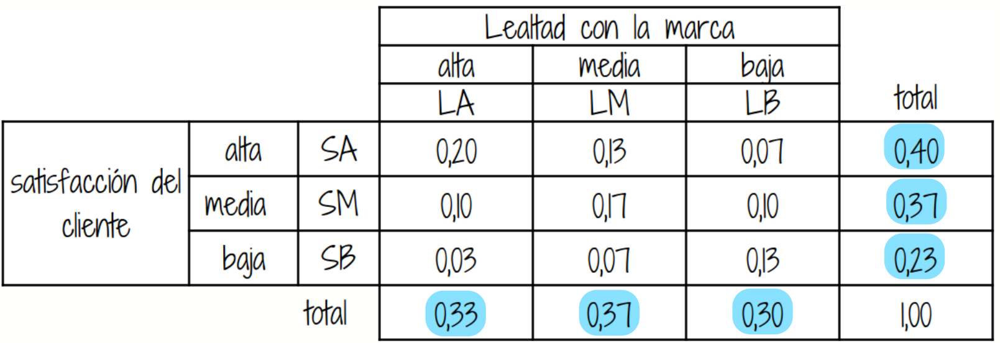
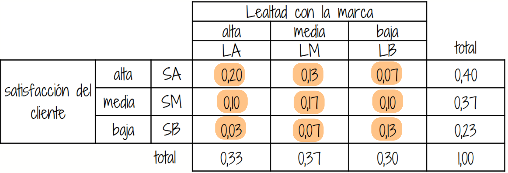

---
title: <span style="color:#F4B43C">Estadística para la toma de decisiones</span>
author: <span style="color:#F4B43C">dgonzalez</span> 
subtitle: <span style="color:#F4B43C"> </span> 
output:
  html_document:
    toc: no
    toc_depth: 2
    toc_float: yes
    code_folding: hide
    theme: flatly
    css:
      - style.css
      - cajas.css
--- 
  

```{r setup, include=FALSE}
knitr::opts_chunk$set(echo = TRUE, message = FALSE, warning = FALSE, comment = NA)
library(knitr)
library(tidyverse)
source("colores.R")
```

```{r, echo=FALSE, out.width="100%", fig.align = "center"}
knitr::include_graphics("img/recurso2.png")
```

<br/><br/>

# Introducción 


<div class="package-logo-row">


</div>


Antes de iniciar, piensa en estas preguntas:

* ¿Qué significa "riesgo" en una decisión empresarial?
* ¿Cómo estimar la probabilidad de que una campaña funcione?
* ¿Cómo usar datos históricos para decidir mejor?
* ¿Cómo cambia una probabilidad cuando aparece nueva información?

<br/><br/>

* ¿Qué es la probabilidad?
* ¿Cuál es su uso…..?
* ¿Como se mide……?
* ¿Que tipos de probabilidad existen?
* ¿Qué propiedades posee….?

<br/><br/>

## ¿Qué significado tienen las palabras…

* Azar / Aleatorio
* Determinístico / No deterministico
* Incertidumbre / Probable / Improbable
* Cierto / Incierto / Imposible


<br/><br/>

Un profesional de la administración, mercadeo, finanzas, de negocios o de ingeniería, toma decisiones bajo incertidumbre todo el tiempo:

- lanzar o no una campaña,
- aprobar o no un crédito,
- priorizar o no un clientes,
- estimar la demanda futura de un producto.
- elegir o no un local para abrir una sucursal.
- contratar o no un candidatos para un puesto
- invertir o no en la compara de dólares
- aumentar o no  la producción

<br/>

>La **probabilidad** es una medida numérica que permite cuantificar el grado de posibilidad de ocurrencia de un evento aleatorio. Su valor se encuentra entre 0 y 1, donde 0 representa un evento imposible y 1 un evento seguro. Cuanto mayor sea la probabilidad, mayor será la posibilidad de que el evento ocurra.
>
>Esta la herramienta permite **cuantificar esa incertidumbre**, ante la ignorancia de conocer si el evento ocurrirá o no.

<br/>
  
En esta unidad trabajaremos definiciones básicas y reglas fundamentales con ejemplos sencillos y cercanos al contexto empresarial.

<br/><br/>

Muchos relacionamos el concepto de probabilidad con los dados, pues forma parte de su origen y de su desarrollo inicial a través de preguntas y situaciones imaginarias y de alguna forma modelables desde las matemáticas. Pero este concepto va mucho más allá como lo veremos en esta unidad.

La probabilidad es un concepto que se empieza a trabajar en 1654 cuando, **caballero de Mered** solicita a **Blas Pascal** le ayude a resolver un problema relacionado con juegos de mesa. En particular este caballero manifestaba que las Matemáticas presentaban un vacío, pues sus cálculos no coincidían con lo que pasaba en la realidad y como consecuencia de ellos perdía dinero en las apuestas que se presentaban en el juego.

Encomendado Pascal de esta tarea empieza a compartir su trabajo con **Fermat**, matemático y de la correspondencia de estos dos brillantes matemáticos nace los principios y fundamentos de lo que hoy conocemos como probabilidad


Con el fin de motivar la construcción de los conceptos principales del tema se plantean las siguientes situaciones :

<br/><br/>

<div class="box2 with-label">
## Problema 

El siguiente problema fué planteado por el Caballero de Meré a Pascal quien lo consultó con Fermat y conforma una serie de situaciones que dan origen a soluciones que conforman los inicios del estudio de la Probabilidad (1654).

Los dados, tal y como los conocemos hoy en día, se hicieron muy populares en la edad media. En esta época un caballero llamado Chevalier de Mere propuso el siguiente problema:

Qué es más probable :

Sacar al menos un seis en cuatro tiradas con un solo dado o

Sacar al menos un doble seis en 24 tiradas con dos dados?

El caballero afirmaba que este problema generaba una solución matemática que difería de la observación empírica

Este problema se retoma mas adelante

[El problema de los dados del caballero de Meré: soluciones publicadas en el siglo XVII](https://materias.df.uba.ar/estadisticaa2019v/files/2019/02/El_caballero_de_Mere.pdf)

</div>

<br/>

Iniciaremos con algunos conceptos básicos que nos permiten la contribución de sus fundamentos.

<br/><br/>

<center>

Tomada : película El dorado 
</center>

<br/><br/>

# Conceptos básicos

Con el fin de poder definir los conceptos principales empezaremos por definir los elementos básicos que nos permitan su contrucción y entendimiento.

<br/>


<div class="box2 with-label">
## Experimento aleatorio 

Un experimento aleatorio es una acción repetible cuyo resultado no puede conocerse con certeza antes de observarlo.

</div>

<br/><br/>

<div class="box6 with-label">
### Ejemplos 

+ $E_{1}$: Lanzar una moneda dos veces y observar los resultados obtenidos en sus caras superiores 

+ $E_{2}$: Lanzar dos dados y observar la suma de los resultados superiores 

+ $E_{3}$: Realizar un examen de estadística y observar el resultado obtenido  

+ $E_{4}$: En una salida de campo, observo si se cumple o no, totalmente el objetivo planteado 

+ $E_{5}$: Observo el número total de ensayos de laboratorio exitosos en  20 intentos realizados.

</div>

<br/><br/>


<div class="box2 with-label">
### Espacio muestral

El espacio muestral (\(S\) o \(\Omega\)) es el conjunto de <strong>todos</strong> los resultados posibles.

</div>

<br/><br/>

<div class="box6 with-label">
### Ejemplos 

+ $S_{1}$= $\{ (cc), (cs), (sc), (ss) \}$  
<br/>

:::: {style="display: flex;"}

::: {}

+ $\begin{equation*}
	S_{2}=\left\{
	\begin{array}{cccccc}
	&(1,1),(1,2),(1,3),(1,4),(1,5),(1,6)&\\
	&(2,1),(2,2),(2,3),(2,4),(2,5),(2,6)&\\
	&(3,1),(3,2),(3,3),(3,4),(3,5),(3,6)&\\
	&(4,1),(4,2),(4,3),(4,4),(4,5),(4,6)&\\
	&(5,1),(5,2),(5,3),(5,4),(5,5),(5,6)&\\
	&(6,1),(6,2),(6,3),(6,4),(6,5),(6,6)&
	\end{array}
	\right\}
	\end{equation*}$ 

:::

::: {}

```{r, echo=FALSE, out.width="100%", fig.align = "center"}
knitr::include_graphics("img/dados.png")
```
:::

::::

<br/>

+ $S_{3}$= $\{ x \in \mathbb{R} | 0 \leq x \leq 5   \}$ 

<br/>

+ $S_{4}$= $\{ x \in \mathbb{N}| 0 \leq x \leq 1 \}$ 

<br/>

+ $S_{5}$= $\{ x \in \mathbb{N}| 0 \leq x \leq 20 \}$
</div>

<br/><br/>

<div class="box2 with-label">
### Evento aleatorio

Un evento es un subconjunto del espacio muestral que representa un resultado de interés. Estos conjuntos se denotan con las primeras letras del alfabeto en mayuscula

</div>

<br/><br/>

<div class="box6 with-label">

### Ejemplos

|           |                                       |                      |
|:----------|:--------------------------------------|:---------------------|
|$A_{1}$    | Obtener solo caras                    | $A_{1}=\{ (c,c)\}$
| $A_{2}$   | Sacar un resultados es inferior a 4   | $A_{2}=\{(1,1),(1,2)(2,1)\}$
| $A_{3}$   | Ganar el examen                       | $A_{3}=\{ x \in \mathbb{R} | 3.0 \leq x \leq 5.0 \}$
| $A_{4}$   | Cumplir el objetivo de la salida      | $A_{4} =\{ 1 \}$
| $A_{5}$   | Obtener más de 5 ensayos éxitos       | $A_{5}$= $\{ x \in \mathbb{N}| 6 \leq x \leq 20 \}$     

Resumiendo:

|Experimento aleatorio| Espacio muestral | Evento aleatorio |
|:--------------------|:-----------------|:-----------------|
|Lanzar una moneda dos veces y observar los resultados obtenidos en sus caras superiores| $S_{1}$= $\{ (cc), (cs), (sc), (ss) \}$ | Obtiener solo caras |
|Lanzar dos dados y observar la suma de los resultados superiores| $S_{2}$= $\{(1,1),(1,2), \dots, (6,6) \}$ | Sacar un resultados es inferior a 6 |
|Realizar un examen de estadística y observar el resultado obtenido|  $S_{3}$= $\{ x \in \mathbb{R} | 0 \leq x \leq 5 \}$| Ganar el examen|
|En una salida de campo, observo si se cumple o no, totalmente el objetivo planteado| $S_{4}$= $\{ x \in \mathbb{N}| 0 \leq x \leq 1 \}$| Cumplir el objetivo de la salida |
|Observo el número total de ensayos de laboratorio exitosos en  20 intentos realizados| $S_{5}$= $\{ x \in \mathbb{N}| 0 \leq x \leq 20 \}$| Obtener más de 5 ensayos éxitos |

</div>

<br/><br/>

# Enfoques de probabilidad

<br/>

<div class="box2 with-label">
### Enfoque clásico 

Se usa cuando todos los resultados posibles del experiemento aleatorio (espacio muestrao) tienen igual probabilidad o equiprobables.

$$P(A)=\frac{n(A)}{n(S)}$$

</div>

<br/><br/>

<div class="box6 with-label">

### Ejemplos 

En el caso del evento $A_{1}=\{(c,c)\}$, su probabilidad se obtiene como: 

$P(A_{1}=\dfrac{n(A_{1})}{n(S_{1})}=\dfrac{1}{4}=0.25$ 

Para $A_{2}$, la suma de los resultados es inferior a 6, se obtiene de la siguiente forma

$P(A_{2})=\dfrac{n(A_{2})}{n(S_{2})}=\dfrac{9}{36}=0.25$

</div>

<br/><br/>

<div class="box2 with-label">
### Enfoque frecuentista

Cuando no es posible determinar de forma exacta la probabilidad de un evento, se recurre entonces a datos históricos del mismo, mediante la estimación de la frecuencia observada.:

$$P(A)\approx \frac{\text{veces que ocurrió }A}{\text{número total de observaciones}}$$

</div>

<br/><br/>

<div class="box6 with-label">
### Ejemplos 

En 500 envíos de email donde se ofrecen servicios de una empresa, 125 clientes respondioeron solicitando servicios.

$$P(\text{clic})\approx \frac{125}{500}=0.25$$

</div>

<br/><br/>

<div class="box2 with-label">
### Enfoque subjetivo

Se usa cuando un experto asigna probabilidad con su experiencia, información  y contexto, dado que no se poseen datos históricos del evento.  
</div>

<br/><br/>

<div class="box6 with-label">

### Ejemplo

El gerente comercial estima en $0.60$ la probabilidad de cerrar un contrato estratégico tras una reunión clave.

</div>

<br/><br/><br/>

## Axiomas de probabilidad

<br/>

<div class="box2 with-label">
### Axiomas de probabilidad

+ $A_{1}$ : Sea $S$ un espacio muestral  asociado a un experimento. Entonces:

$$P(S)=1$$ 

+ $A_{2}$ : Para cualquier evento $A$, se cumple que:

$$0 \leq P(A) \leq 1$$ 

+ $A_{3}$ : Si $A$ y $B$ son dos eventos mutuamente excluyentes, entonces: 
$$P(A \cup B) = P(A) + P(B)$$ 
En general 

$$P(A \cup B) = P(A)+ P(B) - P(A \cap B)$$ 


+ $A_{4}$ : Para cualquier evento $A$, $P(A')=1-P(A)$

+ $A_{5}$ : La probabilidad que no ocurra nada : 

$$P(\phi) = 0$$   


<br/><br/>

Regla general de unión:

$P(A\cup B)=P(A)+P(B)-P(A\cap B)$
\]
</div>

<br/><br/><br/>

## Tipos de probabilidad

Para definir los tipos de probabilidad, pensemos en dos eventos A y B , supongamos :
 
<br/>

```{r, echo=FALSE, out.width="20%",fig.align = "center"}
knitr::include_graphics("img/prob-01.png")
```

<br/>

A partir de esta tabla cruzada podemos definir las siguientes probabilidades, bajo el enfoque frecuentista:


<br/><br/><br/>

<div class="box2 with-label">
### Probabilidad simple o marginal

a probabilidad simple, también llamada probabilidad marginal, es la probabilidad de que ocurra un solo evento, sin considerar simultáneamente la ocurrencia de otros eventos.

$$P(A) = \dfrac{\text{número de resultados favirables de A}}{\text{número total de resultados posibles}} $$
Se denomina marginal especialmente cuando trabajamos con dos o más eventos o variables en una tabla conjunta, porque se obtiene la probabilidad de un evento sin condicionar por el otro, normalmente a partir de los totales marginales de la tabla.
</div>

<br/><br/>

<div class="box6 with-label">
### Ejemplo 

+ $P(A)$ : probabilidad de que ocurra A `:       70/200`

+ $P(A')$ : probabilidad de que NO ocurra A `:   130/200` 

+ $P(B)$ : probabilidad de que ocurra B `:       80/200`

+ $P(B')$ : probabilidad de que NO ocurra B `:   120/200` 
</div>			
			
<br/><br/>

<div class="box2 with-label">
### Probabilidad conjunta

Probabilidad conjunta: es la probabilidad de que dos o más eventos ocurran simultáneamente; es decir, que se presente tanto un evento como el otro.

$$P(A \cap B)$$ 
Se lee : "probabilidad de que ocurra A y B" 
</div>

<br/><br/>

<div class="box2 with-label">
### Ejemplo

+ $P(A \cap B)$ : probabilidad de que ocurra A y B `:              45/200`
			
+ $P(A' \cap B)$ : probabilidad de que NO ocurra A y ocurra B `:     35/200`

+ $P(A \cap B')$ : probabilidad de que ocurra A y NO ocurra B `:     25/200`

+ $P(A' \cap B')$ : probabilidad de que NO ocurra A ni B  `:         65/200`

</div>

<br/><br/>


```{r, echo=FALSE, out.width="40%",fig.align = "center"}
knitr::include_graphics("img/tabla-122.png")
```
  
<br/>

```{r, echo=FALSE, out.width="40%", fig.align = "center"}
knitr::include_graphics("img/diagrama5-22.png")
```


<div class="box6 with-label">
### Ejemplo  

Se requiere estudiar la relación entre la satisfacción del cliente y la lealtad a la marca en una empresa. Para ello, se emplea información contenida en una tabla de contingencia y posteriormente se calcularan probabilidades conjuntas y marginales relacionadas con los eventos.

<br/><br/>

#### Varibales

- **Satisfacción del Cliente**: Alta, Media, Baja
- **Lealtad a la Marca**: Alta, Media, Baja


La siguiente tabla recoge la respuesta dada por 150 clientes

```{r, echo=FALSE, out.width="60%", fig.align = "center"}
knitr::include_graphics("img/tabla-211.png")
```

</div>

<br/><br/>

Bajo el enfoque frecuentista los resultado se convierten en probabilidades de obtener un cliente con las características seleccionadas

```{r, echo=FALSE, out.width="60%", fig.align = "center"}
knitr::include_graphics("img/tabla-212.png")
```


<br/><br/><br/>

## Probabilidad simple o marginal

<br/>


```{r, echo=FALSE, out.width="60%", fig.align = "center"}

```

|       |                                                                                                          |          |
|:------|:---------------------------------------------------------------------------------------------------------|:--------:|
|$P(LA)$| probabilidad de que un cliente seleccionado de manera aleatoria tenga lealtad con la marca **alta**      | 0.33     |
|$P(LM)$| probabilidad de que un cliente seleccionado de manera aleatoria tenga lealtad con la marca **media**     | 0.37     |
|$P(LB)$| probabilidad de que un cliente seleccionado de manera aleatoria tenga lealtad con la marca **baja**      | 0.30     |
|$P(SA)$| probabilidad de que un cliente seleccionado de manera aleatoria tenga un nivel de satisfacción **alta**  | 0.40     |  
|$P(SM)$| probabilidad de que un cliente seleccionado de manera aleatoria tenga un nivel de satisfacción **media** | 0.37     | 
|$P(SB)$| probabilidad de que un cliente seleccionado de manera aleatoria tenga un nivel de satisfacción **baja**  | 0.23     | 


<br/><br/><br/>

## Probabilidad conjunta 


```{r, echo=FALSE, out.width="60%", fig.align = "center"}

```
<br/>

|                 |                                                                                                                                                    |           |
|:----------------|:---------------------------------------------------------------------------------------------------------------------------------------------------|:---------:|			
| $P(LA \cap SA)$ |  probabilidad de que un cliente seleccionado de manera aleatoria tenga lealtad **alta** con la marca y presente un nivel **alto** de satisfacción  | 0.20  |     
| $P(LA \cap SM)$ |  probabilidad de que un cliente seleccionado de manera aleatoria tenga lealtad **alta** con la marca y presente un nivel **medio** de satisfacción | 0.10  |
| $P(LA \cap SB)$ |  probabilidad de que un cliente seleccionado de manera aleatoria tenga lealtad **alta** con la marca y presente un nivel **bajo** de satisfacción  | 0.03  |
| $P(LM \cap SA)$ |  probabilidad de que un cliente seleccionado de manera aleatoria tenga lealtad **media** con la marca y presente un nivel **alto** de satisfacción | 0.13  |
| $P(LM \cap SM)$ |  probabilidad de que un cliente seleccionado de manera aleatoria tenga lealtad **media** con la marca y presente un nivel **medio** de satisfacción| 0.17  | 
| $P(LM \cap SB)$ |  probabilidad de que un cliente seleccionado de manera aleatoria tenga lealtad **media** con la marca y presente un nivel **bajo** de satisfacción | 0.07  |
| $P(LB \cap SA)$ |  probabilidad de que un cliente seleccionado de manera aleatoria tenga lealtad **baja** con la marca y presente un nivel **alto** de satisfacción  | 0.07  |
| $P(LB \cap SM)$ |  probabilidad de que un cliente seleccionado de manera aleatoria tenga lealtad **baja** con la marca y presente un nivel **medio** de satisfacción | 0.10  |
| $P(LB \cap SB)$ |  probabilidad de que un cliente seleccionado de manera aleatoria tenga lealtad **baja** con la marca y presente un nivel **bajo** de satisfacción  | 0.13  |


