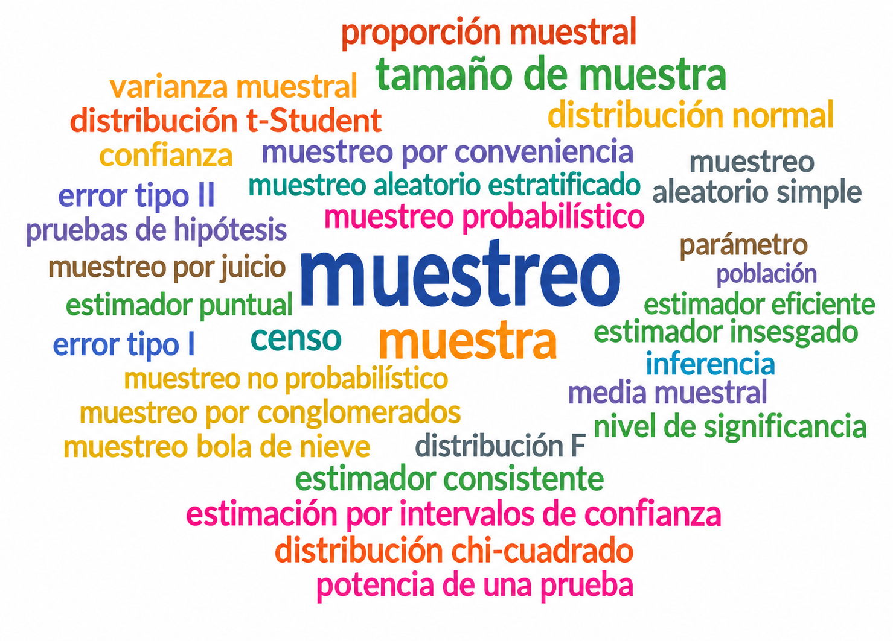
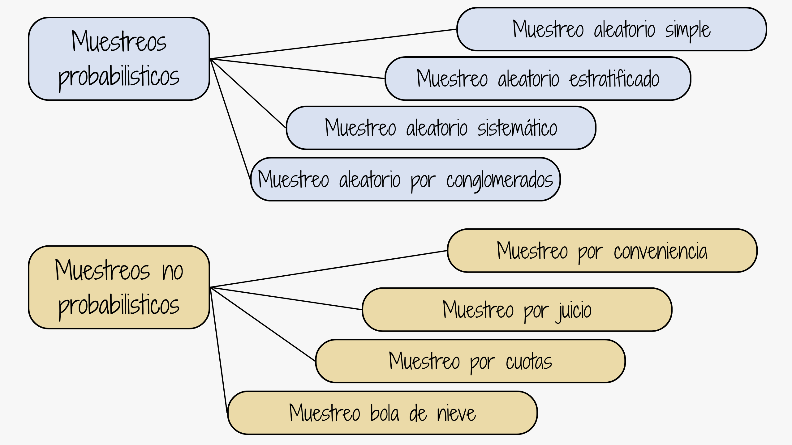
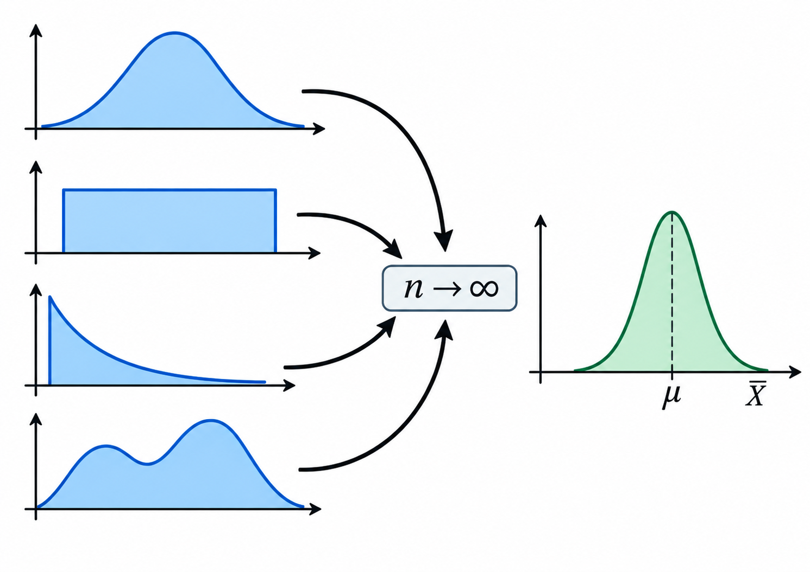
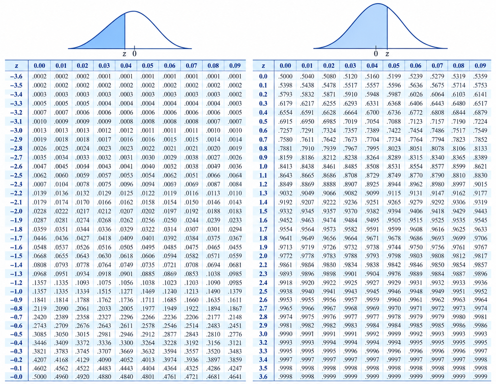
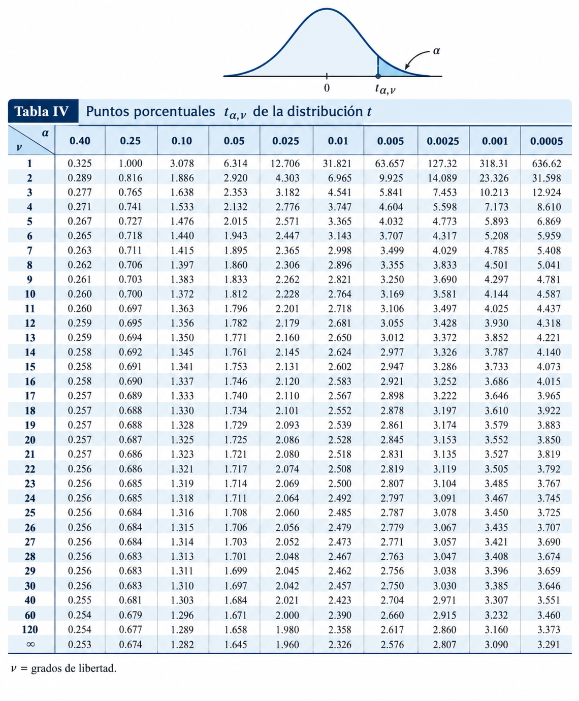
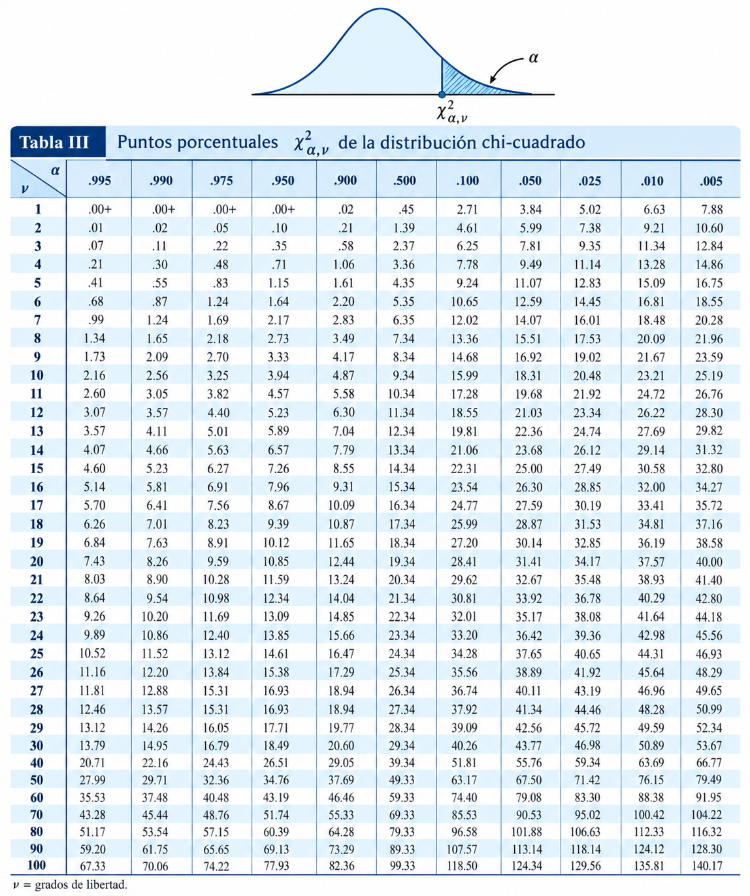
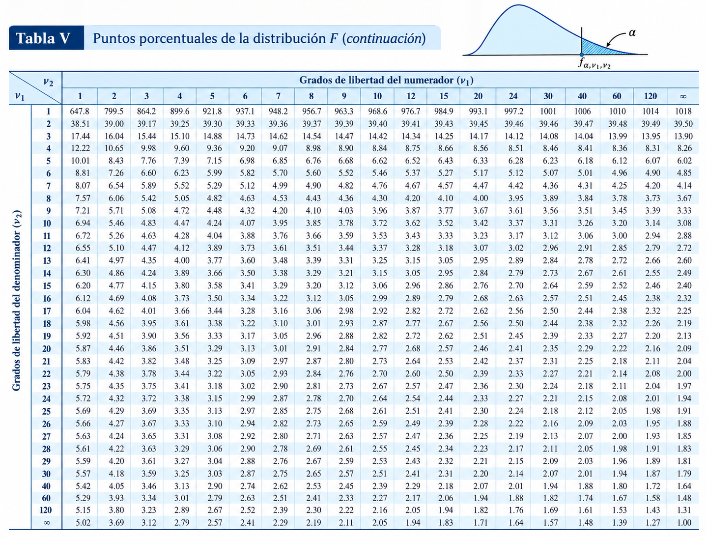
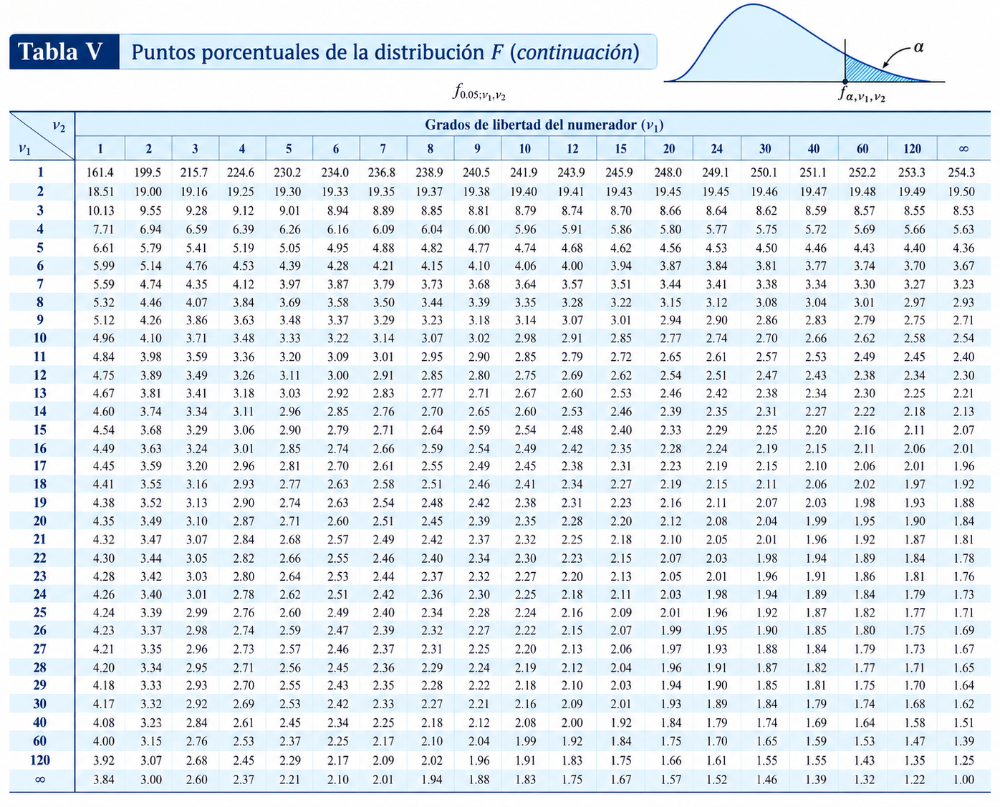

```{r setup, include=FALSE}
knitr::opts_chunk$set(comment = NA)

set.seed(41)

# colores
source("init.R")

```


```{r, echo=FALSE, out.width="100%", fig.align = "center"}
 
```

<br/><br/><br/>

# Introducción

<!-- Pendiente: recuperar img/valiente3.gif (fuente indicada: Valiente, Disney Channel). -->

<br/><br/>

La inferencia estadística permite generalizar lo hallado en una muestra a toda la población. Para realizar este proceso contamos con dos opciones: Estimación y las Pruebas de hipótesis. El fundamento de estos procesos está relacionado con varios conceptos como:

<br/><br/>


```{r, echo=FALSE, out.width="70%", fig.align = "center"}
 
```


<br/><br/>


<div class="box4 with-label">
<div class="label">Población</div>  

En estadística, la población es el conjunto de unidades o mediciones sobre las que se desea obtener información. Una variable aleatoria representa una característica de interés de esas unidades. Un censo estudia todas las unidades de la población; por ejemplo, un censo de población busca enumerar y caracterizar a los habitantes de un país.

</div> 

<br/><br/>


<div class="box4 with-label">
<div class="label">Muestra</div> 

Una muestra es un subconjunto de unidades de la población. En el modelo de muestreo aleatorio independiente, una muestra aleatoria de tamaño $n$ es un conjunto de variables $X_{1}, X_{2},\ldots,X_{n}$ independientes e idénticamente distribuidas. Esta independencia no se cumple exactamente en el muestreo sin reemplazo de una población finita.

</div>

<br/><br/>


<div class="box4 with-label">
<div class="label">Parámetro</div> 

Es una caracterización numérica de la distribución de probabilidad de una variable aleatoria. Como ejemplo de parámetros tenemos a $\mu$, $\sigma^{2}$ que determinan la función de densidad de una variable con distribución normal: 


$$f(x)=\frac{1}{\sqrt{2 \sigma^{2} \pi}} \exp{\Bigg(- \frac{1}{2 \sigma^{2}}\big(x-\mu\big)^{2}\Bigg)}$$

Si suponemos que los valores correspondientes a estos parámetros son $\mu=100$ y $\sigma^{2}=25$   ($\sigma=5$) respectivamente, entonces la función de densidad quedará determinada por :

$$f(x)=\frac{1}{\sqrt{50 \pi}} \exp{\Bigg(- \frac{1}{50}\big(x-100\big)^{2}\Bigg)}$$
</div>

<br/><br/>


<div class="box4 with-label">
<div class="label">Estimador</div> 

Es una función de los valores obtenidos en una muestra aleatoria que da como resultado un valor que corresponde a una aproximación del parámetro objeto de estudio. Generalmente se representa como $\widehat{\theta}$. Como algunos ejemplos podemos citar:

$$\widehat{\mu}=\frac{1}{n}\sum_{i=1}^{n}x_{i}=\bar{x} $$
$$\widehat{\sigma^{2}}=\frac{1}{n-1}\sum_{i=1}^{n}\big(x_{i}-\bar{x}\big)^{2} = s^{2}$$
</div>

<br/><br/>


<div class="box4 with-label">
<div class="label">Estimación</div> 

Es la evaluación o generación del estimador para una muestra determinada. 

Como ejemplo podemos utilizar uno de los estimadores que estudiaremos :  $\widehat{\mu}= \bar{x}$, para una muestra dada

<br/>

$$ 630, 650, 710, 750, 790, 820, 860 \text{ y } 910$$

<br/>

$$\widehat{\mu}=\frac{1}{n}\sum_{i=1}^{n} x_{i} =\frac{1}{8}(630+650+...+910)=765$$
El valor del estimador de $\mu$ para esta muestra es $$\widehat{\mu}=\bar{x}= 765$$.

</div>

<br/><br/>

# Muestreo

<br/>


## Importancia del Muestreo

<br/>

El papel principal de la estadística está relacionado con el análisis de información que permita tomar decisiones con respecto a una población. Es posible que se pueda estudiar la totalidad de elementos  que determinan la población, en este caso estaremos realizando un censo. Sin embargo no siempre podemos estudiar la totalidad de la población por lo cual debemos seleccionar una pequeña parte de ella. A este subconjunto lo podemos llamar muestra.

<br/>

|                                      | **Muestra**     | **Censo**          |
|:-------------------------------------|:----------------|:-------------------|
|Presupuesto                           |pequeño          | grande             |
|Tiempo disponible                     |poco             | mucho              |
|Tamaño de la población                |grande           | pequeña            |
|Varianza de la característica         |pequeña          | grande             |
|Costos de los errores de muestreo     |bajos            | altos              |
|Costos de los errores que no son de muestreo            | alto   | bajo      |
|Naturaleza de la prueba               |destructiva     |no destructiva      |
|Atención a casos individuales         |no               |sí                  |
||||
<font size="-1">Adaptado de Malhotra (2004)</font>

<br/>

Un diseño de muestreo es una estrategia para obtener una muestra, genera algunas preguntas asociadas al proceso de muestreo: ¿cómo seleccionar de una manera óptima la muestra?, ¿Qué característica medir en las unidades observadas? y ¿cómo estimar las características poblacionales a partir de la información muestral?. El proceso de obtención de las muestras por su parte, requiere la definición de algunos aspectos como, ¿cuál es el tamaño óptimo para el cumplimiento de los objetivos?, o  ¿mediante qué procedimiento de aleatorización realizar el proceso de selección?, ¿qué tipo de método observacional utilizar y qué medidas tomar?. En el muestreo, uno tiene la oportunidad de seleccionar deliberadamente la  muestra, para evitar  inducir por ejemplo, a seleccionar por conveniencia algún individuo en particular, situación que pudiera conducir a sesgos en los resultados finales de la investigación.

<br/>

El muestreo consiste en seleccionar una parte de la población mediante un procedimiento definido. En el muestreo probabilístico, la selección aleatoria permite cuantificar la incertidumbre de las estimaciones, aunque no garantiza que cada muestra obtenida reproduzca todas las características poblacionales. La calidad de las conclusiones también depende de:


1. El método de selección de las unidades.
2. El método de medición de las unidades.
3. El conocimiento de los procesos que generan los valores de las unidades medidas.

<br/><br/>

## Diseños Muestrales

<br/>

Un diseño muestral es una estrategia de selección de unidades muestrales, mediante un proceso de aleatorización definido previamente (plan de muestreo). De acuerdo con esta definición, son tres los elementos esenciales de un diseño muestral:

<br/><br/>

### Unidad muestral

<br/>

Constituye la unidad básica a partir de la cual se obtiene la información, pudiendo por tanto, ser éstas personas,  o individuos de cualquier tipo si , por ejemplo nuestro interés es estimar la talla promedio; casas, número promedio de habitaciones, o el consumo de energía; comunidades, si los que nos interesa es el número promedio de especies por comunidad, áreas o cuadrículas si deseamos estimar densidades medias o biomasa total, etc.

<br/><br/>

## Proceso de aleatorización

<br/>

Aun cuando la unidad muestral esté claramente definida, existen algunos elementos que pueden afectar el proceso de muestreo, alterando la calidad de la información. En este caso no es la definición, sino la selección de la unidad muestral, la que puede estar sesgada por la naturaleza de la medición, así por ejemplo, si deseamos encuestar a personas para averiguar su tendencia política o su nivel socio económico, pudiéramos sentirnos tentados a seleccionar sus nombres desde una guía telefónica, lo que dejaría fuera de la encuesta a todas aquellas personas  que no tienen teléfono, constituyéndose ello en una fuente de sesgo. En  otros casos, la naturaleza del muestreo tiene que ver con el entrenamiento de los muestreadores, es el caso, por ejemplo, de las muestras para identificar fallas en un equipo, en que la experiencia del muestreador juega un papel importante en la identificación de los mismos.

En el muestreo probabilístico, cada unidad de la población debe tener una probabilidad de inclusión conocida y positiva. Estas probabilidades no tienen que ser iguales. Además, las selecciones no siempre son independientes: en el muestreo sin reemplazo, seleccionar una unidad modifica las posibilidades de las selecciones posteriores.

<br/><br/>

##  Tamaño

<br/>

Una vez que las unidades muestrales han sido definidas y se ha acordado un proceso de aleatorización, debemos preguntarnos, cuántas unidades debemos seleccionar para tener una buena representación en la  muestra.

Dado que cualquiera sea el proceso de selección de una muestra existe un costo asociado, el que en la mayoría de los casos constituye una exigencia ineludible, nuestro objetivo principal, será obtener el máximo de información con el menor tamaño de muestra que nos sea posible.

Para estimar una media mediante muestreo aleatorio simple, el tamaño inicial $n_{0}$ depende de la varianza, el nivel de confianza y el margen de error tolerado. Usando una aproximación normal, antes de aplicar la corrección por población finita:

$$n_{0}=\dfrac{z^{2}_{1-\alpha/2} \sigma^{2}}{e^{2}}$$

Donde:

**Varianza** ($\sigma^{2}$):  Caracteriza la variable a estimar. Entre mayor sea su valor, mayor deberá ser el tamaño de la muestra. En ocasiones es necesario realizar una prueba piloto que nos permita tener un valor para calcular $n$. Otra alternativa puede ser el conocimiento empírico de expertos sobre el rango de la variable. Con este valor podemos estimar una aproximación de la desviación estándar como: $\sigma =$ rango/4. 

<br/>

**Nivel de confianza** ($1-\alpha$): indica la proporción de intervalos que contendrían el parámetro si se repitiera muchas veces el procedimiento de muestreo y construcción del intervalo. El cuantil $z_{1-\alpha/2}$ corresponde a la probabilidad acumulada $1-\alpha/2$ de la normal estándar; para una confianza del 95%, $z_{0.975}\approx 1.96$.

<br/>

**Margen de error** ($e$): es la semiamplitud máxima deseada para el intervalo de confianza, expresada en las unidades de la variable. Se fija antes de seleccionar la muestra. No debe confundirse con el error de muestreo observado, que es la diferencia entre una estimación y el parámetro poblacional.

<br/><br/>


<div class="box6 with-label">
<div class="label">Ejemplo</div> 
### Cálculo de tamaño de la muestra- Caso de una media
<br/>

Suponga que deseamos determinar el tamaño de la muestra para estimar la media de la nota del curso de estadística, con una confianza del 95\% y un error de muestreo de 0.2 puntos. Un estudio realizado el semestre pasado arrojó una varianza de 1.6.

La información necesaria para el calculo del tamaño de muestra requerido es:

* percentil 97.5 de la distribución normal $z=1.96$ (Entre -1.96 y 1.96 se encuentra el 95\% de los datos)

* varianza $\sigma^{2}=1.6$

* error de muestreo 0.2

 
$$n=\dfrac{1.96^{2} \times 1.6}{0.2^{2}}=153.664 \quad\Rightarrow\quad n=154$$

Si el muestreo es aleatorio simple sin reemplazo de una población finita de tamaño $N$, se puede ajustar el tamaño inicial mediante la corrección por población finita. Es especialmente relevante cuando $n_{0}/N>0.05$:

$$n=\dfrac{n_{0} \times N}{n_{0}+N-1}$$
Supongamos que $N=200$ estudiantes. Como $153.664/200>0.05$, aplicamos la corrección al tamaño inicial sin redondear y redondeamos hacia arriba al final:

$$n= \dfrac{153.664 \times 200}{153.664 + 200 -1} \approx 87.145 \quad\Rightarrow\quad n=88.$$
</div>

<br/><br/>


<div class="box6 with-label">
<div class="label">Ejemplo</div> 
### Cálculo de tamaño de la muestra- Caso de una proporción: 

Supongamos ahora que se desea calcular el tamaño de la muestra para realizar una estimación de la proporción de estudiantes que reprueban el curso de matemáticas fundamentales y que deseamos una confianza del 98\% y un error de muestreo de 0.1. En este caso la varianza corresponde a $pq$ donde $q=1-p$ y por tanto tendrá su valor máximo cuando $p=0.50$, es decir que si utilizamos como varianza $0.5 \times (1-0.5)=0.25$ obtendremos el valor más grande de tamaño de muestra posible.

$$ n=\dfrac{2.33^2 \times 0.25}{0.1^{2}}=135.7225 \quad\Rightarrow\quad n=136.$$

En caso de poder realizar una prueba piloto (observación de una muestra, digamos 30 unidades) y estimar en este caso su varianza, el tamaño de muestra calculado será menor o igual al anterior, pues la varianza estimada no puede superar 0.25.

</div>

<br/><br/><br/><br/>

# Tipos

## Tipos de muestreo 


<div class="box4 with-label">
```{r, echo=FALSE, out.width="60%", fig.align = "center"}
 
```
</div>

<br/>

En general pueden dividirse en dos grandes grupos: métodos de muestreo probabilísticos y métodos de muestreo no probabilísticos.

Los **métodos de muestreo probabilísticos** utilizan un mecanismo aleatorio y asignan a cada unidad de la población una probabilidad de inclusión conocida y positiva. La igualdad de probabilidades de todas las muestras de un tamaño dado caracteriza al muestreo aleatorio simple, pero no a todos los diseños probabilísticos.

Estos métodos permiten realizar inferencia basada en el diseño y estimar el error de muestreo. No garantizan por sí solos que cada muestra sea representativa ni eliminan los errores de cobertura o de medición. Algunas estrategias frecuentes son:

+ muestreo aleatorio simple 
+ muestreo aleatorio sistemático 
+ muestreo aleatorio estratificado 
+ muestreo aleatorio por conglomerados

<br/><br/>

# Muestreos

## Muestreos probabilísticos

<br/><br/>

## Muestreo Aleatorio simple (m.a.s)

<br/>

Una muestra aleatoria simple tomada de una población finita, da a cada subconjunto de la población (muestra) de tamaño específico la misma probabilidad de ser seleccionada.

El muestreo aleatorio simple es un procedimiento de selección de un conjunto de individuos de modo que toda posible muestra de $n$ unidades tiene la misma probabilidad de ser seleccionada de los $N$ individuos asociados a la  población. La muestra se selecciona en $n$ etapas, en cada una de las cuales, cada elemento que no ha sido aún seleccionado, tiene la misma probabilidad de ser seleccionado. Si el número de individuos de donde seleccionamos los $n$ individuos para determinar la muestra tiene un tamaño conocido, podemos asignar un número a cada una de las $N$ unidades y luego mediante la generación de $n$ números aleatorios entre $1$ y $N$, seleccionamos los individuos que determinarán la  muestra de tamaño $n$ correspondiente.

El muestreo puede realizarse sin reemplazo o con reemplazo, o dicho de otro modo, la muestra puede elegirse de dos maneras: sin reposición de la unidad extraída o con reposición de ella. El muestreo con reemplazo es usado cuando es aceptable tener la misma unidad dos veces en la muestra.

<br/><br/>

## Muestreo Estratificado 

<br/>

Una muestra estratificada se obtiene formando estratos, de acuerdo a alguna característica de interés en la población (sexo, edad, ingresos etc.), y de cada estrato se selecciona una muestra aleatoria simple. 

Supongamos, que la población finita se subdivide en $L$ subpoblaciones o estratos, de modo que la muestra esté constituída por elementos de cada uno de ellos. El  muestreo estratificado considera la selección, desde cada uno de los estratos, una muestra aleatoria simple.

La subdivisión de la población en estratos tiene como objetivo reducir la variabilidad total asociada al proceso de muestreo. Por lo tanto es necesario incluir en cada estrato, individuos o unidades muestrales cuya medida de interés tengan variabilidad pequeña respecto a la media. El objetivo general es entonces lograr varianza mínima dentro del estrato y varianza máxima entre estratos. En caso de no lograr esta estratificación, en función de las varianzas, lo más probable es que el proceso de muestreo sea equivalente al que se pudiera haber realizado por muestreo aleatorio simple.

La ventaja principal que puede conseguirse estratificando, es aumentar la precisión de las estimaciones al agrupar elementos con características comunes y con ello disminuir los tamaños muestrales totales y la amplitud de los intervalos de confianza. La mejora respecto al muestreo aleatorio simple depende de la estratificación, la asignación de la muestra y el estimador utilizado; no está garantizada para cualquier diseño.

Por otra parte, la estratificación procura muestras  más representativas. Exagerando, si se pudiera conseguir que cada uno de los $L$ estratos estuviese constituído por elementos idénticos, bastaría tomar $L$ elementos, uno por estrato, y la representatividad sería perfecta. Además, puede lograrse un mejor aprovechamiento de la organización administrativa destinada a la selección de las muestras, al centrar la actividad de muestreo en áreas homogéneas.

El número de estratos depende del criterio de clasificación, es un problema intrínsecamente ligado a la investigación, por ejemplo, si se está trabajando con características de individuos, los estratos pueden elegirse en la siguiente forma:

Estrato 1 $\cdots$ niños (hasta los 14 años inclusive)
Estrato 2 $\cdots$ jóvenes (15 - 25 años)
Estrato 3 $\cdots$ adultos (26 años o mas)

Otros criterios de clasificación pueden obedecer también, por ejemplo, a posiciones geográficas, en otros casos, cada estrato puede ser un sector de la ciudad de la provincia o de la región.

Otro elemento interesante de considerar, en los estudios por muestreo estratificado, es que las conclusiones  pueden darse no sólo a nivel poblacional, sino que independientemente a nivel de cada estrato.

<br/><br/>

## Muestreo Sistemático 

<br/>

Se forma una muestra sistemática seleccionando al azar una unidad y luego se seleccionan adicionalmente las unidades a intervalos igualmente espaciados (cada $k$ unidades de la población, $k>1$) hasta formar la muestra total.

Supongamos que estamos interesados en una población cuyos individuos  han sido numerados desde 1 a $N$, y elegimos una muestra de tamaño $n$ como sigue: entre las $k$ primeras unidades, donde $k =N/n$ elegimos, en forma aleatoria, el elemento $i-ésimo$,entre los $k$ primeros elementos o unidades muestrales. A continuación, sistemáticamente se eligen los elementos $i+k$ que están $k$ lugares después  del $i-ésimo$, y así  sucesivamente hasta agotar los elementos disponibles de la lista, lo que ocurrirá al llegar al elemento que ocupa el lugar $i+(n-1)k$.

Si existen $k$ muestras posibles de $n$ elementos cada una. Por ejemplo, de una población determinada por $N = 1000$ elementos deseamos elegir  sistemáticamente $25$ elementos, habrá $k = 1000/25 = 40$ elecciones diferentes posibles. Elegimos aleatoriamente un número comprendido entre 1 y 40 y a partir de éste, elegimos los 24 restantes de 40 en 40. Supongamos que fue sorteado el 15, entonces la observación que ocupa el $15^{\circ}$ lugar será el primer elemento de la muestra, el segundo será el $55^{\circ}(15+40)$, el tercero será el $95^{\circ}(15+80)$ y así  sucesivamente hasta que el último elemento seleccionado será la observación que ocupe el lugar 975. La muestra estará conformado por los elementos : $15^{\circ},55^{\circ}, 95^{\circ},\cdots,975^{\circ}$ 

El muestreo sistemático suele ser fácil de ejecutar. Su precisión depende del orden de las unidades en la lista y no es necesariamente mayor que la del muestreo aleatorio simple. Cuando $N$ es múltiplo de $n$, basta sortear el inicio entre las primeras $k=N/n$ posiciones y seleccionar cada $k$ unidades.

Este tipo de muestreo no es recomendable cuando el proceso generador de los datos tiene un comportamiento cíclico o estacional, el cuál puede hacer que las unidades seleccionadas coincidan con todos los máximos o todos los mínimos. 


<br/><br/>

## Muestreo por Conglomerados

<br/>

Una muestra por conglomerados se obtiene identificando un conjunto de conglomerados que componen la población, aleatoriamente se selecciona un subconjunto de estos conglomerados y se hace un censo en cada uno de los seleccionados.

A veces, para estudios exploratorios, el muestreo probabilístico resulta excesivamente costoso y se acude a métodos no probabilísticos, aún siendo conscientes de que no sirven para realizar generalizaciones, púes no se tiene certeza de que la muestra extraída sea representativa, ya que no todos los sujetos de la población tienen la misma probabilidad de se elegidos. En general se selecciona a los sujetos siguiendo determinados criterios procurando que la muestra sea representativa.

<br/><br/><br/><br/>

## Muestreos no probabilísticos

<br/>

En el caso de no contar con los supuestos que puedan garantizar la selección de la muestra de una manera aleatoria (no contar con un listado de la población o el no poder identificar con anticipación los elementos que conforman la población) y requerir de información para realizar analisis exploratorios, podemos utilizar otro tipo de muestreos llamados no probabilísticos. A continuación se describen algunos de ellos:

<br/><br/>

## Muestreo por Cuotas 

<br/>

Se asienta generalmente sobre la base de un buen conocimiento de los estratos de la población y/o de los individuos más **representativos** o **adecuados** para los fines de la investigación. Mantiene, por tanto, semejanzas con el muestreo aleatorio estratificado, pero no tiene el carácter de aleatoriedad de aquel. En este tipo de muestreo se fijan unas "cuotas" que consisten en un número de individuos que reúnen unas determinadas condiciones, por ejemplo: 20 individuos de 25 a 40 años, de sexo femenino y residentes en una determinada región. Una vez
determinada la cuota se eligen los primeros que se encuentren que cumplan esas características. Este método se utiliza mucho en las encuestas de opinión.

<br/><br/>

## Muestreo Intencional 

<br/>

Este tipo de muestreo se caracteriza por un esfuerzo deliberado de obtener muestras "representativas" mediante la inclusión en la muestra de grupos
supuestamente típicos. Es muy frecuente su utilización en sondeos preelectorales de zonas que en anteriores votaciones han marcado tendencias de voto.

<br/><br/>

## Muestreo Casual o Incidental

<br/>

Se trata de un proceso en el que el investigador selecciona directa e intencionadamente los individuos de la población. El caso más frecuente de este procedimiento es utilizar como muestra los individuos a los que se tiene fácil acceso (los profesores de universidad emplean con mucha frecuencia a sus
propios alumnos). Un caso particular es el de los voluntarios.

<br/><br/>

## Bola de Nieve 

<br/>

Se localiza a algunos individuos, los cuales conducen a otros, y estos a otros, y así hasta conseguir una muestra suficiente. Este tipo se emplea muy frecuentemente cuando se hacen estudios con poblaciones "marginales", delincuentes, sectas, determinados tipos de enfermos, etc.


<br/><br/><br/><br/>


# Estimadores

<br/>

## Propiedades

<br/>

Dentro de las principales propiedades de los estimadores están:

<br/><br/>

## Insesgadez

<br/>

Un estimador $\widehat{\theta}$ se considera insesgado si $E[\widehat{\theta}] = \theta$

<br/><br/>

## Eficiente

<br/>

Al comparar dos estimadores insesgados del mismo parámetro, $\widehat{\theta_{1}}$ se considera más eficiente que $\widehat{\theta_{2}}$ cuando:

$$V[\widehat{\theta_{1}}] < V[\widehat{\theta_{2}}]$$

<br/><br/>

## Consistente

<br/>

Una sucesión de estimadores $\widehat{\theta}_{n}$ es consistente para $\theta$ si converge en probabilidad a ese parámetro al aumentar el tamaño muestral. Es decir, para todo $\varepsilon>0$, $P(|\widehat{\theta}_{n}-\theta|>\varepsilon)\to 0$ cuando $n\to\infty$. La consistencia no exige insesgadez para cada tamaño de muestra; tampoco basta con que el sesgo tienda a cero.

<br/><br/>

La siguiente figura ilustra el sesgo y la dispersión de cuatro estimadores mediante una simulación. La línea vertical representa el parámetro verdadero. Los estimadores 1 y 2 están centrados lejos de ese valor; los estimadores 3 y 4 están centrados en él. 

Por otro lado la gráfica 3 representa el estimador con las mejores condiciones, insesgado y de menor varianza, lo cual representa un estimador insesgado y eficiente.


<div class="box4 with-label">
<center>
```{r propiedades-estimadores, echo=FALSE, fig.width=8, fig.height=6}
set.seed(4101)
local({
  op <- par(mfrow = c(2, 2), mar = c(4, 4, 3, 1))
  on.exit(par(op))
  centros <- c(2, 2, 0, 0)
  dispersiones <- c(0.3, 1, 0.3, 1)
  for (i in seq_along(centros)) {
    valores <- rnorm(10000, centros[i], dispersiones[i])
    hist(valores, breaks = 40, probability = TRUE,
         xlim = c(-4, 6), ylim = c(0, 1.5), col = "skyblue",
         border = "white", xlab = "Valor del estimador", ylab = "Densidad",
         main = paste("Estimador", i))
    abline(v = 0, col = "red", lwd = 2)
  }
})
```
</center>
</div>

<br/><br/>


<div class="box3 with-label">
<div class="label">Ejemplo</div> 

<br/>

Para una muestra obtenida de una población exponencial con parámetro $\beta$ ( $E[X]=\beta$, $V[X]=\beta^{2}$). Examinar los siguientes estimadores para una muestra de $n=4$ ($X_{1}$, $X_{2}$, $X_{3}$, $X_{4}$)

+ $\widehat{\theta}_{1} = \dfrac{1}{6}(X_{1}+X_{2}) + \dfrac{1}{3}(X_{3}+X_{4})$

<br/>

+ $\widehat{\theta}_{2} = \dfrac{1}{10}(X_{1}+2X_{2} + 3X_{3} + 4X_{4})$

<br/>

+ $\widehat{\theta}_{3} = \dfrac{1}{4}(X_{1} + X_{2} + X_{3} + X_{4})$


Como se puede verificar  $\widehat{\theta}_{3}$ es el mejor estimador de los tres, siendo insesgado y eficiente

```{r, fig.align='center'}
# Se simulan 4 variables de la misma población
n=1000
x1234 = data.frame(x1= rexp(n,1/5),
                   x2= rexp(n,1/5),
                   x3= rexp(n,1/5),
                   x4= rexp(n,1/5))
# Se estiman los tres estimadores
f1 = function(x){1/6*(x[1]+x[2])+ 1/3*(x[3]+x[4])} 
f2 = function(x){1/10*(x[1]+2*x[2]+3*x[3]+4*x[4])} 
f3 = function(x){1/4*(x[1]+x[2]+ x[3]+x[4])} 

T1 = apply(x1234, 1, f1)
T2 = apply(x1234, 1, f2)
T3 = apply(x1234, 1, f3)

# Se visualiza el resultado obtenido

T123 =data.frame(T1,T2,T3)
boxplot(T123, las=1)
abline(h=5, col = "red")

# Se calulan las medias
apply(T123,2, mean)

# Se calculan las varianzas
apply(T123,2, var)
```

</div>

<br/>

Los tres estimadores son insesgados. Bajo independencia, sus varianzas son $V(T_{1})=5\beta^{2}/18$, $V(T_{2})=3\beta^{2}/10$ y $V(T_{3})=\beta^{2}/4$. Por tanto, $T_{3}$ tiene la menor varianza de los tres. Las medias y varianzas simuladas son aproximaciones y pueden variar entre simulaciones.


<br/><br/><br/>

# Distribuciones

## Distribuciones muestrales

<br/>

## Principales distribuciones muestrales: 

+ **normal**
+ **Chi-cuadrado**, 
+ **t-student**, 
+ **F-Fisher**


Se denomina distribución muestral a la distribución que sigue los principales estimadores puntuales o funciones de ellos como son:

$$\bar{X},\hspace{.2cm} \widehat{p}, \hspace{.2cm}\frac{(n-1)S^ {2}}{\sigma^{2}}, \hspace{.2cm} T=\frac{\bar{X}-\mu}{S/\sqrt{n}}, \hspace{.2cm} F=\frac{\chi^ {2}_{1}/v_{1}}{\chi^{2}_{2}/v_{2}}$$

Las relaciones entre estas distribuciones se resumen a continuación:

<br/>


<div class="box4 with-label">
<center>
| Construcción | Distribución | Condiciones |
|:--|:--|:--|
| $\sum_{i=1}^{k} Z_i^2$ | $\chi_k^2$ | $Z_i$ normales estándar independientes |
| $Z/\sqrt{V/v}$ | $t_v$ | $Z\sim N(0,1)$ y $V\sim\chi_v^2$, independientes |
| $(U/v_1)/(V/v_2)$ | $F_{v_1,v_2}$ | $U\sim\chi_{v_1}^2$ y $V\sim\chi_{v_2}^2$, independientes |
</center>
</div>


Si $X\sim N(\mu,\sigma^{2})$, entonces $Z=(X-\mu)/\sigma\sim N(0,1)$. La suma de los cuadrados de $k$ variables normales estándar independientes tiene distribución chi-cuadrado con $k$ grados de libertad. Asimismo, la suma de variables chi-cuadrado independientes tiene grados de libertad iguales a la suma de sus grados de libertad. Si $Z\sim N(0,1)$ y $V\sim\chi^{2}_{v}$ son independientes, $Z/\sqrt{V/v}$ tiene distribución t de Student. La razón $(U/v_{1})/(V/v_{2})$ tiene distribución F cuando $U$ y $V$ son chi-cuadrado independientes con $v_{1}$ y $v_{2}$ grados de libertad.

En sintesis, la distribuciones de muestreo básicas, tienen de base la distribución normal.

<br/><br/>

## Distribución chi-cuadrado 

<br/>

Si $S^{2}$ es la varianza de la muestra aleatoria de tamaño $n$ que se toma de una población normal que tiene varianza $\sigma^{2}$, entonces el estadístico:
$$\chi^{2}=\frac{(n-1)S^{2}}{\sigma^{2}}=\sum_{i=1}^{n}\frac{\big(x_{i}-\bar{x}\big)^{2}}{\sigma^{2}}=\sum_{i=1}^{n} \Big(\frac{x_{i}-\bar{x}}{\sigma}\Big)^{2} $$
tiene una distribución chi-cuadrado con $v=n-1$ grados de libertad.


Nota: Esta función fue creada por Karl Pearson cientifico inglés (1857-1936) y su función de densidad y su representación gráfica estan dadas por:

$$f(x)=\frac{1}{2^{(v/2)}\Gamma(v/2)}x^{(v/2)-1}\exp\{-x/2\} ,\hspace{.3cm} x>0$$
<br/><br/>

```{r, fig.align='center'}
 curve(dchisq(x, df=7), lwd=3, las=1,xlim = c(0,30), ylim=c(0,.13), ylab='Densidad', col="red",axes = FALSE)
curve(dchisq(x, df=9), lwd=3, las=1,xlim = c(0,30), ylab='Densidad',add = TRUE, col="blue")
curve(dchisq(x, df=11), lwd=3, las=1,xlim = c(0,30), ylab='Densidad',add = TRUE, col="green")
abline(h=0)
grid()
```

Esta distribución es un caso especial de la distribución Gamma con parámetros $\alpha=\frac{v}{2}$ y $\beta=2$ 


<br/><br/>


<div class="box3 with-label">
<div class="label">Ejemplo</div> 

En los ejemplos de cuantiles, el subíndice indica probabilidad acumulada a la izquierda, como en las funciones `qchisq`, `qt` y `qf` de R. Para una distribución chi-cuadrado calcule:

* $\chi^{2}_{0.025}$, cuando $v = 15$

```{r}
qchisq(0.025,15)
```


* $\chi^{2}_{0.01}$, cuando $v = 7$

```{r}
qchisq(0.01,7)
```

* $\chi^{2}_{0.05}$, cuando $v = 24$


```{r}
qchisq(0.05,24)
```

</div>

<br/><br/>

## Distribución t-Student

<br/>

Esta función nace de la relación entre una variable con distribución normal estandar y la raiz cuadrada de una variable con distribución chi-cuadrado
Sean Z una variable normal estándar y V una variable chi-cuadrado con v grados de libertad, independientes entre sí; entonces la variable aleatoria T se distribuye t-student con v grados de libertad

$$T=\frac{Z}{\sqrt{V/v}} \sim t_{v}$$


Nota: Esta función de distribución fue propuesta por William Sealy Gosset en 1908. Gosset trabajaba en una fábrica de cerveza de propiedad de Guinness, quien prohibia a sus empleados la publicación de artículos cientificos debido a la difusión previa de secretos industriales. Debido a esta prohibición Gosset publicaba sus artículos con el seudonimo de Student.(Wikipedia.org)

La función de densidad de la distribución t-Student y su representación gráfica están dadas por:

$$f(x)=\frac{\Gamma[(v+1)/2]}{\Gamma[v/2]\sqrt{\pi v}}\Bigg(1+\frac{x^{2}}{v} \Bigg)^{-(v+1)/2}, \hspace{.3cm} -\infty< x<\infty $$

```{r, fig.align='center'}
 curve(dt(x, df=1), lwd=3, las=1,xlim = c(-4,4), ylim=c(0,0.4), ylab='Densidad', col="red",axes = FALSE)
curve(dt(x, df=5), lwd=3, las=1,xlim = c(-4,4), ylab='Densidad',add = TRUE, col="blue")
curve(dt(x, df=20), lwd=3, las=1,xlim = c(-4,4), ylab='Densidad',add = TRUE, col="green")
abline(h=0)
grid()
```

La gráfica de la distribución t-student es similar a la de la distribución normal, salvo que sus colas son más pesadas.

Si $X_{1},X_{2},...,X_{n}$ es una muestra aleatoria de $n$ variables independientemente e idénticamente distribuidas $N(\mu,\sigma^{2})$ y

$$\bar{X}=\frac{1}{n}\sum_{i=1}^{n}X_{i} $$

$$S^{2}=\frac{1}{n-1}\sum_{i=1}^{n}\Big(X_{i}-\bar{X}\Big)^{2} $$

Entonces la variable aleatoria:

$$T=\frac{\bar{X}-\mu}{S/\sqrt{n}} $$

tiene una distribución t-student con $v=n-1$ grados de libertad

<br/><br/>


<div class="box3 with-label">
<div class="label">Ejemplo</div> 

* Calcule $t_{0.025}$, cuando $v = 14$

```{r}
qt(0.025,14)
```

* Calcule $t_{0.975}$, cuando $v = 10$

```{r}
qt(0.975, 10)
```


* Calcule $t_{0.10}$, cuando $v = 7$

```{r}
qt(0.10, 7)
```

</div>

<br/><br/>


## Distribución F-Fisher

<br/>

Si $S_{1}^{2}$ y $S_{2}^{2}$ son las dos varianzas de muestras aleatorias independientes de tamaños $n_{1}$ y $n_{2}$ tomadas de poblaciones normales con varianzas $\sigma_{1}^{2}$ y $\sigma_{2}^{2}$ respectivamente, entonces:

$$F=\frac{S_{1}^{2}/\sigma_{1}^{2}}{S_{2}^{2}/\sigma_{2}^{2}}=\frac{\sigma_{2}^{2}}{\sigma_{1}^{2}} \frac{S_{1}^{2}}{S_{2}^{2}} $$

tiene una distribución F con grados de libertad $v_{1}=n_{1}-1$ y $v_{2}=n_{2}-1$\\


Nota: Ronald Aylmer Fisher (1890-1962) cientifico, matemático, estadístico, biólogo evolutivo y genetista inglés fue el creador de la distribución F. Su función de distribución y su representación gráfica estan dadas por:

$$f(x)=\displaystyle\frac{\Gamma \Bigg[\displaystyle\frac{v_{1}+v_{2}}{2}\Bigg]\Bigg(\displaystyle\frac{v_{1}}{v_{2}}\Bigg)^{v_{1}/2} x^{(v_{1}/2)-1}}{\Gamma \Bigg[\displaystyle\frac{v_{1}}{2}\Bigg] \Gamma \Bigg[\displaystyle\frac{v_{2}}{2}\Bigg]
\Bigg[\Bigg(\displaystyle\frac{v_{1}}{v_{2}}\Bigg)x+1\Bigg]^{\big(v_{1}+v_{2}\big)/2}}, \hspace{.3cm} x>0 $$


```{r, fig.align='center'}
 curve(df(x, df1=5, df2=10), lwd=3, las=1,xlim = c(0,5), ylim=c(0,1), ylab='Densidad', col="red",axes = FALSE)
curve(df(x, df1=10, df2=25), lwd=3, las=1,xlim = c(0,5), ylab='Densidad',add = TRUE, col="blue")
curve(df(x, df1=20, df2=20), lwd=3, las=1,xlim = c(0,5), ylab='Densidad',add = TRUE, col="green")
abline(h=0)
grid()
```


<br/><br/>


<div class="box3 with-label">
<div class="label">Ejemplo</div> 

* Calcule $f_{0.025}$, con $v_{1} = 7$ y $v_{2} = 15$

```{r}
qf(0.025, 7,15)
```


* Calcule $f_{0.975}$, con $v_{1} = 7$ y $v_{2} = 15$

```{r}
qf(0.975, 7, 15)
```

```{r}
1/qf(0.025, 15,7)
```

</div>

<br/><br/>

# Media

<br/>

## Media muestral 


$$ \bar{X}=\frac{1}{n}\sum_{i=1}^{n} X_{i}$$

Al hablar de distribución de probabilidad de la media muestral, implicitamente estamos afirmando que $\bar{X}$, es una variable aleatoria. De esta variable a continuación estudiaremos sus principales caracteristicas. 

Para verificar las propiedades de este estimador podemos hacer uso de las propiedades del valor esperado de la siguiente manera:

$$\begin{eqnarray*}
E[\bar{X}] &=& E\Bigg[ \frac{1}{n}\sum_{i=1}^{n}X_i\Bigg] = \frac{1}{n} E\Big[X_{1}+X_{2}+\cdots + X_{n}\Big]\\
&=&\frac{1}{n} [\mu + \mu + \cdots + \mu ] = \frac{1}{n} n\mu = \mu\\
\end{eqnarray*}$$

por tanto:

$$\mu = \mu_{\bar{X}}$$

Como conclusión obtenemos que la media de la media muestral es igual a la media de la variable. 

Para observaciones independientes con varianza común, las propiedades de la varianza dan:

$$\begin{eqnarray*}
V[\bar{X}]&=&V\Bigg[\frac{1}{n} \sum_{i=1}^{n} X_{i}\Bigg] \\
&=&\dfrac{1}{n^{2}} V\big[X_{1}+X_{2}+\cdots + X_{n}\big] \\
&=& \dfrac{1}{n^{2}} \Big(V[X_{1}]+V[X_{2}]+\cdots +V[X_{n}]\Big)\\
&=& \dfrac{1}{n^{2}} n\sigma^{2}\\
&=& \dfrac{\sigma^{2}}{n}
\end{eqnarray*}$$

Se concluye que:

$$V[\bar{X}] = \dfrac{\sigma^{2}}{n}$$

Obtenemos así que, bajo independencia, la varianza de la media muestral es igual a la varianza de la variable dividida entre el tamaño muestral $n$. \\


Para verificar estas caracteristicas, vamos a suponer que tenemos una población de N=5, conformada por los elementos: $10,20,30,40,50$. Para esta población podemos calcular sus parametros $\mu$ y $\sigma^{2}$.

$$\begin{eqnarray*}
\mu_{_{X}}&=&\dfrac{1}{5}\sum_{i=1}^{5}x_{i} =\dfrac{(10+20+30+40+50)}{5}=30 \\
\sigma^{2}_{_{X}}&=&\sum_{i=1}^{5}\dfrac{1}{5}\big(x_{i}-30 \big)^{2} =\dfrac{1}{5}\Big[ \big(10-30\big)^{2} + ...\\
& &\big(20-30 \big)^{2}+ ....\big(50-30 \big)^{2} \Big]=\dfrac{1000}{5}=200
\end{eqnarray*}$$

Ahora estudiaremos la población de muestras que se pueden obtener de esta población de tamaño $n=2$ tomadas con reemplazo (probabilidad constante)

En la practica el muestreo se realiza sin remplazo y debido a que el tamaño de la población es grande o es considerado como infinito, hace que la probabilidad de seleccionar un objeto de la población se pueda considerar como constante .

<br/><br/>


|  muestra |  $\bar{x}$ |  muestra | $\bar{x}$ |  muestra |  $\bar{x}$ |  muestra | $\bar{x}$ | muestra  | $\bar{x}$ |
|:--------:|:----------:|:--------:|:---------:|:--------:|:----------:|:--------:|:---------:|:--------:|:---------:|
| (10,10)  |  10        | (20,10)  | 15        | (30,10)  |  20        | (40,10)  |  25       |  (50,10) |  30       |  
| (10,20)  |  15        | (20,20)  | 20        | (30,20)  |  25        | (40,20)  |  30       |  (50,20) |  35       |
| (10,30)  |  20        | (20,30)  | 25        | (30,30)  |  30        | (40,30)  |  35       |  (50,30) |  40       |    
| (10,40)  |  25        | (20,40)  | 30        | (30,40)  |  35        | (40,40)  |  40       |  (50,40) |  45       |
| (10,50)  |  30        | (20,50)  | 35        | (30,50)  |  40        | (40,50)  |  45       |  (50,50) |  50       |

<br/><br/>

Estos valores conforman la población de muestras ordenadas de tamaño n=2 que se pueden obtener con reemplazo de la población inicial, En este caso podemos calcular la media y la varianza poblacional de $\bar{X}$

$$\begin{eqnarray*}
\mu_{_{\bar{X}}}&=& \dfrac{1}{25}(10+15+20+...50) = 30 \\
\sigma^{2}_{_{\bar{X}}}&=& \dfrac{1}{25} \Big[\big(10-30\big)^{2} +...+\big(50-30\big)^{2} \Big]=100
\end{eqnarray*}$$

De estos resultados podemos concluir que:

* La media poblacional de la variable aleatoria $X$ es idéntica a la media de la distribución muestral de la media $\bar{X}$

$$\mu_{_{X}} = \mu_{_{\bar{X}}}$$

* La varianza poblacional de $\bar{X}$ es igual la varianza de $X$ dividido por el tamaño de la muestra

$$\sigma^{2}_{_{\bar{X}}} = \dfrac{\sigma^{2}_{_{X}}}{n}$$


Si el muestreo se realiza sin reemplazo la población de muestras de tamaño n=2, estaría conformada por:

<br/><br/>

|  muestra |  $\bar{x}$ |  muestra | $\bar{x}$ |  muestra |  $\bar{x}$ |  muestra | $\bar{x}$ | muestra  | $\bar{x}$ |
|:--------:|:----------:|:--------:|:---------:|:--------:|:----------:|:--------:|:---------:|:--------:|:---------:|
|(10,20)   | 15         | (10,40)  | 25        | (20,30)  |   25       | (20,50)  | 35        |  (30,50) | 40        |
|(10,30)   | 20         | (10,50)  | 30        | (20,40)  |   30       | (30,40)  | 35        |  (40,50) | 45        |

<br/><br/>

En este caso la media y la varianza de esta población son:
$$\begin{eqnarray*}
\mu_{_{\bar{X}}}&=& \dfrac{1}{10}(15+20+...45) = 30 \\
\sigma^{2}_{_{\bar{X}}}&=& \dfrac{1}{10} \Big[\big(15-30\big)^{2} +...+\big(45-30\big)^{2} \Big]=75
\end{eqnarray*}$$

La diferencia en la varianza se debe al muestreo sin reemplazo; su efecto es apreciable porque la fracción de muestreo es grande ($\frac{n}{N}=\frac{2}{5}=0.40$). El haber realizado el muestreo sin repetición cambia la probabilidad condicional del segundo elemento y genera dependencia entre las observaciones. En este caso se debe corregir el valor obtenido para obtener el valor correcto de la varianza multiplicando la varianza por **fcpf** factor de corrección por población finita

$$V(\bar{X})=\dfrac{\sigma_X^2}{n} \times \dfrac{(N-n)}{(N-1)} =100 \times \dfrac{(5-2)}{(5-1)}=75$$

$$\text{fcpf:} \dfrac{(N-n)}{(N-1)}$$

<br/><br/>


<div class="box3 with-label">
<div class="label">Ejemplo</div> 

<br/>

Cierto tipo de batería para automóviles dura un promedio de 1110 días con una desviación estandar de 80 días. Si se eligen n=400 de estas baterías de manera aleatoria, encuentre la probabilidad de que el promedio sea mayor a 1120 días y halle el percentil 80 para esta distribución.
Para una muestra independiente de tamaño $n=400$, el teorema central del límite permite aproximar la distribución de la media por $\bar{X}\approx N(1110,80^{2}/400)$, con desviación estándar de 4 días. La distribución sería exactamente normal si la duración individual fuera normal.

$$\begin{eqnarray*}
P(\bar{x} > 1120) &=& P\Bigg(\dfrac{\bar{x}-\mu}{\sigma/\sqrt{n}} > \dfrac{1120-1110}{80/\sqrt{400}}\Bigg)\\
&\approx& P(Z > 2.5)\\
&=& 1-P(Z < 2.5)\\
&\approx& 1-0.9938 \\
&\approx& 0.0062
\end{eqnarray*}$$

El percentil 80 de la distribución aproximada de la media es:

$$x_{0.80}=1110+z_{0.80}\frac{80}{\sqrt{400}}
\approx1110+0.84162(4)=1113.37\text{ días}.$$

</div>

<br/><br/><br/><br/>

# Proporción

<br/>

## Proporción muestral 

Al igual que en la media podemos realizar la verificación con la proporción, mediante la utilización de la siguiente población. Supongamos que en una población compuesta por 5 personas ($N=5$) tres de ellas son profesionales y queremos estudiar $p$, la proporción de profesionales en la población. En términos de variable seria: $S_{1}, N_{2}, N_{3}, S_{4}, S_{5}$, con el fin de distinguir las personas colocaremos un subindice. Con esta información podemos calcular los valores poblacionales:

$$p=\dfrac{3}{5}=0.6$$

$$pq=p(1-p)=0.6 \times 0.4 = 0.24$$

Podemos obtener la distribución de proporciones muestrales ($\widehat{p}$) de tamaño $n=2$ mediante muestreo con reemplazo:

<br/><br/>

|muestra |$\widehat{p}$ |  muestra|$\widehat{p}$|muestra|$\widehat{p}$|muestra|$\widehat{p}$ | muestra|$\widehat{p}$ |
|:-------------:|:-----:|:-------------:|:----:|:-------------:|:----:|:-------------:|:----:|:-------------:|------:|
|$(S_{1},S_{1})$|$1.0$  |$(N_{3},S_{4})$|$0.5$ |$(S_{1},N_{2})$|$0.5$ |$(N_{3},S_{5})$|$0.5$ |$(S_{1},N_{3})$|$0.5$  |
|$(S_{4},S_{1})$|$1.0$  |$(S_{1},S_{4})$|$1.0$ |$(S_{4},N_{2})$|$0.5$ |$(S_{1},S_{5})$|$1.0$ |$(S_{4},N_{3})$|$0.5$  | 
|$(N_{2},S_{1})$|$0.5$  |$(S_{4},S_{4})$|$1.0$ |$(N_{2},N_{2})$|$0.0$ |$(S_{4},S_{5})$|$1.0$ |$(N_{2},N_{3})$|$0.0$  |
|$(S_{5},S_{1})$|$1.0$  |$(N_{2},S_{4})$|$0.5$ |$(S_{5},N_{2})$|$0.5$ |$(N_{2},S_{5})$|$0.5$ |$(S_{5},N_{3})$|$0.5$  | 
|$(N_{3},S_{1})$|$0.5$  |$(S_{5},S_{4})$|$1.0$ |$(N_{3},N_{2})$|$0.0$ |$(S_{5},S_{5})$|$1.0$ |$(N_{3},N_{3})$|$0.0$  |

<br/><br/>

De esta población tenemos que:

$$\mu_{\widehat{p}}=\dfrac{15}{25}=0.6$$

$$V[\hspace{.1cm}\widehat{p}\hspace{.1cm}]=\frac{3}{25}=0.12$$

Con este resultado estamos verificando que se cumple que:

$$E[\hspace{.1cm}\widehat{p}\hspace{.1cm}]= p$$

$$V[\hspace{.1cm}\widehat{p}\hspace{.1cm}] =\dfrac{p(1-p)}{n}$$

<br/><br/>


<div class="box6 with-label">
<div class="label">Ejemplo</div> 

<br/>

La proporción de individuos con tipo de sangre Rh positivo es de 85%. Si se tiene una muestra de $n=500$ individuos, Encuentre la probabilidad de que la proporción muestral $\widehat{p}$ pase de 82%.
Para observaciones Bernoulli independientes, cuando $np$ y $n(1-p)$ son suficientemente grandes, la distribución de la proporción se aproxima a una distribución normal con media $p$ y varianza $p(1-p)/n$. Usando la aproximación normal sin corrección de continuidad, podemos estimar la probabilidad solicitada:

$$\begin{eqnarray*}
P(\widehat{p}>0.82) &=& P\Bigg(\dfrac{\widehat{p}-p}{\sqrt{p(1-p)/n}} > \dfrac{0.82 - 0.85}{\sqrt{(0.85 \times 0.15)/500}}\Bigg) \\
&\approx& P\big(Z > -1.879 \big) \\
&=& 1 - P(Z < -1.88)\\
&\approx& 1-0.0301 = 0.9699
\end{eqnarray*}$$

</div>

<br/><br/>

# Varianza

<br/>

## Varianza muestral 


<br/>

Ahora tenemos interes en estudiar el comportamiento de $S^{2}$ llamada cuasivarianza por algunos y definida por:
$$\widehat{\sigma^{2}}=S^{2}=\dfrac{1}{(n-1)}\sum_{i=1}^{n}\big(x_{i}-\bar{x}\big)^{2}$$


Para una muestra independiente e idénticamente distribuida con varianza finita, se puede demostrar que:

$$E[S^{2}] = \sigma^{2}$$


Si, además, la población es normal, se cumple:

$$V[S^{2}] = \dfrac{2\sigma^{4}}{(n-1)}$$


Bajo ese mismo supuesto de normalidad:

$$\dfrac{(n-1) S^{2}}{\sigma^{2}} \sim \chi^{2}_{(v=n-1)} $$

Revisar : Canavos(1988) pp.231

<br/><br/>

[**Practica 005**](https://javerianacaliedu-my.sharepoint.com/:x:/g/personal/dgonzalez_javerianacali_edu_co/EeC4j33wrR9LsMF3CDlgsVwBqFaMB2mJJHKNpyW3JcNowQ?e=lAfCEI)


<br/><br/><br/><br/>

## Estimadores más empleados

<br/>

Las varianzas de la siguiente tabla suponen muestreo independiente; las diferencias requieren muestras independientes entre sí. La expresión para $V(S^2)$ requiere, además, normalidad poblacional. En muestreo sin reemplazo de poblaciones finitas deben aplicarse las correcciones correspondientes.

| Parámetro         |  Estimador                        | Valor esperado              | Varianza                                              |
|:-----------------:|:---------------------------------:|:---------------------------:|:-----------------------------------------------------:|
| $\theta$          | $\widehat{\theta}$                | $E[\widehat{\theta}]$       | $V[\widehat{\theta}]$                                 |
| $\mu$             | $\bar{x}$                         |  $\mu$                      | $\displaystyle\frac{\sigma^{2}}{n}$                   |
| $p$               | $\widehat{p}=\frac{X}{n}$         | $p$                         | $\displaystyle\frac{pq}{n}$                           |
|$\sigma^{2}$       | $S^{2}=\displaystyle\frac{\displaystyle\sum_{i=1}^{n}(x_i-\bar{x})^{2}}{n-1}$ | $\sigma^{2}$|$\dfrac{2\sigma^{4}}{(n-1)}$ |
|$\mu_{1}-\mu_{2}$  | $\bar{x}_{1}-\bar{x}_{2}$         | $\mu_{1}-\mu_{2}$         |$\dfrac{\sigma^{2}_{1}}{n_{1}}+\dfrac{\sigma^{2}_{2}}{n_{2}}$ |
|$p_{1}-p_{2}$      | $\widehat{p_{1}}-\widehat{p_{2}}$ | $p_{1}-p_{2}$               |$\dfrac{p_{1}q_{1}}{n_{1}}+\dfrac{p_{2}q_{2}}{n_{2}}$ |


<br/><br/><br/>


<!-- ## **Ejercicio M&M** -->

<!-- [Base M&M](https://javerianacaliedu-my.sharepoint.com/:x:/g/personal/dgonzalez_javerianacali_edu_co/ESEEyzhH7E1Ilm0D5tr3X1ABcah7El3-qIVuwW0lvWpAuA?e=FHfrbF) -->

<!-- <br/><br/><br/> -->

# Teorema del límite central  

<br/>


```{r, echo=FALSE, out.width="100%", fig.align = "center"}

```


Sean $X_1,\ldots,X_n$ variables independientes e idénticamente distribuidas con media $\mu$ y varianza finita $0<\sigma^2<\infty$. El teorema central del límite establece la convergencia en distribución de la media estandarizada:

$$Z_n=\dfrac{\bar{X}-\mu}{\sigma/\sqrt{n}} \xrightarrow{d} N(0,1),\qquad n\to\infty.$$

Para tamaños muestrales suficientemente grandes, puede usarse la aproximación normal; su calidad depende de la distribución de origen. También se aplica a la suma $T_n=X_1+\cdots+X_n$, cuya estandarización es $(T_n-n\mu)/(\sigma\sqrt n)$.

<!--  -->


El teorema no exige que la población sea normal, pero sí que se cumplan sus supuestos. No existe un tamaño muestral universal que garantice una buena aproximación para todas las distribuciones. Las simulaciones siguientes ilustran el resultado para poblaciones uniforme y exponencial.

<br/><br/>

## Verificación del teorema central del límite

<br/>


<div class="box3 with-label">
<div class="label">Ejemplo</div> 
### Distribución uniforme(10,50)

El siguiente bloque genera las animaciones de las poblaciones uniforme y exponencial. Se ejecuta manualmente cuando se quieran regenerar los archivos de `img/`.

```{r generar-animaciones, eval=FALSE}
library(magick)
set.seed(4102)

generar_animaciones <- function(generador, nombre, prefijo) {
  tamanos <- c(1, 5, 10, 20, 30, 50, 100, 200, 500, 1000)
  datos <- matrix(generador(1000 * max(tamanos)), nrow = 1000)
  medias <- lapply(tamanos, function(n) rowMeans(datos[, seq_len(n), drop = FALSE]))
  temporales <- tempfile("fotogramas-")
  dir.create(temporales)
  on.exit(unlink(temporales, recursive = TRUE))
  dir.create("img", showWarnings = FALSE)

  for (tipo in c("hist", "qqnorm")) {
    archivos <- file.path(temporales, paste0(tipo, "_", tamanos, ".png"))
    for (i in seq_along(tamanos)) {
      png(archivos[i], width = 800, height = 600)
      tryCatch({
        titulo <- paste(nombre, "- medias con n =", tamanos[i])
        if (tipo == "hist") {
          hist(medias[[i]], main = titulo, xlab = "Media muestral",
               ylab = "Frecuencia", col = "skyblue", border = "white")
        } else {
          qqnorm(medias[[i]], main = titulo, col = "blue", pch = 16)
          qqline(medias[[i]], col = "red", lwd = 2)
        }
      }, finally = dev.off())
    }
    fotogramas <- image_read(archivos)
    animacion <- image_animate(fotogramas, fps = 1)
    image_write(animacion, file.path("img", paste0(prefijo, "_", tipo, ".gif")))
  }
}

generar_animaciones(function(n) runif(n, 10, 50), "U(10,50)", "animation")
generar_animaciones(function(n) rexp(n, rate = 1/20), "Exp(tasa = 1/20)", "animation2")
```

```{r, echo=FALSE, fig.align="center", out.width="49%", fig.show="hold"}
knitr::include_graphics(c("img/animation_hist.gif", "img/animation_qqnorm.gif"))
```


Se puede notar la transformación de la distribución de la media a una distribución normal a medida que el tamaño de muestra aumenta


</div>

<br/><br/><br/><br/>


<div class="box3 with-label">
<div class="label">Ejemplo</div> 

## Distribución exponencial(1/20)


```{r, echo=FALSE, fig.align="center", out.width="49%", fig.show="hold"}
knitr::include_graphics(c("img/animation2_hist.gif", "img/animation2_qqnorm.gif"))
```


</div>

## Video

<br/>

<center>
<iframe width="560" height="315" src="https://www.youtube.com/embed/jbrnCa3jq0Y" title="YouTube video player" frameborder="0" allow="accelerometer; autoplay; clipboard-write; encrypted-media; gyroscope; picture-in-picture" allowfullscreen></iframe>
</center>

<br/><br/><br/>

## Tablas

<br/><br/>

#### Tabla normal estandar
```{r, echo=FALSE, out.width="100%", fig.align = "center"}
 
```

<br/><br/>

Las tablas t, chi-cuadrado y F siguientes muestran cuantiles de cola derecha: $P(X>c)=\alpha$. Para obtenerlos en R se usa probabilidad acumulada $1-\alpha$.

#### Tabla t-Student
```{r, echo=FALSE, out.width="100%", fig.align = "center"}
 
```

<br/><br/>

#### Tabla chi-cuadrado
```{r, echo=FALSE, out.width="100%", fig.align = "center"}
 
```

<br/><br/>

#### Tabla F 

```{r, echo=FALSE, out.width="100%", fig.align = "center"}
 
```

<br/><br/>

#### Tabla F 

```{r, echo=FALSE, out.width="100%", fig.align = "center"}
 
```