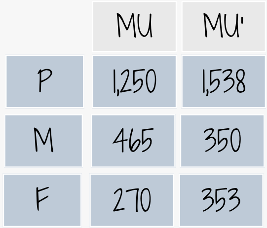
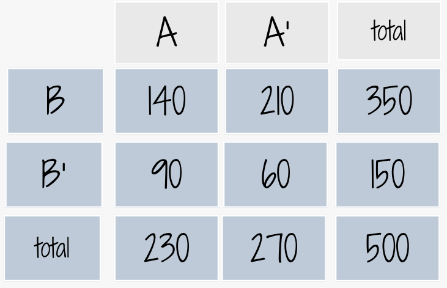
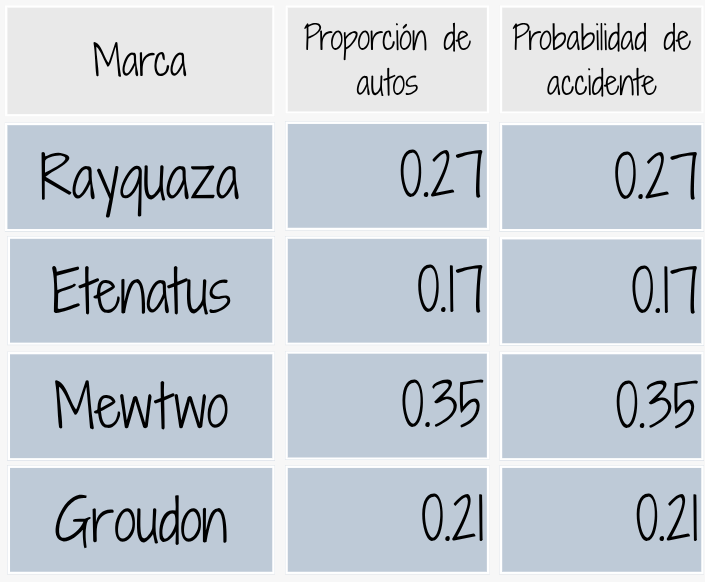

 

```{r setup, include=FALSE}
options(htmltools.dir.version = FALSE)
knitr::opts_chunk$set(
  fig.width=9, fig.height=3.5, fig.retina=3,
  out.width = "100%",
  cache = FALSE,
  echo = TRUE,
  message = FALSE, 
  warning = FALSE,
  hiline = TRUE,
  comment = NA
)
## colores
source("colores.R")

library(forcats)
library(patchwork)
library(lubridate)
library(ggplot2)
library(gridExtra)
library(cowplot)
library(summarytools)

#library(dviz.supp)
```

<br/><br/>

<div class="box1 with-label">
<div class="label">Problema 1</div>

<br/>

En una universidad de la región hay 4000 estudiantes distribuidos en tres grupos: primeros semestres (1 a 3), mitad de carrera (4 a 7) y final de carrera (8 a 10). Esta población está conformada por estudiantes que participan en actividades extracurriculares y estudiantes que no participan.

**Convenciones**

- `MU`: Participa en actividades del Medio Universitario.
- `MU'`: No participa en actividades del Medio Universitario.

- `P` : Primeros semestres
- `M` : Mitad de programa 
- `F` : Final de programa


```{r, echo=FALSE, out.width="25%", fig.align = "center"}

```

<br/>

Se ha encomendado a un grupo de profesores consejeros, seleccionar un estudiante de este grupo para guiarlos académicamente en su proceso de formación. El grupo de profesores está conformado por Sandra, Isabel, David, Daniel y Gerardo Sandra prefiere que el grupo de estudiantes a su cargo sean estudiantes de primeros semestres y que participan en actividades del Medio Universitario (MU) . Isabel en cambio los elegirá dentro del grupo de estudiantes que está finalizando carrera, dentro de los que prefieren no participar en actividades del MU. Por su parte David desea estudiantes sean del rango intermedio o mitad de carrera, pues ellos no han realizado la escogencia del énfasis. Daniel solicita un listado de los estudiantes que participan en actividades del MU y de ellos desea que el estudiante a su cargo esté cursando últimos semestres. Finalmente Gerardo solo quiere que el estudiante seleccionado para su acompañamiento sea de primeros semestres. Si en cada caso los estudiantes son seleccionados de manera aleatoria de toda la población, ¿qué profesor tiene la mayor probabilidad de ver cumplidos sus deseos?

<br/>

</div>

<br/><br/><br/>

<div class="box1 with-label">
<div class="label">Problema 2</div>

<br/>

En una fábrica de artı́culos para protección biodegradables ,cuatro operarios colocan etiquetas de caducidad en cada artı́culo al final de la lı́nea de producción. Juan, quien coloca la fecha de caducidad en un 40% de los paquetes no logra ponerla en uno de cada 200 paquetes; Nicolle, quien coloca en 30% de los paquetes, no logra colocarla en uno de 100 paquetes; Sara, quien coloca etiquetas en el 15% de los paquetes, no lo hace una vez en 90 paquetes; y Nelson que fecha 15% de los paquetes, falla en uno de cada 200 paquetes. Si un cliente se queja de que su paquete no muestra la fecha de caducidad. ¿Cuál de los empleados es el más probable culpable de esta omisión?

</div>

### Información suministrada

$P(Juan) = 0.40$
$P(Nicole)= 0.30$
$P(Sara) = 0.15$
$P(Nelson) = 0.15$

$P(NoEtiqueta | Juan) = 1/200$
$P(NoEtiqueta | Nicole) = 1/100$
$P(NoEtiqueta | Sara) = 1/90$
$P(NoEtiqueta | Nelson) = 1/200$

Como  
$P(B|A) = \dfrac{P(A \cap B)}{P(A)}$
Se puede tambien escribir
$P(A \cap B) = P(B|A) P(A)$

Entoces 

$P(\text{Juan} \cap \text{NoEtiqueta}) = P(Juan) \times P(NoEtiqueta | Juan) = 0.40 \times 1/200 = 0.00200$
$P(\text{Nicolle} \cap \text{NoEtiqueta}) = P(Nicolle) \times P(NoEtiqueta | Nicolle) = 0.30 \times 1/100 = 0.00300$
$P(\text{Sara} \cap \text{NoEtiqueta}) = P(Sara) \times P(NoEtiqueta | Sara) = 0.15 \times 1/90 = 0.00167$
$ P(\text{Nelson} \cap \text{NoEtiqueta}) = P(Nelson) \times P(NoEtiqueta | Nelson) = 0.15 \times 1/200 = 0.00075$

Ahora tenemos que la suma de estas probabilidades nos dá: 
$P(NoEtiqueta) = 0.002 + 0.003 + 0.00167+ 0.00075 = 0.00742$ 


Con estos valores puedo encontrar:

$P(Juan | NoEtiqueto) = 0.002/0.00742 = 0.2695418$
$P(Nicolle | NoEtiqueto) = 0.003/0.00742 = 0.4043127$
$P(Sara | NoEtiqueto) = 0.00167/0.00742 = 0.2250674$
$P(Nelson | NoEtiqueto) = 0.00075/0.00742 = 0.1010782$

Nicolle es la sospechoza numero uno de haber cometido el error


<br/><br/><br/>

<div class="box1 with-label">
<div class="label">Problema 3</div>

<br/>

Una empresa de servicios financieros analizó `500` posibles clientes que mostraron interés por sus productos después de revisar dos canales de mercadeo: pauta digital y referidos comerciales.

**Clasificación**

- **A**: compra (termina el proceso).
- **A'**: no compra.
- **B**: pauta digital.
- **B'**: referido.

<br/>

```{r, echo=FALSE, out.width="30%", fig.align = "center"}

```
<br/>

Con el fin de realizar una buena asignación del presuipuesto comercial para este año, requieren decidir sobre la conveniencia o no de invertir en los diferentes medios. Para ello solicitan validar cada una de las siguiente sospechas.

1. Es mas probable que un cliente referido compre que uno que haya llegado por una pauta digital
2. Es mejor invertir en la pauta digital que en la de referidos
3. El canal digital tiene mayor probabilidad de interesar a clientes potenciales

<br/>

</div>

<br/><br/><br/>

<div class="box1 with-label">
<div class="label">Problema 4</div>

<br/>

Examen de drogas Muchas universidades aplican exámenes para detectar el uso de drogas en estudiantes, con la finalidad de mejorar la salud y el bienestar en el campus, y reducir el riesgo de comportamiento inapropiado, accidentes y problemas académicos. Las personas que se oponen a esta práctica argumentan que este procedimiento puede etiquetar injustamente a algunos estudiantes, dado que las pruebas no son 100% confiables. Supongamos que una universidad utiliza una prueba con un 98% de exactitud, la cual identifica a un estudiante como usuario o no usuario de drogas con una probabilidad de .98. Para reducir la posibilidad de error, se solicita a cada estudiante que realice dos pruebas. Si los resultados de las dos pruebas en el mismo estudiante son eventos independientes, ¿cuáles son las probabilidades de los siguientes eventos?

<br/>

1. Un estudiante que no consume drogas falle ambas pruebas.
2. Se detecte a un estudiante como usuario de drogas (falla en al menos una prueba).
3. Un estudiante que consume drogas pase ambas pruebas.

<br/>

</div>


<br/><br/><br/>

<div class="box1 with-label">
<div class="label">Problema 5</div>

<br/>

Una compañia de seguros de automóviles trabaja con cuatro tipo de autos :  Rayquaza, Etenatus, Mewtwo y Groudon, sobre los que cuenta con la información que se muestra en la siguiente tabla.

Construya un diagrama de árbol que represente la información suministrada y a partir de los resultados obtenidos ayude al gerente de la compañía quien está interesado en conocer cuál marca tiene mayor probabilidad de accidente si se conoce que ha tenido un accidente. Esto le ayudará a realizar ajustes en los precios de las pólizas.
  
<br/>


```{r, echo=FALSE, out.width="30%", fig.align = "center"}

```

<br/>


</div>

<br/><br/><br/>

<div class="box1 with-label">
<div class="label">Problema 6</div> 

<br/>

Un dispositivo sirve para identificar una cierta enfermedad. Si alguien está enfermo, hay un 90 % de posibilidades de que la prueba sea positiva. Si no está enfermo hay todavía un 1 % de posibilidades de que la prueba sea positiva. Aproximadamente el 1 % de la población está enferma. Smith pasa la prueba y resulta positiva. ¿Cuál es la probabilidad de que tenga la enfermedad? (Carmen Diaz-2005)

<br/>

</div>

<br/><br/><br/>

<div class="box1 with-label">
<div class="label">Problema 7</div> 

En una ciudad hay 60 hombres y 40 mujeres por cada 100 habitantes. La mitad de los hombres y una tercera parte de las mujeres fuman. Si se selecciona al azar un fumador, ¿qué es más probable, que sea hombre o mujer? (Carmen Diaz-2005)

</div>


<br/><br/><br/>

<div class="box1 with-label">
<div class="label">Problema 8</div> 

<br/>

En una empresa de distribución, se están evaluando tres tipos de estrategias de capacitación implementadas para el personal comercial: capacitación presencial tradicional, capacitación virtual interactiva y capacitación basada en acompañamiento en campo. Se ha determinado que el 25% de los vendedores recibió capacitación presencial tradicional, el 50% capacitación virtual interactiva, y el 25% capacitación basada en acompañamiento en campo.

Además, se ha observado que la probabilidad de que un vendedor mantenga un desempeño satisfactorio después de 5 años es del 80% para quienes recibieron capacitación presencial tradicional, del 60% para quienes recibieron capacitación virtual interactiva, y del 40% para quienes recibieron capacitación basada en acompañamiento en campo.

Si se selecciona al azar un vendedor que presenta desempeño satisfactorio después de 5 años, ¿cuál es la probabilidad de que haya recibido capacitación presencial tradicional?


En una empresa se analizan dos tipos de estrategias publicitarias para promocionar un producto: campañas en redes sociales (estrategia A) y campañas en televisión (estrategia B). En el estudio, se encontró que el 40% de las campañas realizadas corresponden a publicidad en redes sociales (A) y el 60% a publicidad en televisión (B).

Además, se observó que el 90% de las campañas desarrolladas en redes sociales logran mantener recordación de marca después de 10 meses, mientras que el 75% de las campañas en televisión también alcanzan este objetivo en el mismo período.

Si se selecciona al azar una campaña que logró mantener recordación de marca después de 10 meses, ¿cuál es la probabilidad de que haya sido una campaña de redes sociales (estrategia A)?

<br/>

</div>

<br/><br/>

### **Nota**:


<br/>

<a href="data/base150.csv" download style="display:inline-block;padding:10px 16px;background:#2c7fb8;color:#fff;text-decoration:none;border-radius:6px;font-weight:600;">Descargar base150.csv</a>


```{r, eval=FALSE}
library(readr)
base <- read_csv("data/base150.csv")
table(base$NS, base$NL)

T=table(base$nivsat, base$nivlea)
rownames(T) = c("NS-A", "NS-M","NS-B")
colnames(T) = c("NL-A", "NL-M","NL-B")
T

margin.table(T,1)
margin.table(T,2)

prop.table(T,1)
prop.table(T,2)

prop.table(T)
```

<br/>

<a href="pdf/F-taller211.Rmd" download style="display:inline-block;padding:10px 16px;background:#2c7fb8;color:#fff;text-decoration:none;border-radius:6px;font-weight:600;">Descargar F-taller211.Rmd</a>
