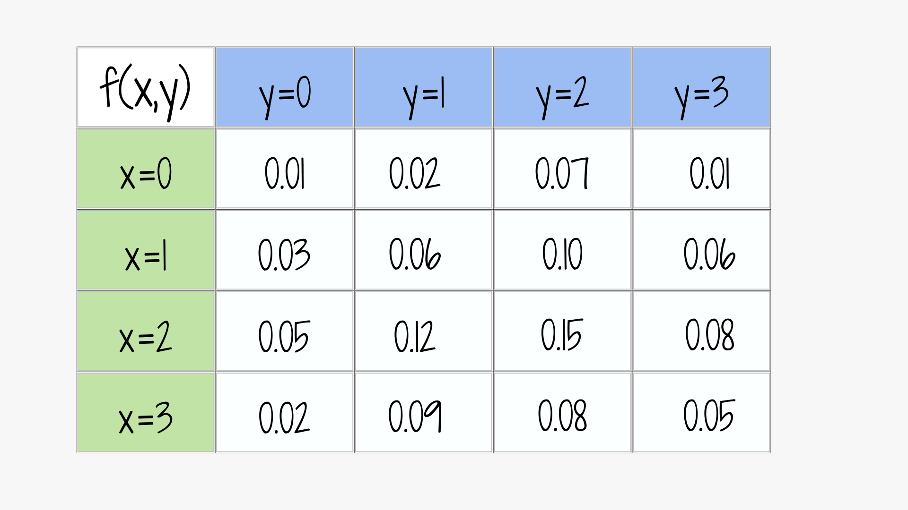

---
title: " "  
subtitle: " "  
author: "dgonzalez "
output:
  html_document:
    toc: no
    toc_depth: 2
    toc_float: yes
    code_folding: hide
    theme: flatly
    css: style.css
---      


```{r setup, include=FALSE}
options(htmltools.dir.version = FALSE)
knitr::opts_chunk$set(
  fig.width=9, fig.height=3.5, fig.retina=3,
  out.width = "100%",
  cache = FALSE,
  echo = TRUE,
  message = FALSE, 
  warning = FALSE,
  hiline = TRUE
)
# colores
source("init.R")

#paleta4=c(c00,c10,c20,c30)


library(forcats)
library(patchwork)
library(lubridate)
library(ggplot2)
library(gridExtra)
library(cowplot)
library(summarytools)

#library(dviz.supp)
```


</br></br></br>

```{r, echo=FALSE, out.width="100%", fig.align = "left"}
knitr::include_graphics("img/taller3.png")
```
</br></br></br>

## **Resumen de conceptos**


\( f(x, y) \) es función de densidad de probabilidad conjunta de dos **variables discretas** si:

$$f(x, y) \geq 0$$
$$\sum_{R_X} \sum_{R_Y} f(x, y) = 1 $$

La función de densidad marginal de \( X \) es:

$$g(x) = \sum_{R_Y} f(x, y)$$


Y la función de densidad marginal de \( Y \) es:

$$h(y) = \sum_{R_X} f(x, y)$$


Si \( X \) y \( Y \) son independientes:

$$f(x, y) = g(x) \cdot h(y)$$


La función de distribución condicional es:

$$f(x|y) = \frac{f(x, y)}{h(y)}$$

El valor esperado de \( X \) es:

$$E[X] = \sum_{R_X} x \cdot g(x)$$

Y el valor esperado de \( Y \) es:

$$E[Y] = \sum_{R_Y} y \cdot h(y)$$


En el caso de **variables continuas**, reemplazamos la sumatoria por una integral doble:

$$\int_{-\infty}^{\infty} \int_{-\infty}^{\infty} f(x, y) \, dx \, dy = 1$$


<br/><br/><br/>

## **Problemas propuestos**

<div class="box1 with-label">
<div class="label">Problema 1</div>

Un camión de entregas viaja de una ciudad A a otra ciudad B. El camión puede presentar entre 0 y 3 inconvenientes (averías o accidentes) en su recorrido de ida y regreso. Sea \( X \) el número de inconvenientes en el viaje de ida y \( Y \) el número de inconvenientes en el viaje de regreso. La distribución conjunta de \( X \) y \( Y \) está dada por la siguiente tabla:


```{r, echo=FALSE, out.width="50%", fig.align = "left", fig.align='center'}

```
<!-- \[ -->
<!-- \begin{array}{|c|c|c|c|c|} -->
<!-- \hline -->
<!-- f(x, y) & y = 0 & y = 1 & y = 2 & y = 3 \\ -->
<!-- \hline -->
<!-- x = 0   & 0.01  & 0.02  & 0.07  & 0.01 \\ -->
<!-- x = 1   & 0.03  & 0.06  & 0.10  & 0.06 \\ -->
<!-- x = 2   & 0.05  & 0.12  & 0.15  & 0.08 \\ -->
<!-- x = 3   & 0.02  & 0.09  & 0.08  & 0.05 \\ -->
<!-- \hline -->
<!-- \end{array} -->
<!-- \] -->

(a) ¿Qué porcentaje de las veces el camión puede hacer el recorrido completo sin problemas?

(b) ¿Qué porcentaje de las veces el camión encuentra un inconveniente en el viaje de ida?

(c) ¿Qué porcentaje de las veces el camión encuentra dos inconvenientes en el camino de regreso?

(d) ¿Qué porcentaje de las veces se presentan menos de cuatro inconvenientes en todo el recorrido (ida y vuelta)?

(e) En cien viajes de regreso con tres inconvenientes, ¿cuántos de ellos presentaron dos inconvenientes en el viaje de ida?

(f) Determinar las funciones de probabilidad marginales para \( X \) y \( Y \).

(g) Determinar la función de probabilidad condicional \( P(Y|X = 0) \).

(h) ¿Cuántos inconvenientes se esperan tener en un viaje completo?

(i) Construir los gráficos de la función de probabilidad conjunta, marginales y condicionales.

(j) ¿Se pueden considerar las variables \( X \) y \( Y \) independientes?

</div>

<br/><br/><br/>

<div class="box1 with-label">
<div class="label">Problema 2</div>

Sea \( X \) la cantidad de encogimiento (\%) de una fibra cuando se calienta a 120°C y \( Y \) el encogimiento adicional cuando se calienta a 140°C. La función de densidad conjunta de \( X \) y \( Y \) está dada por:

\[
f(x, y) = 
\begin{cases}
kxy^2 & 3 \leq x \leq 4, 0.5 \leq y \leq 1 \\
0     & \text{en otro caso}
\end{cases}
\]

(a) Determinar el valor de \( k \) para que \( f(x, y) \) sea una función de densidad válida.

(b) ¿Qué porcentaje de las fibras tienen un encogimiento menor al 3.2% a 120°C y mayor a 0.8% a 140°C?

(c) Si 500 fibras presentaron un encogimiento menor a 0.8% a 140°C, ¿cuántas de ellas tuvieron un encogimiento menor a 3.8% a 120°C?

(d) ¿Son independientes las variables \( X \) y \( Y \)?

</div>

<br/><br/><br/>

<div class="box1 with-label">
<div class="label">Problema 3</div>

Una empresa produce mezclas de café con tres variedades: Colombia, Bourbon y Caturra. Sea \( X \) el peso de la variedad Colombia y \( Y \) el peso de la variedad Bourbon en un paquete de café. La función de densidad conjunta de \( X \) y \( Y \) está dada por:

\[
f(x, y) = 
\begin{cases}
24xy & 0 \leq x \leq 1, 0 \leq y \leq 1, x + y \leq 1 \\
0    & \text{en otro caso}
\end{cases}
\]

(a) ¿Qué porcentaje de los paquetes contienen más de la mitad de su peso en café tipo Colombia?

(b) Si se distribuyeron 200 paquetes con menos de la mitad en Bourbon, ¿cuántos de ellos contienen más de 3/4 de su peso en Colombia?

(c) Si 300 paquetes contienen la mitad en Colombia, ¿cuántos de ellos contienen menos de la mitad en Bourbon?

(d) ¿Cuál es la probabilidad de que el café Bourbon represente más de la mitad de la mezcla?

(e) Determinar las funciones marginales para \( X \) y \( Y \).

(f) Graficar las funciones marginales \( g(x) \) y \( h(y) \).


</div>
